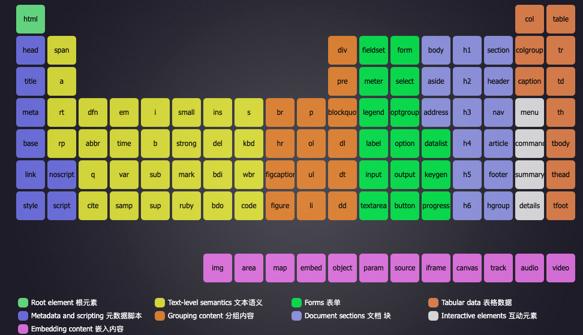

# 文本元素
[toc]
HTML5中支持的元素：HTML元素周期表

http://www.xuanfengge.com/funny/html5/element/

## h
标题
h1～h6:表示1级标题到6级

## p

段落
>lorem 乱数假文

## span 【无语义】

比如三元素：红绿蓝，仅想把这三个字的颜色也变成对应的，只能使用CSS
但是使用CSS就必须使用HTML元素，如果HTMl元素带有语义，就达不到想要的效果了

以前：某些元素在显示时会独占一行(块级元素)，而某些元素不会(行级元素)
到了HTML5，已经弃用这种说法。被更复杂的内容类别代替了

## pre

预格式化文本元素

空白折叠：在源代码中的连续空白字符(空格、换行、回车、制表)
        在页面显示时，会被折叠为一个空格

例外：在pre元素中不会出现空白折叠，会按照代码格式显示到页面上。

该元素通常用于在网页中显示一些代码

pre元素功能的本质：它有一个默认的css属性

> 显示代码时，通常外面套code元素，code表示代码区域
