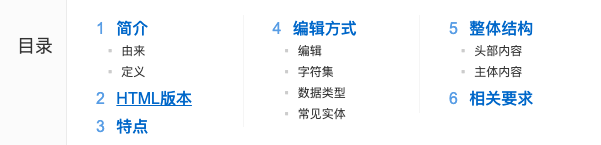

# a元素
[toc]
超链接

## href属性
hyper reference(引用)：表示跳转地址

1. 普通链接
2. 锚链接 

id属性：全局属性，表示元素在文档中的唯一编号

3. 功能链接
点击后出发某个功能
- 执行JS代码 javascript:
- 发送邮件 mailto:
- 拨号 tel:

## target属性

表示跳转窗口位置

target的取值:

- _self: 在当前页面打开
- _blank: 在新窗口中打开