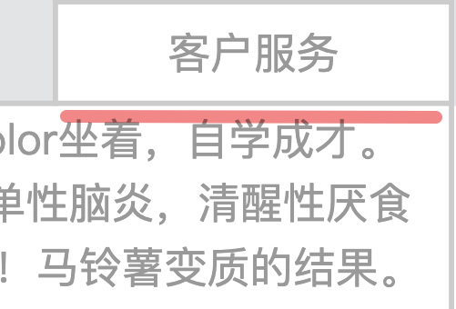
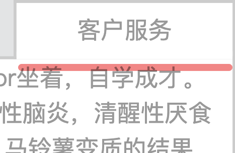
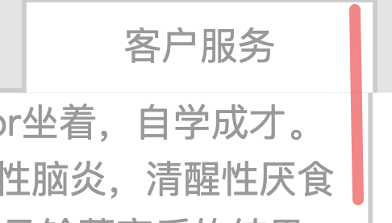
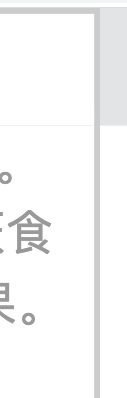
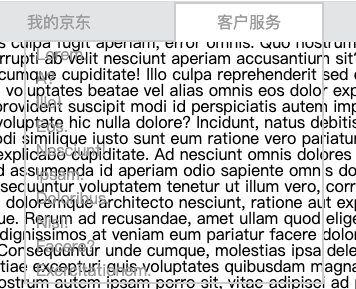
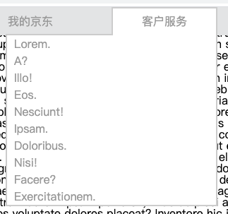
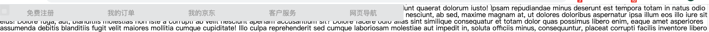
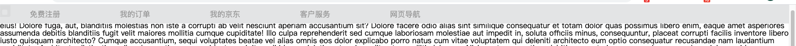

```css
.header .topnav>li:hover::after{
    content: "";
    position: absolute;
    width: 100%;
    height: 5px;
    background: white;
    bottom: 0;
    left: 0;
}
```
效果
 前
 后

```css
  right: -2px;
```
 rigth为 **0px**时
 right为 对应边框宽时
子盒的活动范围为 包容块的内容盒 所以要通过定位或者margin使其突破出去。

```css
background: white;
```
默认颜色不是白色，是穿透
 


```css

.header{
    background-color: #e3e4e5;
    color: #999;
    height: 40px;
    line-height: 40px;
    position: fixed;
    width: 100%;
    left: 0;
    top:0;
}
width: 100%;
```

