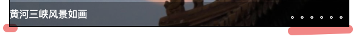

```css
.banner .modal{
    width:100%;
    height: 40px;
    background: rgba(0,0,0,0.3);
    position: absolute;
    left: 0;
    bottom: 0;
    color: #fff;
    line-height: 40px;
    padding: 0 20px;
}
width：100%;
padding:0 20px;
```
效果：


原因 ： width：100%，内容装满整个包含块(宽度=包含块宽度)，但是又有padding，width又不能变，只能margin变为负数超出去，这时候内容就有一部分在外面了。
至于为什么没有显示超出部分，则是因为 
```css
.banner{
    width: 557px;
    height: 305px;
    border:1px solid;
    margin: 1em auto;
    overflow: hidden;
    position: relative;
}
overflow:hidden;
```
效果


解决方法
```css
box-sizing: border-box;
```
把width、height的效果，变为整个盒子的宽高，而不只是内容盒的宽高

