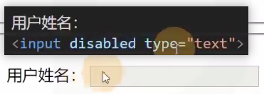

# 表单元素

[toc]

form元素
一系列元素，主要用于收集用户数据

## input元素

输入框

- type 输入框类型

  1. type:text, **普通文本输入框**
      
  2. type:password **密码框**
      
  3. type:date **日期选择框**，有兼容性问题，新的浏览器一般支持，要谨慎使用
      
      **样式改不了**
  4. type：search **搜索框**，一般手机使用，有兼容性问题
     1. 
  5. type：range **滑块**
     1. 
     2. **滑块下的值要靠js提供，配合js才有效果。**
  6. type:color **颜色选择** 经常配合js使用
     1. 
  7. type:number **数字输入框** 有一点兼容性问题
     1. 
     2. 
     3. 
  8. type:checkbox **多选框** 
      1. 
      2. 
      3. **默认选中** 
  9. type:radio **单选框**
      1. **默认选中**  
      2. 
      3. 不写个name，浏览器和其他后端技术不知道你是一组的，接着就无法对这些数据进行汇总，操作。
  10. type:file **选择文件** 
      1. 
      2. 
      3. 要上传到服务器，要配合js，简单说单单这个没用。
**更多的元素，百度w3c或者csdn**

- value **输入框里的值**
    1. 

- placeholder属性：显示提示的文本框，文本框没有内容时显示 js也可以实现但是不推荐
    1. 
    2. 

**input元素可以制作按钮，但是过时了，别用，用下面的按钮元素**
type：reset、button、submit、input表示按钮
也要配合其他知识点(js、后端语言)才能用。
尽量用普通按钮写样式，功能交给js和后端语言

## select元素

**下拉列表选择框**

**通常和option元素配合使用**
**option表示下拉列表的选项**

**这是单选**

**多选**

## textarea元素

文本域，多行文本框

**不过建议用css控制，而不是cols和rows控制。**
**通常这么用**

## 按钮元素

**button** 专门做按钮的

type属性: rest、submit、button，默认submit

**推荐变成button** 

## 表单状态

- readonly属性：布尔属性，是否只读，不会改变表单显示样式

- disabled属性：布尔属性，是否禁用，会改变表单显示样式

## 配合表单元素的其他元素

## lable 标签

**普通元素** 通常配合单选和多选框使用
**一个表单元素的标签文本**
- 显式关联

可以通过for属性，让lable元素关联某一个表单元素，for属性书写表单元素的id值
- 隐式关联

## datalist 通常不太会使用，了解下就可以
数据列表
该元素本身不会显示到页面，通常用于和普通文本框配合

**百度的建议搜索词条也不是通过这个做的**

## form元素

**这就是一个表单，装表单元素用的。**
通常，会将整个表单元素，放置form元素的内部，作用是当提交表单时，会将form元素内部的表单内容以合适的方式提交到服务器。

**form元素对开发静态页面没有意义。**
**学服务器和js后就很有用了。**

### name属性的意义

## fieldset元素

**表单分组**

