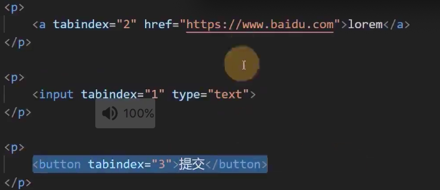
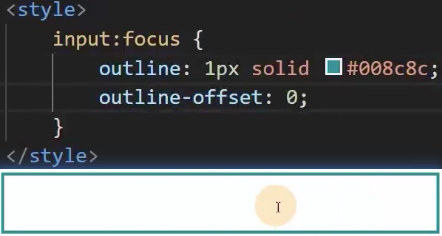
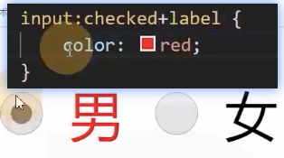
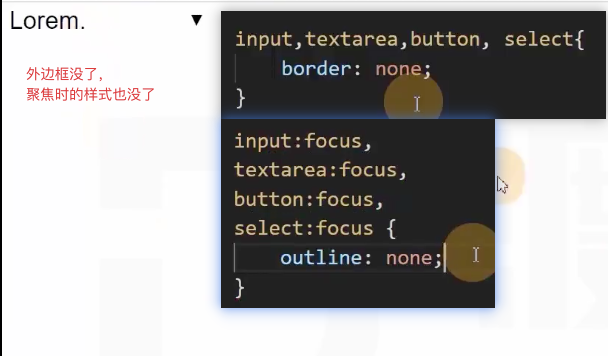
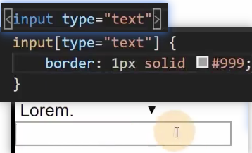
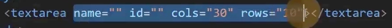
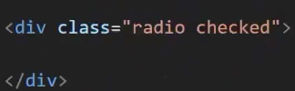
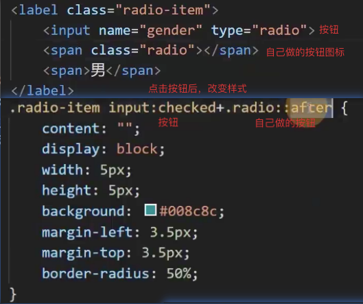
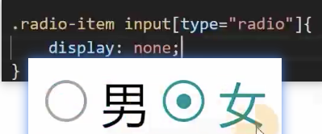

# 美化表单元素——CSS

## 新的属性
- tabindex tab健切换相关的

## 新的伪类

1. focus
    - 元素聚焦时的样式，所有元素都有
    - 开发要覆盖掉浏览器的外边框 例如 input:foucs {} 
2. checked
    - 单选或多选框被选中时的样式
    - **单选框和多选框是一个可替换元素**，因此没什么样式是checked能够控制的。
    - **但是**可以控制下一个**兄弟元素**。 

## 常见美化方法
1. **重置表单元素样式——方便我们自己设置样式**
   - 
   - 自建样式表 
2. **设置textarea标签是否允许调整尺寸**
- 
- 
   - **resize属性** 为 **none** **不能调整尺寸**
   - **resize** 为 **horizontal** **水平方向可以调整**
   - **resize** 为 **vertical** **垂直方向可以调整**
3. **文本框边缘到内容的距离**
   1. 使用 padding 
   2. 使用text-indent 首行缩紧
4. 控制单选和多选的样式 **可替换元素没法改样式**，**那就扔了自己做个**
   1. ***本质就是个div*** 
   2. ***然后关联自己的按钮元素*** 
   3. **效果gif图** 
   4. **最后隐藏按钮就好了** 

### 注意
lable里不允许 div，因此用span
