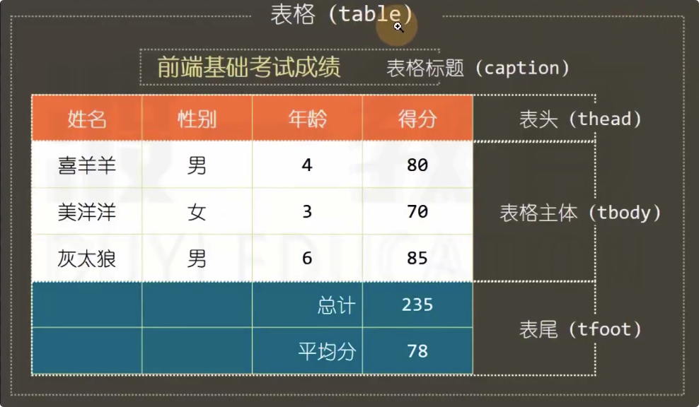
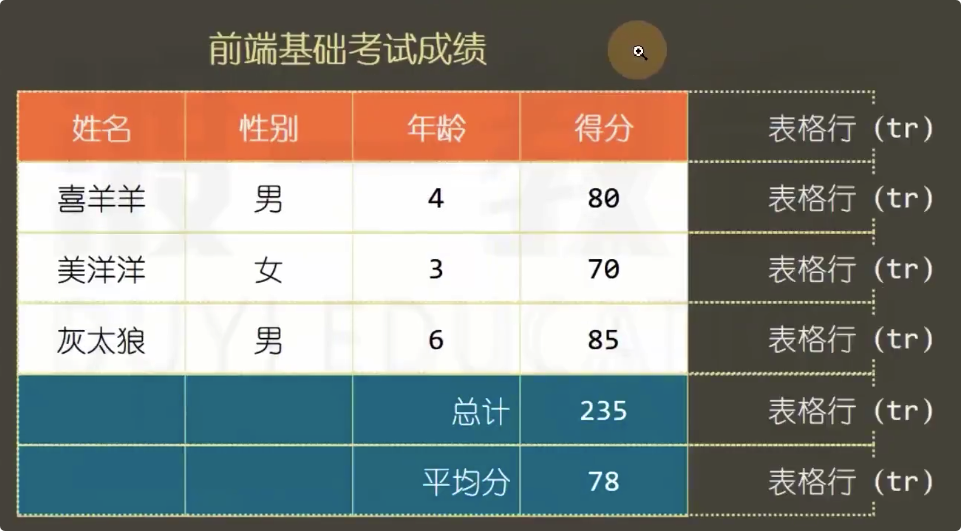
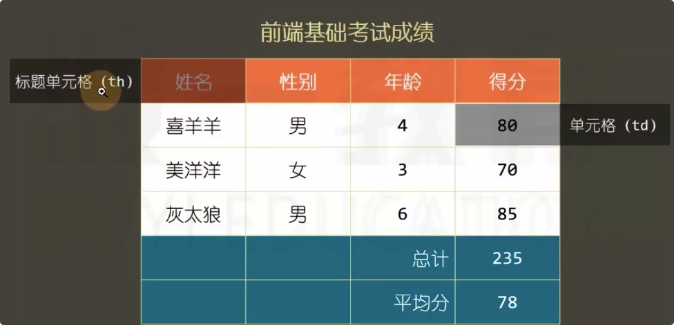
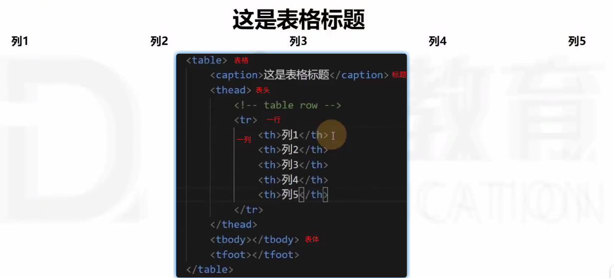
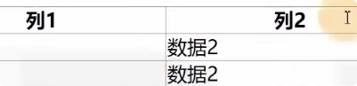
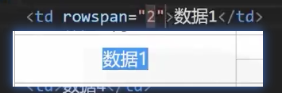

#  	表格元素

在css技术出现之前，网页通常使用表格方式

用的很少很少了，过时的垃圾。
后台管理系统中可能会出现表格。

前台网页：面向用户
后台网页：面向管理员。对界面要求不高，功能要齐全 一般是框架插件迅速生成

表格不再适合于网页布局。渲染速度过慢

## 表格涉及的元素
table
caption
thrad   tr th
tbody   tr td
tfoot   tr td

## 表格涉及的属性

**table  border-collapse 表格的单元格是分离的还是合并的**

**td colspan 跨越多少行**

**td rowspan 跨越多少列**

