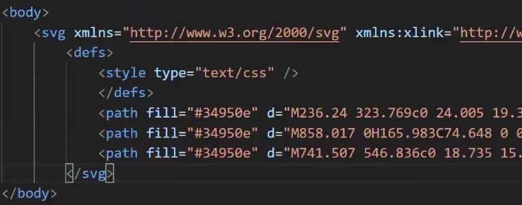
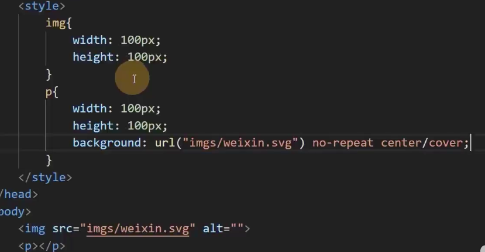
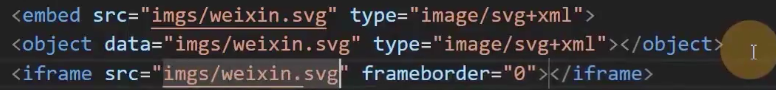
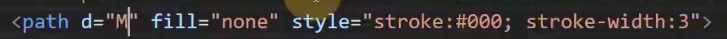
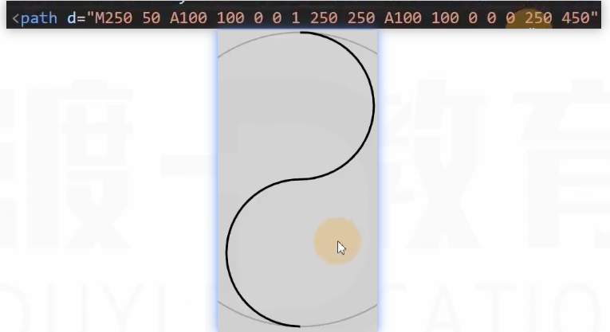
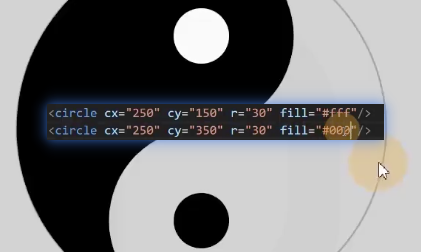

# svg

svg: scalable vector graphics,可缩放的矢量图

1. 该图片使用代码书写而成
2. 图片不会失真
3. 内容轻量


## 怎么使用

svg可以嵌入浏览器，也可以单独成为一个文件



xml语言，svg使用之中语言定义

## 书写svg代码
```svg
<svg style="" width="xxx" height="xxx" xmlns:xlink="http://www.w3.org/1999/xlink">

</svg>
```
### 形状:rect
在svg里面写
```svg
<rect width="xxx" height="xxx" fill="red">
```
### 圆形 circle

### 椭圆 ellipse

### 多边形 polygon

### 路径:path

M= moveto
L= lineto
H= horizontal lineto
V= vertical lineto
C= curveto
s= smooth curveto
Q= quadratic Belzier curve
T= smooth quadratic Belzier curveto
A= elliptical Arc
Z= closepath


fill 颜色填充
stroke 边框


