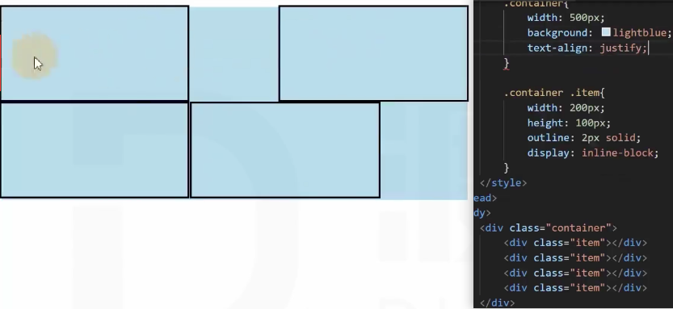
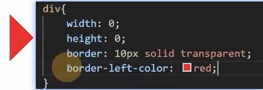
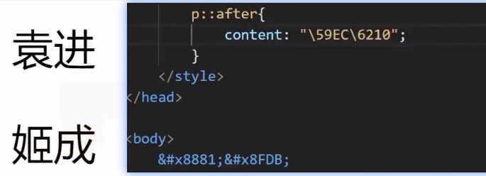

# 样式补充

## display:list-item
**ul li就是默认这种显示方式**
设置为该属性值的盒子,本质上仍然是一个块盒,但同时该盒子会附带另一个盒子
元素本身生成的盒子叫做主盒子,附带的盒子称为次盒子,次盒子和主盒子水平排列
涉及的css:
1. ```list-style-type```
设置次盒子中内容的类型


2. ```list-style-position```
设置次盒子相对于主盒子的位置
**属性值** inside outside

3. 速写属性```list-style```
 先 type 再 postion

**清空次盒子**
list-style:none

## 图片失效时的宽高问题
如果img元素的图片链接无效,img元素的特性和普通行盒一样,无法设置宽髙

## 行盒中包含行块盒或可替换元素
行盒的高度与它内部的行块盒或可替换元素的高度无关

## text-align: justify
text-align
    left:左对齐
    right:右对齐
    center:居中
   - justify:除最后一行外,分散对齐



## 制作一个三角形



## direction 和 writing-mode

开始 start -> 结束 end
左 left -> 右 end

开始和结束是相对的，不同国家有不同的习惯
direction设置的是开始到结束的方向
rtl 从右到左 ltr从左到右

writing-mode:设置文字书写方向


## utf-8字符



