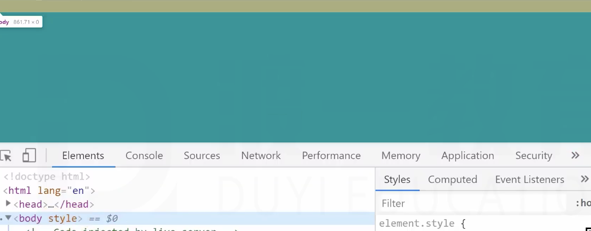

**问题**
背景颜色填充的是边框盒

可是边框盒高度为0，页面居然变颜色了

# body背景

**画布 canvas**

一块区域

特点：
1. 最小宽度为视口宽度
2. 最小高度为视口高度

## **HTML的背景**
覆盖画布

**body元素的背景**
如果HTML元素有背景，body元素正常，背景覆盖边框盒
如果HTML没有背景，body元素的背景覆盖画布。

**关于画布背景图**

1. 背景图的宽度百分比，相对于视口
2. 背景图的高度百分比，相对于HTML元素高度(网页高度)
    
    本来的话，红色边框外面应该是白色，黑色是背景图的一部分 120 = (浏览器的margin-top)8 + 2 + 100 + 2 + (margin-bottom)8
3. 背景图的横向位置百分比、预设值 是相对于视口
4. 背景图的纵向位置百分比、预设值 是相对于网页(HTML)高度

不用多说了，以后html一定要设置一个背景，不设置一切都不对了。
