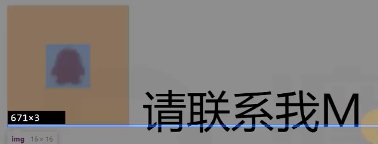

# 参考线-深入理解字体

font-size、line-height、vertical-align、font-family

## 文字

文字是通过一些文字制作软件制作的，比如fontforge

制作文字时，会有根参考线，不同的文字类型，参考线不一样。同一种文字类型，参考线一样。 

## font-size

字体大小、设置的是文字的**相对大小**

**文字的相对大小**：1000 2048、1024(金属框的大小)
**文字的实际大小**：文字顶线到底线的距离，是文字到实际大小(content-area，内容区)
而我们font-size设置的是 **文字的相对大小**，也就是说
实际上 font-size=12px，实际上font-size不一定是12px

## 行高

顶线向上沿伸的空间，和底线向下沿伸的空间，两个空间相等，该空间叫做gap(空隙) 
top到bottom的区域，叫做 virtual-area(虚拟区域)

**行高** 就是 **virtual-area**
我们设置的 行高 实际上就是影响 **line gap**的大小，顶线到底线的大小是不能变的。
gap默认是设计者决定的高度 设计者一般默认为0，但也有例外
line-height:noremal 默认值 使用文字默认的gap

### 注意事项

line gap默认为0，那么行高= 顶线到底线的距离，也就是字体的实际大小

p元素盒子的大小 是 span元素的大小 就是M字体的 top到bottom的大小
而M字体的实际影响区域覆盖的是 顶线 到 底线的区域
当gap为负数的时候，那么M字体的实际覆盖区域就大于盒子的区域，那么就会发生问题，比如 
那么当line-height：1时 行高 = 定下的相对大小，而一般来说字体的实际大小都是不等于相对大小的，那么 以这个为标准就会出现问题。

解决方法：直接使用normal line-height:normal 按照设计者的方式显示

2. 对于**浏览器**来说 文字的正中间是 **顶线和基线的正中间**，但是如果文字的正中间不在这上面，那么实际上显示的效果就是不是正中间，机器逻辑上是正中间。   所以，**文字一定出现在一行的正中间，❌的**
3. content-area一定出现在virtual-area的中间或者说中线重叠,对的
4.  

## vertical-align
 这些线就是参考线
决定参考线：font-size、font-family、line-height
font-size:决定了参考线的距离
font-family:决定了参考线的种类
line-height:决定了 top和bottom之间的距离
一个元素如果子元素出现行盒，该元素内部也会产生参考线
文字一定要在行盒里，因为只有行盒有参考线，如果字体是在块盒里，那么就会生成一个 **匿名行盒**
> 行盒的参考线 不等于 文字的参考线
> 参考线与参考线之间，默认是 基线对齐

vertical-align 属性
  - baseline:该元素的基线 与 父元素的基线   对齐  
  - super:   该元素的基线 与 父元素的上基线 对齐
  - sub:     该元素的基线 与 父元素的下基线 对齐
  - text-top:该元素的virtual-area的top，对齐父元素的text-top
  - text-bottom:该元素的virtual-area的bottom，对齐父元素的text-bottom
  - top:该元素的virtual-area的top，对齐line-box的顶边
  - bottom:该元素的virtual-area的bottom，对齐line-box的底边
  - middle:该元素的中线，与父元素的X字母高度一半的位置对齐
行盒组合起来，可以形成多行，每一行的区域叫做line-box
实际，一个元素的实际占用高度(高度自动)，高度的计算通过line-box计算。
行盒:inline-box
行框:line-box  暂时这么叫

数值:相对于基线的偏移量，向上是正数，向下是负数
百分比:相对于基线的偏移量，百分比是相对于自身的virtual-area的高度

line-box是承载文字内容的必要条件
**以前情况不生成行框**
1. 某元素内部没有行框
2. 字体大小为0

## 可替换元素和行块盒

### 图片参考线
解决图片出现的白边

图片:基线位置 位于 图片的下外边距

这也是为什么 图片底部会出现白边的原因
解决方法
1. 父元素 的 font-size:0
2. 把图片设为块盒 最好的办法

### 表单元素参考线

表单元素：基线位置在内容底边

### 行块盒参考线
1. 行块盒最后一行有line-box，用最后一行的基线作为整个行块盒的基线。 
2. 如果行块盒内部最后一行没有行盒，则使用下外边距作为基线。

