# 构造函数的继承
**不是对象的继承，而是构造函数**
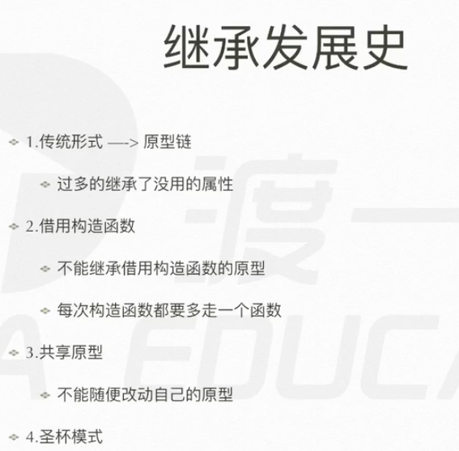

## 原型链
千层饼一样的东西，一级一级的原型连起来就是原型链


## 借用构造函数


## 共享模式

function extend()
```js
function inherit(target, origin) {
    Target.porototype = Origin.prototype;
} 
inherit(Son,Father);
var son = new Son();   // son继承了Father

因为改了 son.prototype 就相当于改了 father.prototype
因此还不好
```

## 圣杯模式
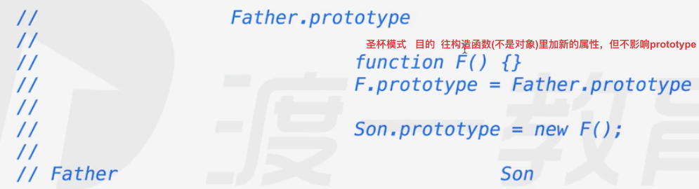

这是要往 构造函数里 加属性，构造函数不是对象，不能直接进行 增删改查
可是 对 构造函数构造的对象进行，又不会影响 构造函数本身
又因为 构造函数里 唯一有的对象是 prototype，因此 只能往原型里进行增删改查
但是 又不能对原型进行更改， 因此 产生了圣杯模式 形成一个中间层F()
**最终模式**
演变过程
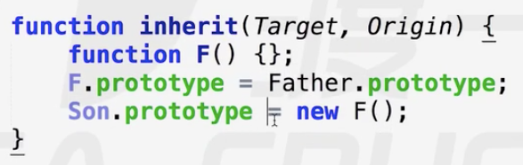

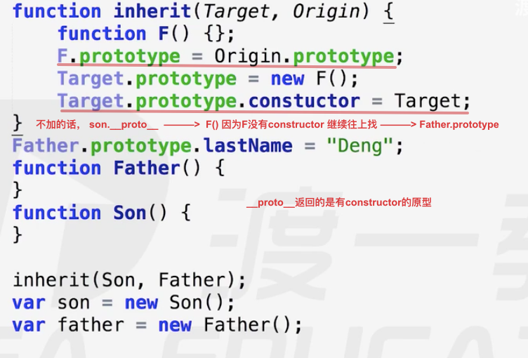
超类
最完美的继承方式
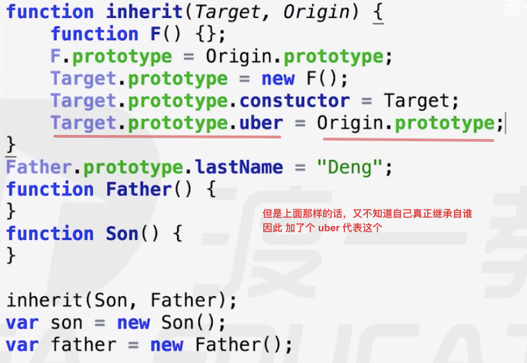
拓展
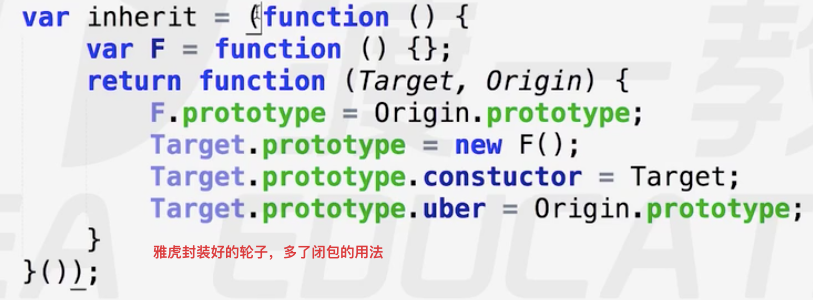
**闭包的私有化变量**
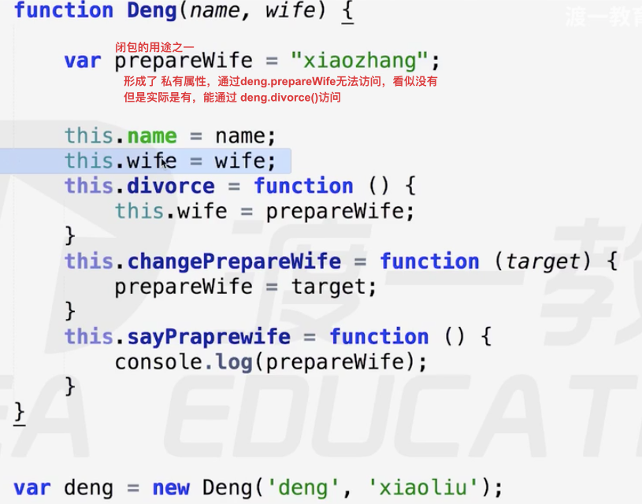

# 命名空间

管理变量，防止污染全局，适用于模块化开发

解决多人开发时，会产生的变量冲突

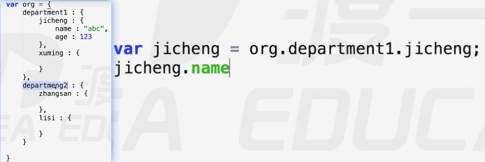
以前的解决办法

现在的解决办法
闭包
```js
var wp_init = (function(){
    var name = "立即执行函数"
    function callName(){
        console.log(name);
    }
    return function(){
        callName();
    }
}())
wp_init();
```


## 连续 使用对象里的方法
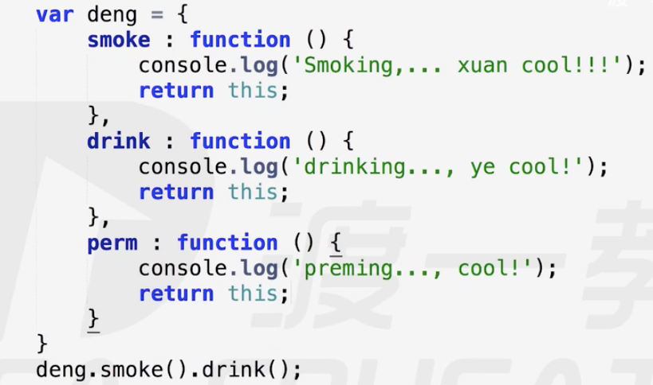

## 属性拼接
on clickon clickdown 的时候会发挥大作用
**原理**
```js
var obj = {
    name : "abc",
}
obj.name 实质上是先生成  obj['name']
然后再调用 obj['name']

```
那么
我可就可以直接用 obj['name']来实现这一目的
```js
var deng = {
    wife1:{name:"xiaoliu"},
    wife2:{name:"xiaozhang"},
    wife3:{name:"xiaoliu"},
    sayWife:function(num){
        return this['wife'+num];
    }
}
deng.sayWife(1)
deng.sayWife(2)
```

# 对象枚举
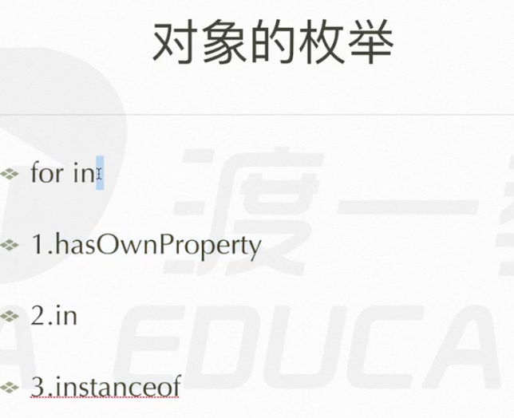

## for in 循环
**涉及了 for in、hasOwnProperty、in**
**in是没用的，开发中使用的次数极其低**,但是考试会考

因为传统的循环，没法遍历对象，能遍历数组是因为数组有个length可以返回数组的长度，但是对象没有这样的属性
因此 产生了一个 for in循环
目的只有一个 ： 遍历对象用
```js
var obj = {
    name : '13';
    age : 123;
    sex : "male";
    height : 180;
    weight : 75;
}
prop 指向 对象obj里的 属性
for (var prop in obj) {
    console.log(prop); // 传属性名 且返回的是字符串
}
for (var prop in obj) {  // 会出错
    console.log(obj.prop); // 错误的传属性值方法
    obj.prop ---->  obj['prop'] 这个就是一个 'prop'字符串 而不是prop代表的字符串
    console.log(obj[prop]); // 真正的传属性值方法
}
```
但是上诉的代码还是有问题的，他会把原型也拿出来,不包括最终的原型 Object
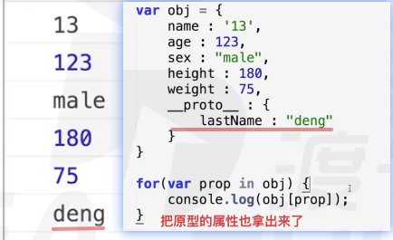
那么就要判断什么属性是原型的，然后无视。
改良后的代码
### hasOwnProperty
```js
有一个方法 hasOwnProperty() 能够判断是不是自己的属性

var obj = {
    name : '123';
    age : 123;
    sex : "male";
    __proto__ : {
        lastName : "deng";
    }
}
for(var prop in obj) {
    if (obj.hasOwnProperty(prop)){
        console.log(obj.[prop]);
    }
}
这样就能只返回 obj自己的属性了
```
但是吧 for(var prop in obj)依然会遍历到原型里去，这依然不太好

### instanceof

**介绍**
```js
A instanceof B 判断 A对象 是不是 由 B构造函数构造出来的
实质 : 看A对象的原型链上 有没有 B的原型
因此 A instanceof Object 也是 true
```


## 数组和对象的区分方法

方法一
```js
var obj = {}; 对象
var arr = []; 数组
obj.constrctor = Object
arr.constector = Array
```


方法二
```js
var obj = {}; 对象
var arr = []; 数组
obj instanceof Array  false
arr instanceof Array  true
```

方法三 ———— toString
```js
var obj = {}; 对象
var arr = []; 数组
Object.prototype.toString.call(obj) object Object
Object.prototype.toString.call(arr) object Array

```
