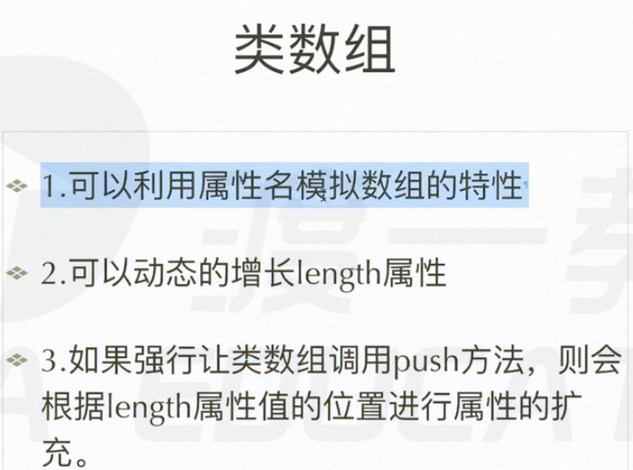

# 数组

## 数组的声明方法
```js
var arr = []; 数组字面量
var arr = new Array[]; 数组构造方法
```
2中方法有一点区别
```js
var arr = [10];   一个值
var arr = new Array[10];  十个值
```
数组所有方法全来自 Array.prototype 原型


## 数组的方法

### 可以改变原数组

push、pop、shift、unshift、sort、reverse

splice

**push代码**
```js
Array.prototype.push = function() {
    for(var i = 0; i < arguments.length;i++) {
        this[this.length] = arguments[i];
    }
    return this.length;
}
```
**push代码** 在最后面增加数字
**unshift** 在最前面增加 数字
**pop** 删掉最后一位数字
**shift** 删掉最前面的数字
**soft** 排序
**reverse** 逆反 返回原数组 [1,2,3]——>[3,2,1]
**splice** 
splice可以无穷个参数
第一个参数 ———— 从第几位开始
第二个参数 ———— 截取多少的长度 从原数组剪切 成一个新数组
后面的参数 ———— 在这个剪切位置加入新的数字

**sort** 排序 根据字符串ascll来排序的
那么就要自己来定义了
```js
arr.sort(function (a,b){ 必须写2形参
    return a - b;按照升序排序
    return b - a;按照降序排序
}); 正数交换位置，负数不交换位置
```
### 不改变原数组

concat，join ——>split，toString，slice


**concat** 连接2个数组
    arr1 = arr1.concat(arr2)
**toString** 把数组变成字符串

**slice** 从该位开始截取，截取到该位
    newarr = arr.slice(1,4) 1-4
    newarr = arr.slice(1) 1-最后
**join** 把数字 以 指定到 模式连接
    arr = [1,2,3];
    arr.join("-"); ---> "1-2-3"
**split** 与join互逆
    arr = ["1-2-3-4"]
    arr.split("-") ---> ["1","2","3","4"]


## 类数组

```js
var obj = {
    "0" : 'a',
    "1" : 'b',
    "2" : 'c',
    "lenght" : 3,
    "push" : Array.prototype.push,
    "splice" : Array.prototype.splice
}
Array.prototype.push = function(target) {
    obj[obj.lenght] = target;
    obj.lenght ++;
}
可以用 obj[0] obj[1] obj["1"] obj['1'] 来访问数字系列
但是 只能用 obj["lenght"]来访问lenght属性
        用 obj[lenght]会报错
```

## 连接字符串 数组方法的应用

散列

var str1 = “al”;
var str2 = “al”;
var str3 = “al”;
var str4 = “al”;
var str5 = “al”;
var str6 = “al”;
var str7 = “al”;
var str8 = “al”;
var strFinal = "";
var arr = [str,str1,str2,str3....]
console.log(arr.join(""));


## 数组去重

```js
自己写的
Array.prototype.unique= function() {
    var temp = {};
    var arr = [];
    var len = this.length;
    for(var i = 0; i < len; i++) {
        temp[this[i]] = this[i];
    }
    for(var i in temp){
        arr.push(i);
    }
    return arr;
}
```

```js
姬成写的
Array.prototype.unique = function(){
    var temp = {},
        arr = [],
        len = this.length;
    for(var i = 0; i < len; i ++) {
        if(!temp[this[i]]) {
            temp[this[i]] = this[i];
            arr.push(this[i]);
        }
    }
    return arr;
}
```