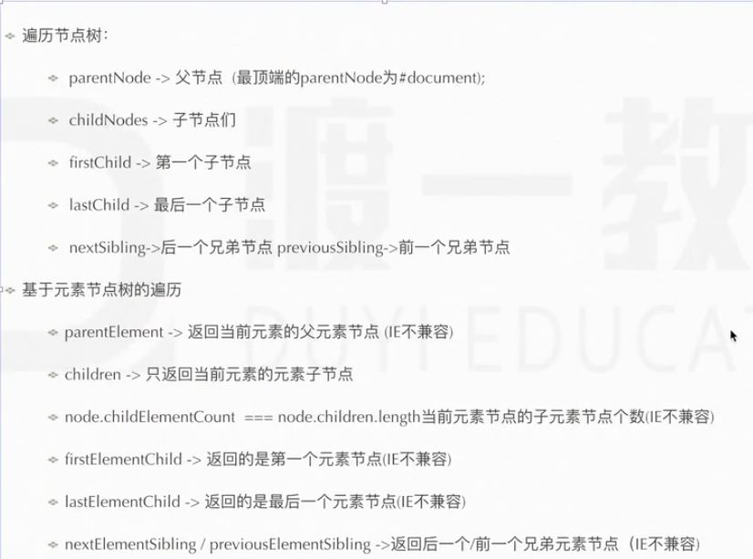
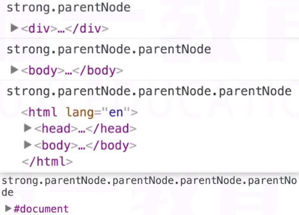
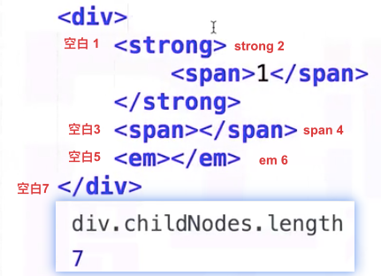
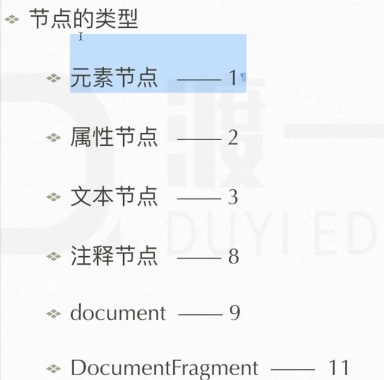
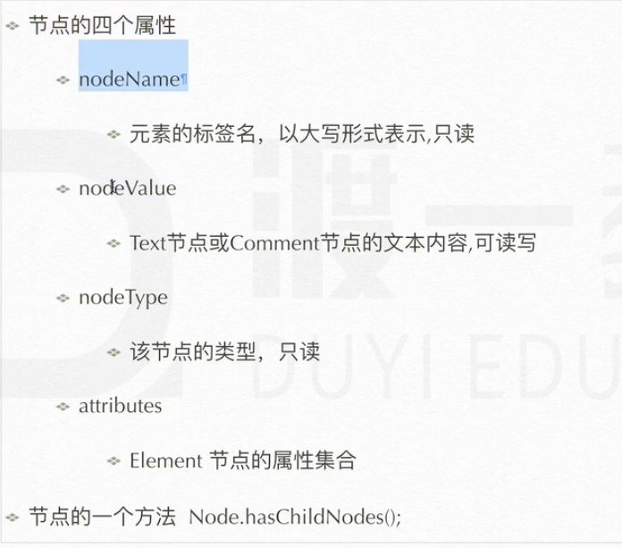

# dom选择器 节点类型
document代表真个文档

## 查找
dom生成的成组的方式 都是 类数组
1. document.getElementsById('')  id查找 ie8以下不区分大小写 最少用的
2. document.getElementsByTagName('') 标签查找
3. document.getElementsByName(); 查找有标签name 只有部分标签name可生效(表单、img、iframe)**没人用的**
4. document.getElementsByClassName('') 查找类的
5. document.querSelector('') css选择器 选中一个 没啥人用  缺乏实时性
6. document.querySelectorAll(‘’) css选择器 选中一组 没人用 缺乏实时性

## 遍历节点树

**方法**

e = e.nextElementSibling; 找e的下一兄弟元素 ie9以下不能用
e = e.previousElementSibling; 找e的上一兄弟元素 ie9以下不能用
e = e.nextSibling; 找下一个节点

ie9.0以下 不兼容元素节点树

Nodetype能让机器知道 节点是什么类型
