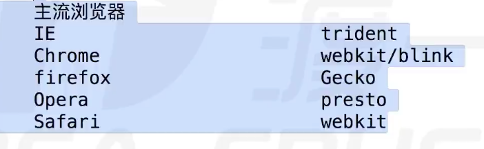
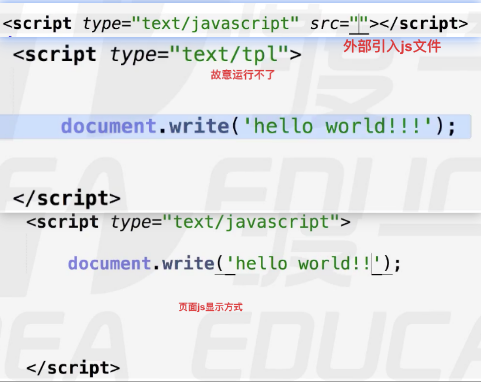
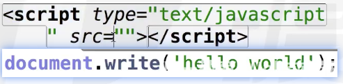
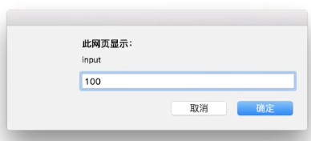
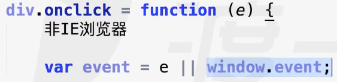

# js介绍






## js创建变量
var a; 声明变量

a = 100; 赋值

document.write();**输出**
var score = window.prompt('input'); **输入**
    var socre = parseInt(window.prompt('input')) 数值输入
     input就是上面的值
document.write(a,b,c,d,e);

var arr = [1,2,true,“abc”]; 数组声明
arr.push(2); 往arr数组中 压入一个值
document.write(arr) 输出 1，2,true,abc,2

- 原始值 number String Boolean undefined null
  - 数据存在 stack 中
- 引用值 array object function ... data RegEx
  - 数据存在 heap 中

```js
<br>换行
```

运算操作符
- +
  1. 数学运算、字符串链接
  2. 任何数据类型加字符串都等于字符串

比较运算符
```js
> < == >= <= !=
```
var a = "a" > "b"

**特例 NaN 不等于任何东西,包括自己**
var a = “a” == "b" 对
var a = NaN == NaN 错

## 逻辑运算符 && || !
**运算符就是要求结果**
var a = 1 && 2;  不输出true 而是 **2**
&& 与运算符会看 前面的表达式 看看是不是为真

    1. undefined null NaN “” 0 false ==> false;

1. var a = 20 && 10; a = 10;
2. var a = 10 && 20; a = 20;
3. var a = 10 && 20 + 1; a = 21;
4. 当第一个表达式是false的话，那么就直接返回0。
   var a = 0 && 2 + 2; a = 0;

## 条件语句
```js
if(){

}else{

}
```
```
n 为条件  ta、tt为条件判断 可以随意为数字、字符串、boolean属性
switch(n){
    case ta: ;
    case tt: ;
}
```
## 中止语句————break、continue

## 初识引用值

**数组** 就是python的列表


**对象**  类
```js
var deng = {
  lastName : “asd“,
  age : 40,
}
```

## typeof() 可以区分数据是什么类型
typeof() 本身返回 **字符串**
number string boolean object undefined function
引用值都是 object 包括 null
var num = undefined  返回 undefined

## 类型转换
1. 显示类型转换
   1. **Number** 转换为数字
      - var n = Number('123'); n = 123;
      - var n = Number(null) n = 0
      - Undefined 不能转换，显示NaN是因为num没值,其他5类都是0
      - 然后看起来就不是数字，不能转，  var n = "123abc" 显示是 NaN

   2. **parseInt(string,radix)** 转换为整数 只要最前面是数字，那就不会是NaN
      - 就是把字面上的数字**转换为整数**，字面上不是(比如true)也不能。
      - 字符串“123“能转，123.9也能转成123
      - var num = parseInt(demo,16); 代表demo是十六进制的数，然后转换成十进制再 赋值 给 num   radix只能2-36进制
      - var num = parseInt(“123.3abc")   num = 123
   3. **parseFloat()**
      - var num = parseFloat(“123.23apx") num = 123.23
   4. **String()**
      - 什么都能转
   5. **Boolean()**
      - 除了那6个值都是true
   6. **toString()**
      - 是类的方法，var demo = 123;
      -           var num = demo.toString(8);123转成8进制
      - undefined、null不能用
2. 隐式类型转换
   1. isNaN(‘abc’) 判断是不是NaN   答案是true
      
      - Number('abc')  --> 再与NaN比较
   2. ++ -- +/-(一元正负)
      - a = “123”;a++;   a先 a = Number(a) 再a++;
      - +"abc"  显示NaN  类型是 **Number**
   3. +
      
      - 当 + 左右俩侧有一个 是 字符串， 那么就变成字符串加减
   4. - * / % ——> number,经过Number()之后再计算
   5. > < <= >=
   6.  == !=  1=="1"==true

**=== !== 不会发生类型转换**

## console 控制台类

console.log ——> 控制台显示

## 兼容性问题——IE——解决方案


## alert()
弹出窗

