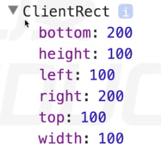

# 获取窗口属性

## 查看滚动条的滚动距离

```js
1. window.pageXOffset/pageYOffset
    IE8及以下不兼容
2. doucument.body/documentElement.scroollLedt/scrollTop
    兼容性比较混乱，用时取2个值相加，因为不可能存在两个同时有值
3. 封装兼容性方法，求滚动轮滚动距离 getScrollOffset()
```
```js
function getScrollOffset() {
    if(windwo.pageXOffset) {
        return {
            x : window.pageXOffset,
            y : window.pageYOffset
        }
    }else{
        return {
            x : doucument.body.scrollLeft+ document.documentElement.scrollLeft,
            y : doucument.body.scrollTop + document.documentElement.scrollTop
        }
    }
}
```
## 让滚动条滚动
window上有三个方法
scroll()、scrollTo() 一样的
scrollBy() 可以累加
```js
window.scroll(0,10);
```

## 可视区窗口的尺寸

```js
1. window.innerWidth/innerHeight
2. document.documentElement.clientWidth/Height 标准模式 <!DOCTYPE html>
3. document.body.clientWidth/Height 怪异模式 没有那行
document.compatMode
```
兼容代码
```js
function getVierportOffset(){
    if(window.innerWidth){
        return {
            w : window.innerWidth;
            h : window.innerHeight;
        }
    }else{
        if(document.compatMode === "BackCompat") {
            return {
                w : document.body.clientwidth;
                h : document.body.clientHeight;
            }
        }else{
            return {
                w : document.documentElement.clientWidth;
                h : document.documentElement.clientHeight;
            }
        }
    }
}
```


## 查看元素的几何尺寸


```js
domEle.getBoundingClientRect();
var div = div.getBoundClientRect();
兼容性很好
返回一个对象，对象里有 left top right bottom等属性
    left top代表该元素左上角的X、Y坐标
    right、bottom代表该元素右下角的X、Y坐标
height、width在老版本的ie并没有
返回的结果不是实时性的
```

**上面的方法已经报废了，被下面的替换了**

查看元素尺寸
```js
dom.offsetWidth  视觉上的尺寸(只包含内容区)
dom.offsetHeight
```

查看元素的位置
```js
dom.offsetLeft
dom.offsetTop
对于无定位父级的元素，返回相对文档的坐标。对于有定位父级的元素返回相对于最近有定位的父级的坐标。

dom.offsetParent
返回最近的有定位的父级,没有返回body
body.offsetParent返回 null
```
求元素相对于文档的坐标 getElementPosition
