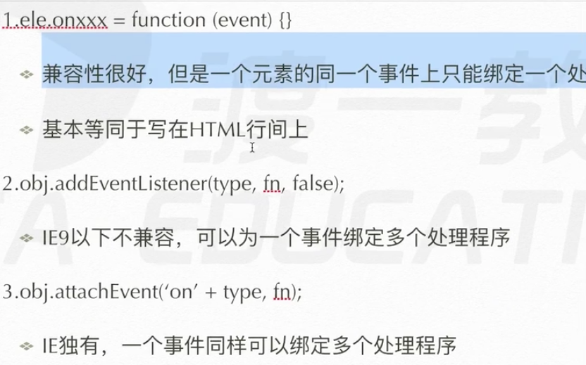
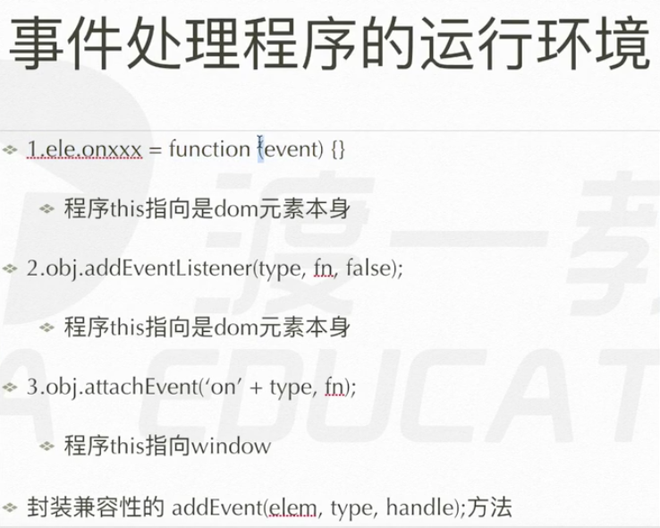
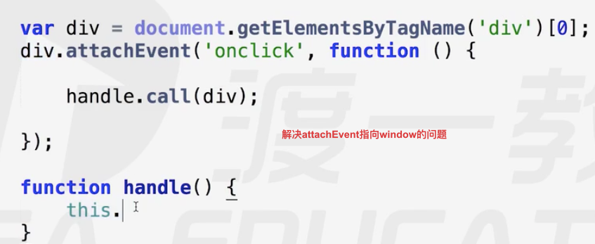
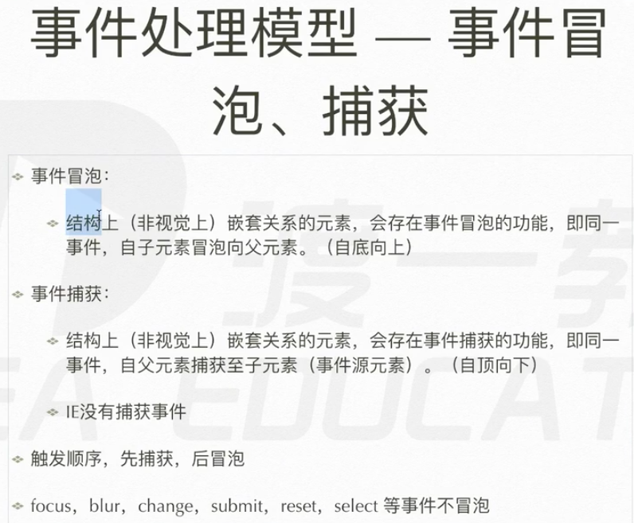
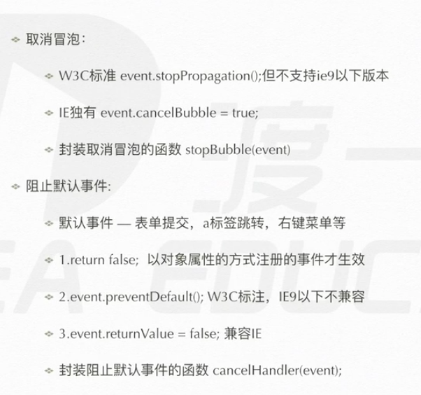
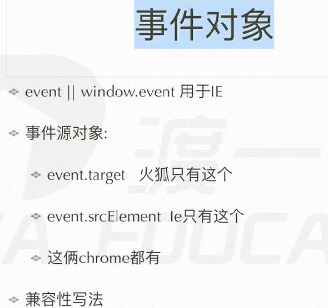
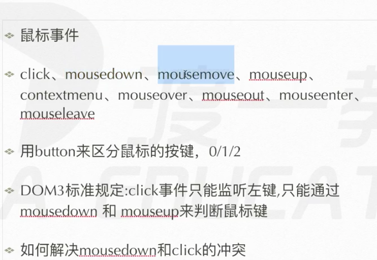

# 事件
交互体验的核心功能

div.onclick 点击事件
div.onclick = function() {

} 这个function() 是事件要执行的函数


## 绑定事件处理的函数
**三种 事件类型的的写法**
1. **ele.onxxx (div.onclick) 句柄**
   ele.onclick = function() {}
2. **ele.addEventListener('事件类型',处理函数，false);**
    div.addEventListener('click',test,false);
3. **obj.attachEvent('on'+'事件',function(){}); 只有ie独有**
    obj.attachEvent('onclick',test);


## 事件处理函数的环境问题





```js
// 兼容 事件处理  非常重要
function addEvent(elem,type,handle) {
    if(elem.addEventListener) {
        elem.addEventListener(type,handle,false);
    }else if(elem.attachEvent) {
        elem.attachEvent('on' +type, function(){
            handke.call(elem);
        })
    }else {
        elem['on' + type] = handle;
    }
}

```

## 解除事件处理程序
div.onclick ---->   div.onclick = false/''/null;
div.addEventListener('click',test,false) --->
div.removeEventListener(type,fn,false);
div.attachEvent('on'+type,test) ---> div.detachEvent('on' + type,fn)

## 事件冒泡


事件捕获 ie没有
addEventListener('click',function(){},true);
把 false 变成 true 就从 冒泡 变成了 事件捕获
事件捕获 先 捕获最外层的父元素 在一层一层往下执行

若是都有，一定是先捕获后冒泡
捕获 区域事件执行 冒泡
事件执行，谁写前面，谁先执行

## 取消冒泡和阻止默认事件


**取消冒泡**
事件对象
div.onclick = function(e) {}
e就是事件对象，我们不能传东西，但是系统会传，只能传一个
e记载了 事件发生时的一系列状态和信息，然后打包成对象传入进去。
然后这个e对象有一个方法能够阻止 冒泡的进行
1. e.stopPropagation() w3c
2. e.cancelBubble = true; ie和谷歌
```js
// 封装 取消冒泡
function stopBubble(event) {
    if(event.stopPropagation) {
        event.stopPropagation();
    }else{
        event.cancelBubble = true;
    }
}
```

**阻止默认事件**
```js
document.ontextmenu = function(e) {
    console('a');
    return false;
} // 以对象属性的方式注册的事件才生效 div.onclick = function(){} 的方式(句柄)
```

```js
// 封装
function cancelHandler(event) {
    if(e.preventDefault) {
        e.preventDefault();
    }else{
        e.returnValue = false;
    }
}

```

## 事件对象



**事件源对象**

event.target() 火狐/chrome
event.srcElement ie/chrome

用途:事件委托

## 事件分类

### 鼠标事件

click、mousedown、mousemove、mouseup、contextmenu、mouseover、mouseout、mouseenter、mouseleave

document.onmousemove
div.onmousemove
click = mousedown + mouseup
html5新规范
mouseenter 鼠标盖住你的区域会怎么样 mouseover
mouseleave 鼠标离开你的区域会怎么样 mouseout

只有mouseup 和 mousedown 能确认你点的是 左键还是 右键
**dom3规定：click事件只能监听左键**

移动端鼠标事件就不好使了，有touchstart、touchmove、touchend
### 键盘事件
keydown keypress keyup
keydown > keypress > keyup
keydown 能够检测所有键盘类按键 检测字符类按键不准
keypress 只能检测到字符类按键 很准 ancll码里的


String.fromCharCode(e.charCode);能够返回按键的字符


### 文本类操作事件

```js
var input = document.getElementsByTagName('input')[0];
    input.onchange = function(e){
        console.log(this.value);
}
```

### 窗体操作类

window.scroll
window.onscroll = function(){} 滚动条事件
window.pageXOffset 横向滚动条的距离
window.pageYOffset 纵向横向条的距离

window.onload事件 主程序别放进去去
在页面渲染全部就绪的最后 加载 load
1. 没意义
2. 最慢的
3. 可以放放广告之类的

