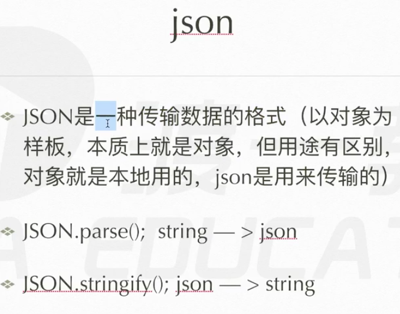
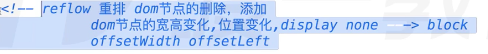
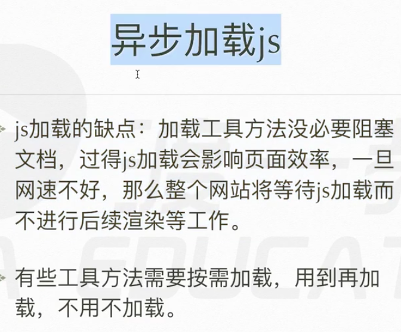
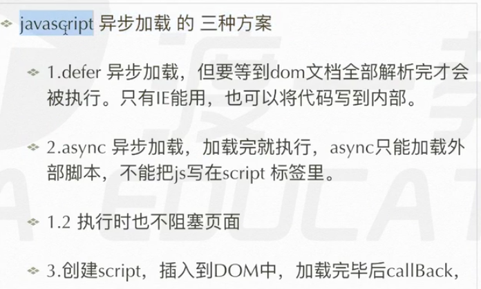
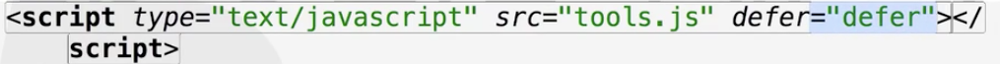
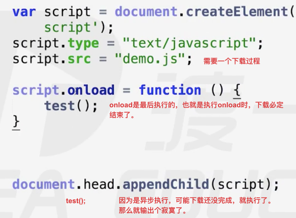
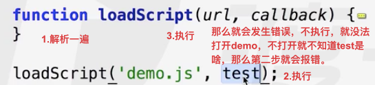
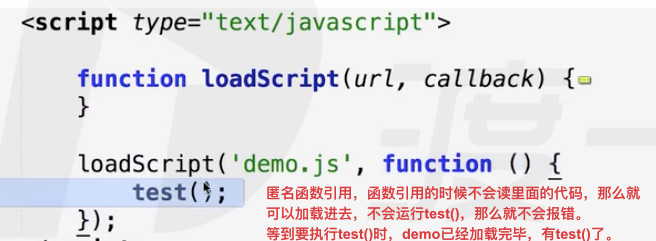
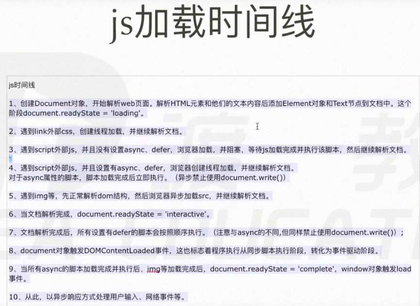
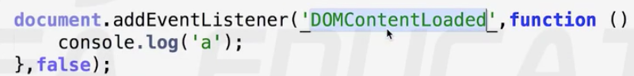

# json 异步加载 时间线



json --> {} 就是个对象

前端发送 数据 给 后端 数据通信

以什么样的格式发过去，又是接受什么格式 
以前是 以 xml语言的格式发送数据

现在数据传输 传的就是对象，这个对象就叫json
```js
var obj = {
    "name" : "deng",
    "age" : 123
    必须加双引号
}
通过JSON.stringify(obj)变成了字符串
‘{"name":"deng","age":123}'数据传输的是这么个字符串
后端拿到这个字符串之后，会解析成正常的json
后端传来一个字符串，就用JSON.parse(str)解析成正常的json

```
reflow重排，编程时要避免


repaint 重绘

异步加载js




```js
var div = document.crateElement('script');
script.type = "text/javascript";
script.src = "tools.js";
document.head.appendChild(script);
```
onload的用法

**ie 的 onload方法**
script.readyState = "loading" 加载中
script.readyState = "interactive" 激活状态
script.readyState = "loaded/cpmplete"; 加载完，这个状态码就会显示这2个值之一
script.onreadystatechange = function() {
    if(script,readyState == 'complete'||script.readyState == 'loaded') {
        callback();
    }
}
```js
// 兼容 按需异步加载的方式
function loadScript(url,callback){
    var script = doucment.createElement('script');
    script.type = "text/javascript";
    if(script.readyState) {
        script.onreadystatechange = function() {
            if(script,readyState == 'complete'||script. readyState == 'loaded') {
                callback();
            }
        }
    }else{
        script.onload = function() {
            callback();
        }
    }
    script.src = url;
    document.head.appendChild(script);
}
```
还有问题

解决方法

更好的解决办法
```js
function loadScript(url,callback){
    var script = doucment.createElement('script');
    script.type = "text/javascript";
    if(script.readyState) {
        script.onreadystatechange = function() {
            if(script,readyState == 'complete'||script. readyState == 'loaded') {
                tools[callback]();
            }
        }
    }else{
        script.onload = function() {
            tools[callback]();
        }
    }
    script.src = url;
    document.head.appendChild(script);
}
loadScript('demo.js',"test()");

demo.js
var tools = {
    test : fucntion(){console.log('a')}; ,
    demo : function(){}
}
```

js加载时间线


document.write() 具有消除文档的功能

总共就三点

1. 创建doucment对象 js可以运行了
2. 文档解析完了
3. 文档加载完了，执行完了

DOMContentLoaded 只有在 addEventListener事件上才能发生


在dom树构建完后 就异步执行js
jquery里有 $(document).ready(function(){}) 解析完就执行
window.onload区别 ，就是 onload要全部加载完再执行
