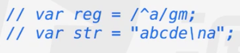

# 正则表达式

转义字符 \"
最基本的用法，输出不能输的字符

正则表达式的作用：匹配特殊字符或有特殊搭配原则的字符的最佳选择

## 正则表达式的创建方式
RegExp
1. 直接量(推荐直接用这个)
2. new RegExp()

var reg = /abc/;  正则表达式abc
var reg1 = new RegExp("abc",m);
var reg1 = new RegExp(reg,m);
var reg1 = RegExp(reg,m); reg1就是reg

## 测验方法
var reg = /abc/;
var str = "abcd";
reg.test(str); 看看str含不含reg规定的片段
str.match(reg); 在字符串里看有没有 符合reg片段的字符
## 正则表达式属性
var reg = /abcd/i; 忽视大小写
var reg = /abcd/g; 查找所有匹配的字符串，而不是在找到第一个后就停止
var reg = /abcd/m; 多行匹配 

m就这一个用

## 正则表达式
var reg = /[1234567890][1234567890][1234567890]/g; 片段位3位数字的都选 []代表区间
var reg = /[ab][cd]/; 可以匹配 ac ad bc bd 
var reg = /[0-9A-z][cd][d]/g;
var reg = /[^a]/ 除了a的所有
var reg = /(abc|bcd)/g; 括号 与 或
