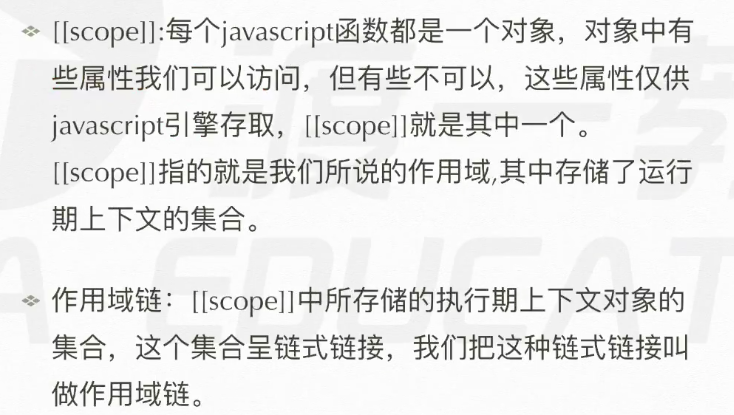
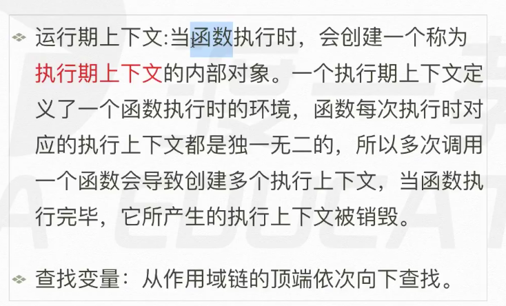
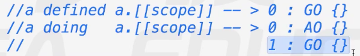
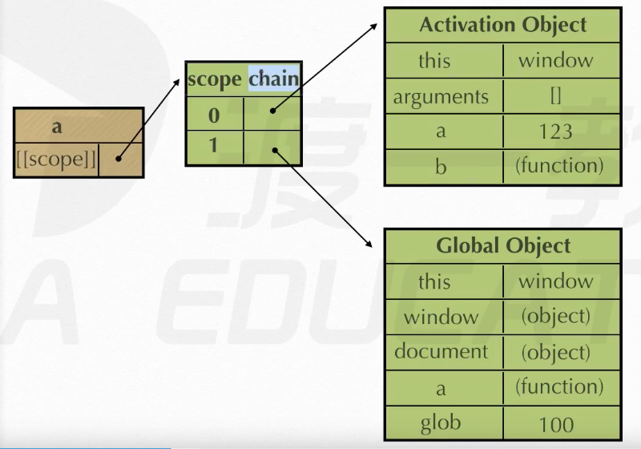
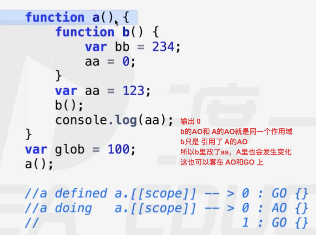

# 作用域
每个 javascript函数都是对象
每个 对象 都有 属性


执行期上下文 就是 AO GO


```js
function test(){

}
test.[[scope]]  作用域链 函数先在AO找，没有就去GO，就是体现之一
随着函数的产生而产生，但是无法访问，是给javascript用的。
```


AO是在函数执行时产生的,预编译不是只发生一次，GO的全局预编译只发生一次
当执行到script时，先语法解析一次，然后创建GO.
接着js开始执行代码，当执行到函数执行语句时，再一次预编译函数里的代码，创建AO后，再执行。而再预编译执行前 也就是AO创建前，a.[[scope]]里就有GO了，然后再加入后创建的AO。



