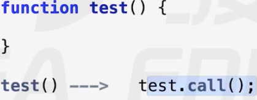
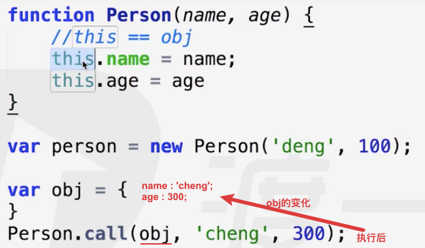
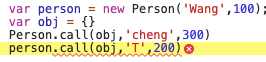
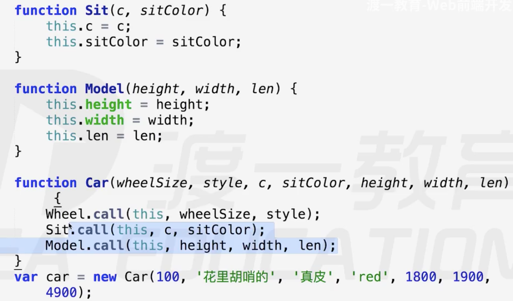
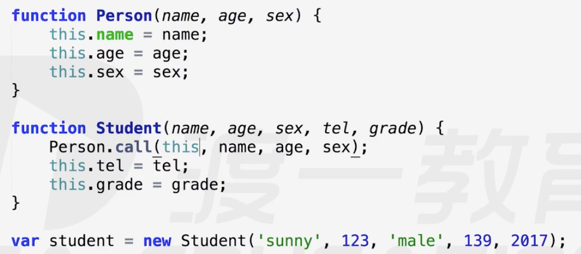

# call/apply

作用，改变this指向

区别，后面传的参数形式不同

**call** ———— 借用别人的函数实现自己的功能

只能函数用，对象没有call属性。

用别人造好的零部件，组装自己的车车

**函数用法**

apply

sit.call()    可以一位一位的传实参进去
sit.apply()   只能传一个实参列表
作用：都是改变this指向
区别只有：传参列表不同
