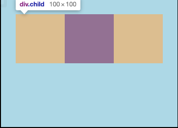
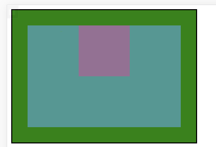
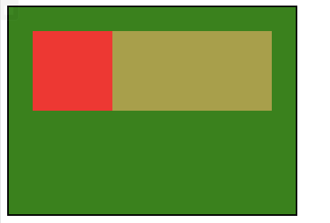

# 视觉格式化模型

css最重要的3个知识点：**属性值计算过程**、**盒模型**、**视觉格式化模型**

**盒模型**：规定单个盒子的规则

**视觉格式化模型(布局规则)**：页面中的多个盒子排列规则

**视觉格式化模型**：大体将页面中盒子的排列分为3种方式：

1. 常规流
2. 浮动
3. 定位

## 常规流布局
常规流、文档流、普通文档流、常规文档流，**一个意思**

所有元素，**默认情况下**，都属于**常规流布局**

总体规则：块盒独占一行，行盒水平排列

**包含块(containing block)**：每个盒子都有它的包含块，包含块决定了盒子的排列范围。相当于 **坐标系**

**黄色区域就是包含块**
绝大部分情况下：**盒子的包含块为其父元素的内容盒**

**块盒**

1. ***每个块盒的总长度，必须刚好等于包含块的宽度(绝大多数为父块的内容盒)***
   

**宽度的默认是auto**
margin的取值也可以是auto，**默认是0**
**auto**：将剩余空间吸收掉

**width吸收能力强于margin**

**若宽度、边框、内边距、外边距计算后，仍有剩余空间，该空间被margin-right吸收。**

在**常规流**中，**块盒**在其**包含块**中居中，可以定宽，然后左右设置auto。

1）. 每个块盒重置方向上的auto值

height：auto  适应内容上的高度

margin：auto  表示0

1. 百分比取值

padding、宽高、margin可以取值为百分比

**以上所有的百分比**相对于 **包含块的宽度**，和 **高度没关系**
高度的百分比：
1). 包含块的高度 取决于子元素的高度，设置百分比无效
2). 包含块的高度不取决于子元素的高度，百分比相对于父元素高度

4. 两个常规流块盒，上下外边矩相邻，会进行合并

中间的空白本来该100，但是合并了变成了50px，取最大值

