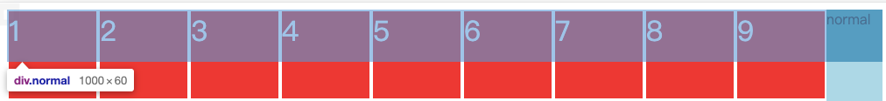
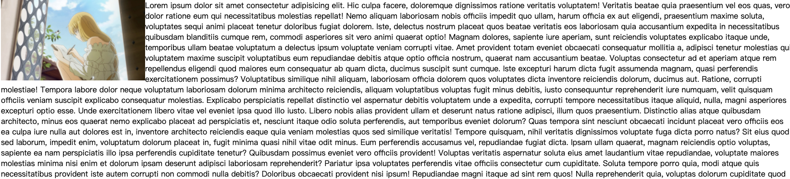

# 视觉格式化模型

## 浮动(兼容性最好的模型)

### 应用场景

1. 文字环绕(浮动盒子 + 文字行盒[会自动变成行盒])
2. 横向排列(行块盒 问题:空白折叠)、横向排列一般是浮动

### 浮动的基本特点

修改float属性值为:

- left: 左浮动，元素靠上靠左排列
- right:右浮动，元素靠上靠右排列

默认值为 **none**，常规流

1. 当一个元素浮动后，元素必定为块盒(更改display属性为块盒)
2. 浮动元素的包含块，和常规流一样，为父元素的内容盒
    

### 盒子尺寸

1. 宽度为auto时，适应内容宽度
2. 高度为auto时，与常规流一致，适应内容高度
3. margin为auto时，为0
4. 边框、内边矩、百分比设置与常规流一样

### 盒子排列

1. 左浮动的盒子靠上靠左排列
2. 右浮动的盒子靠上靠右排列
3. 浮动盒子在包含块中排列时，会避开常规流盒子
4. 常规流**块盒**在排列时，无视浮动盒子
    
5. 行盒在排列时，会避开浮动盒子
   
6. 外边距合并不会发生，这只会在常规流发生。
>如果文字没有在行盒中，浏览器会自动生成一个行盒包裹文字,该行盒称为匿名行盒

### 高度坍塌

**很多时候是造成网页样式混乱的根源**

高度坍塌的根源：**常规流盒子自动高度适应内容，在计算时，不会考虑浮动盒子**

解决方法：清除浮动，涉及css属性：**clear**
```md
clear：
- 默认值：none
- left：清除左浮动，**应用了clear属性的元素**必须出现在前面所有左浮动盒子的下方
- right：清除右浮动
- both： 清除左右浮动
- 伪元素选择器的使用的时候到了————3.选择器
```
