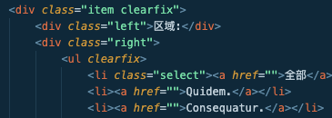
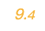

# 注意事件
做一个页面从大到小，从后到前
1. 哪个地方用了浮动，父元素就加上clearfix(清除浮动)
,即使现在没问题也要避免以后出问题

2. 选中第一个字符

```css
.main .container .movies .movie-item .score::first-letter{
    /* 选中元素里的第一个字母 */
    font-size: 1.2em;
}

```
3. css表中改变图片大小
```css
.main .container .movies .movie-item .poster img {
    /* 改变图片大小的方法，在css样式表中 */
    width: 160px;
    height: 220px;
}
```
4. 对固定对象改变样式
```css
.main .container .movies .movie-item:nth-child(6n){
    /* 选中括号里符合条件的类 并对其执行样式改变 */
    margin-right: 0px;
}
```

