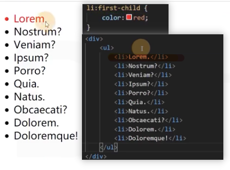
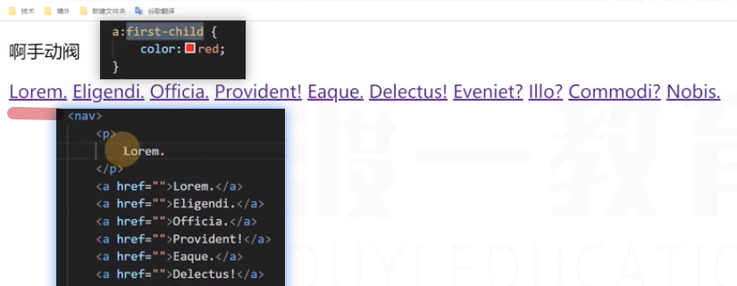
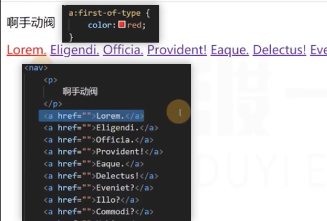
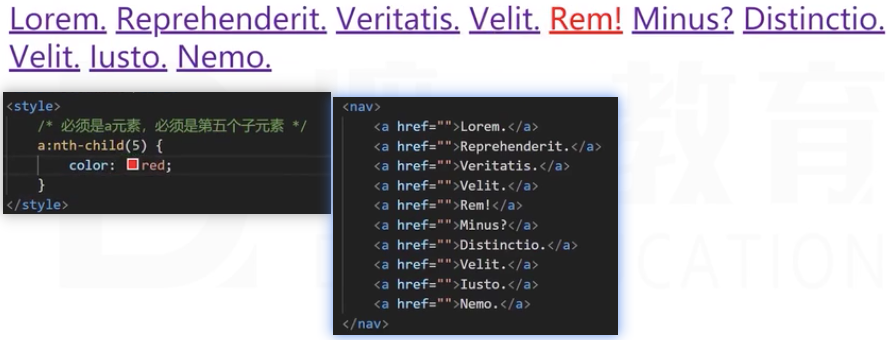
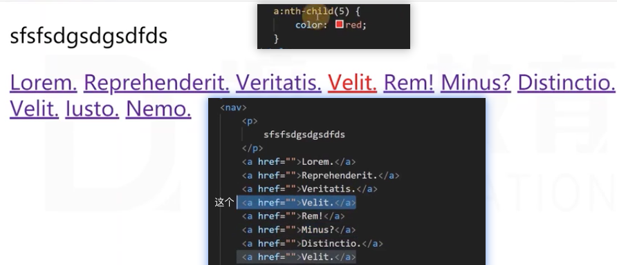
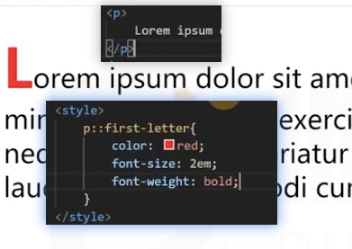
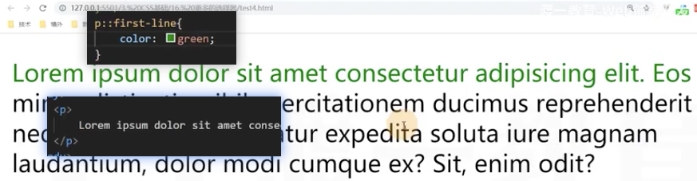
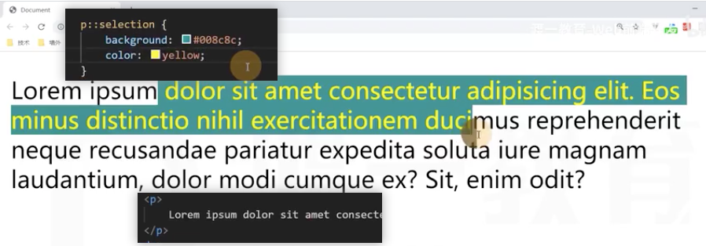

# 更多的选择器

## 更多伪类选择器

1. first-child

选中第一个子元素

必须是a元素，又必须是第一个子元素(**父元素是nav，父元素的第一个子元素是p**)

**fitst-of-type**，选中子元素中第一个指定类型的元素

2. last-child

**last-of-type**
**同first一模一样**，只是选择的是最后一个

3. nth-child

**选中指定的第几个子元素**

even(偶数)：关键字，等同于2n
odd(奇数): 等同于2n+1

1. nth-of-type

**同上，选中子元素中指定元素的第几个元素**

## 更多的伪元素选择器

1. first-letter

**选中第一个字母**

1. first-line

**选中元素中第一行的**

1. selection
   

选中被用户框选的文字

