# 更多的样式

## 透明度

1. opacity,它设置的是**整个元素**的透明度，**背景、边框、内容、所有东西** 取值0 ～ 1 通常不用
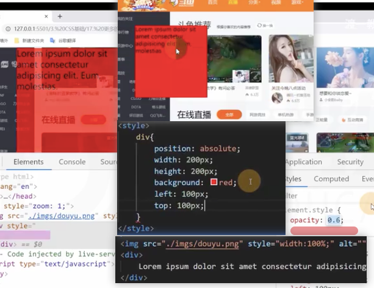
2. 在颜色位置设置alpha通道 rgba(0,0,0,0)
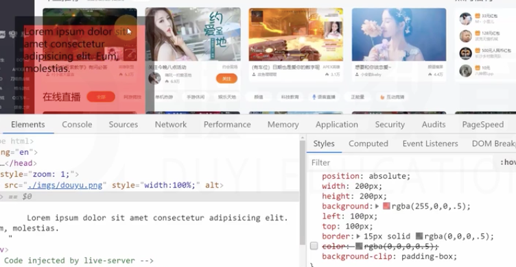
**可以精细的控制**，不同的属性不同的透明度

## 鼠标

**curson**
默认值auto，让浏览器自己控制

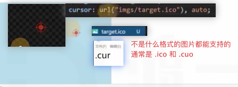

## 盒子隐藏

**display**:none; 不生产盒子，可能会影响其他元素
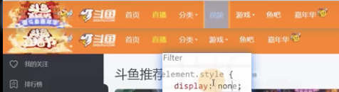

**visibility**：hidden 生成盒子，只是从视觉上移除盒子，盒子依旧占据空间
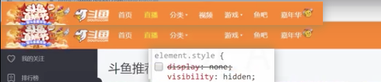

## 背景图

### 和img的区别
img元素是属于html的概念
背景图属于css的概念

1. 当图片属于网页内容时，必须使用img元素
2. 当图片仅用于美化网页时，必须使用背景图
   

### 涉及的css属性

1. **background-image**
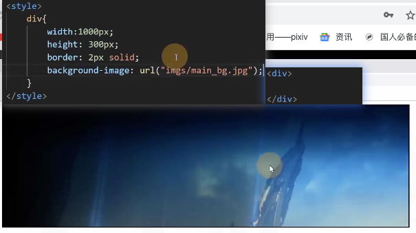

2. **background-repeat**
**默认情况下，图片没有铺满就会不断重复至铺满**
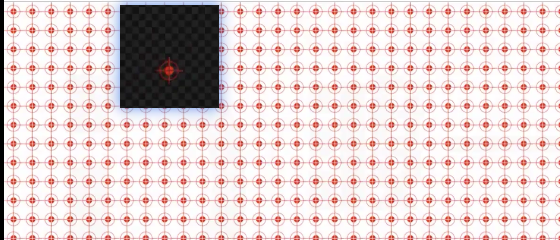
**设置background-repeat后**
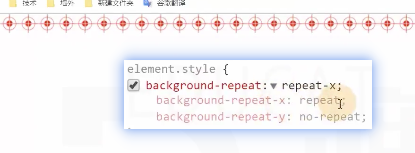

3. **background-size**
预设值：contain、cover，类似object-fit
**contain**
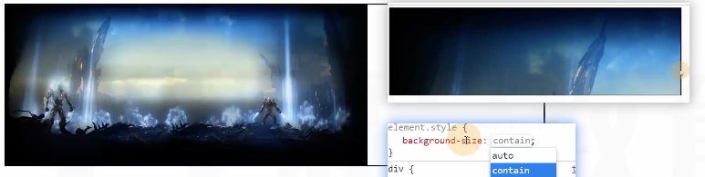
**cover**
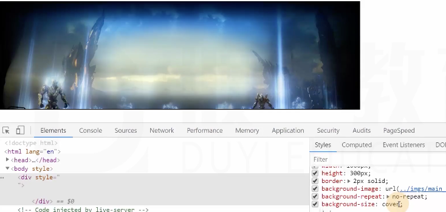
**数值或百分比**————**background-size**
100px,100px
100% 100%

4. **background-position**：
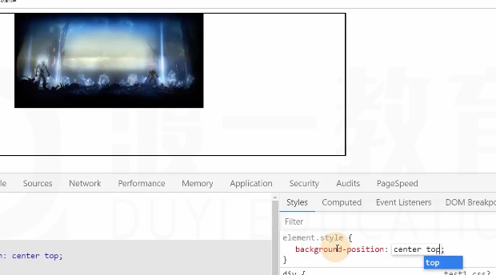

**预设值**：left、bottom、right、top、center

**数值或百分比**

**雪碧图**(精灵图)[spirit] 
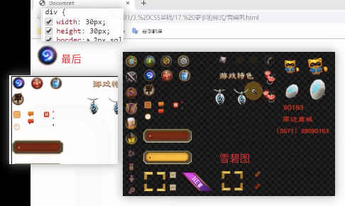

5. **background-attachment**
**通常用于固定背景图**
相当于定位里的 **固定定位**
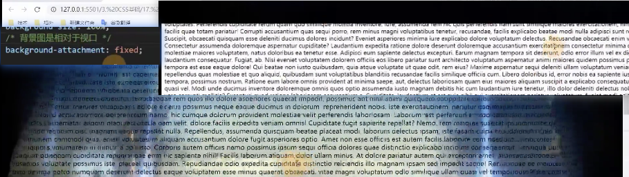

6. 背景图和背景颜色混用

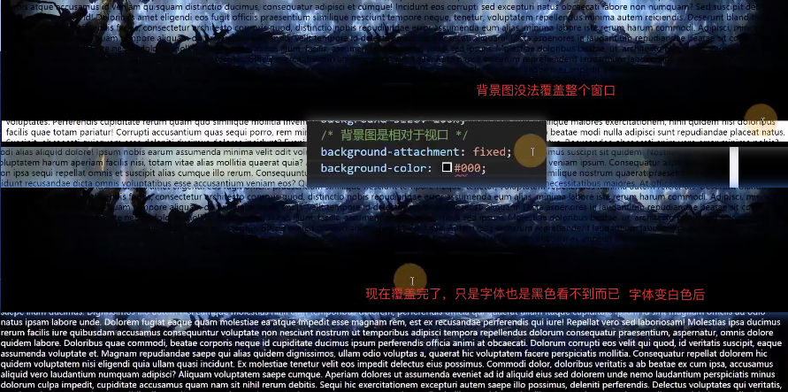

7. 速写属性 background

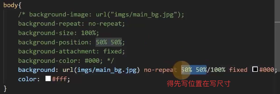

