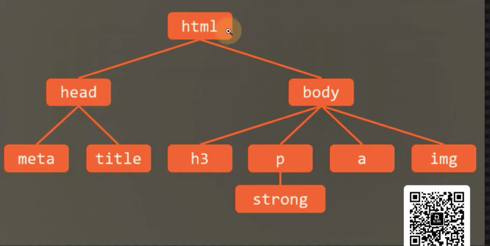
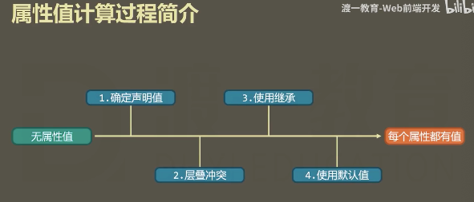
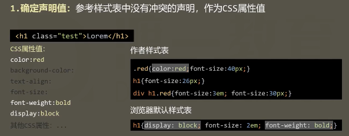
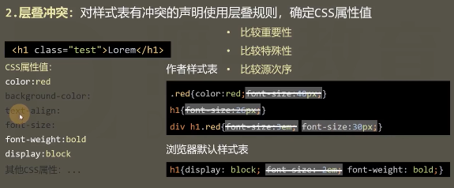
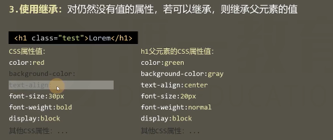

# 属性值的计算过程
**很重要**
讲的是页面渲染过程

搞懂了对页面渲染就会很清晰

## 核心
一个元素一个元素依次渲染，顺序按照页面文档的树形目录结构进行
从左至右

渲染每一个元素的前提条件：该元素的所有css属性必须有值

一个元素，从所有属性都没有值，到所有属性都有值，这个计算过程叫做**属性值计算过程**

**特殊的2个css取值**:
inherit：强制继承，将父元素的值去除应用到该元素
initial：设置为默认值
