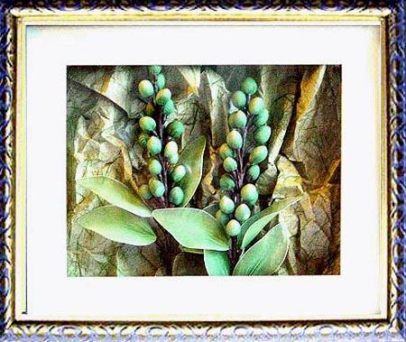

# 盒模型

**盒模型非常重要，没有它就做不出一个网页**
**网页是需要布局的**
box: 盒子，每个元素在页面中都会生成一个矩形区域(盒子)

盒子类型:
1. 行盒，display等于inline的元素  不换行
2. 块盒，display等于block的元素   换行
**之前的块级元素和行级元素的正确叫法**

display默认值为inline

浏览器模样样式表设置的块盒：容器元素、*h1～h6*、p 跟文本相关的
常见的行盒：span、a、img、video dudio 跟内容相关的

## 盒子的组成部分

无论行盒还是块盒，都由下面几个部分组成，从内到外分别是：
1. **内容**     content    快递盒子里的产品
   1. width、height，设置的是盒子内容的宽高
   2. 内容部分通常叫做整个盒子的**内容盒子 content-box**
2. **填充**     padding    快递中大量的泡沫 
**盒子边框到盒子内容的距离**
   1. padding-left、padding-right、padding-top、padding-botton
   2. **简写** **padding**: 上 右 下 左; 或 padding 上下 左右; padding:上下左右;
   3. **是像素**
   4. **填充区域**+**内容盒** = **填充盒**
3. **边框**     border     快递盒子 
   1. **边框** = 边框样式 + 边框宽度 + 边框颜色
   2. **边框样式**：border-style **默认没有**
   3. **边框宽度**：border-wedth **默认为0**
   4. **边框颜色**：border-color **默认字体颜色**
   5. **简写** **border**:**宽** **样式** **颜色**;
   6. **边框** + **填充区** + **内容区** = **边框盒 border-box**
4. **外边矩**   margin     **快递盒与快递盒的距离**
   1. **边框到其他盒子到距离**
   2. margin-top、margin-right、margin-bottom、margin-left
   3. **速写属性**margin

- 里面的画 就是 **内容**
- 空白 就是 **填充**
- 画框口 是 **边框**
- 这幅画和另一幅画的距离 就是 **外边框**
  

**行盒有点特殊**

