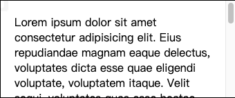
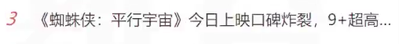
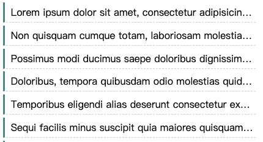

# 盒模型应用

[toc]
## 改变宽高范围

默认情况下，width 和 height 设置的内容盒宽高。

>页面重构师：将psd文件(设计稿)制作为静态页面

一个psd文件到手：
1. 量宽高
2. 开始规划做页面

- 内容盒 填充盒 边框盒
衡量设计稿尺寸的时候，往往使用的是边框盒，但设置width和height时，则设置但是内容盒
- 解决办法
精确计算
CSS3：box-sizing 盒子尺寸


## 改变背景覆盖范围

默认情况下，背景覆盖边框盒

可以通过background-clip进行修改

## 溢出处理

- overflow
控制内容溢出边框盒溢出后的

## 断词规则


**为什么amet后面还有空白，consectetur就换行了？**

- 原因，方便阅读
- 相关css属性
    1. word-break，会影响文字在什么位置被截断换行
    2. normal：普通。CJK字符(文字位置截断)，非CJK字符(单词位置截断)
    3. break-all：截断所有，所有字符都在文字处截断(感觉没用)
    4. keep-all：所有字符默认在单词位置截断，中文要加上空行了(更没用了)

## 空白处理

**非常有用**


**内容显示不下，用3个点代替**
**white-space: mowrap**

```css
/* 不换行，溢出了 */
white-space: nowrap;
/* 隐藏溢出 */
overflow: hidden;
/* 文字溢出的部分用原点代替 */
text-overflow: ellipsis;
只能控制单行文本，多行文本的隐藏只能js处理
```


