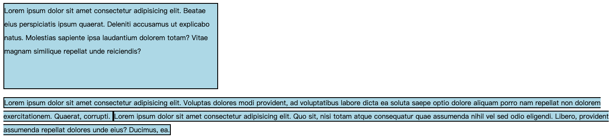
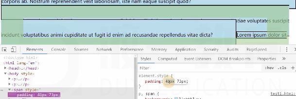
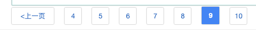
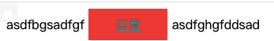
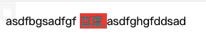
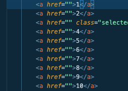

# 行盒的盒模型

**有很多差异，和块盒不一样**

- 常见的行盒:包含具体内容的元素
span、strong、em、i、迷宫、video、audio

## 显著特点

- 行盒的宽高是跟着内容走的，**因此行盒不能设置宽高**
- 因此要**调整行盒的宽高**，应该使用字体大小、行高、字体类型 **间接调整**
- 内边距(填充区)

水平方向有效，垂直方向仅会影响背景，不会实际占据空间
- 边框
水平方向有效，垂直方向仅会影响背景，不会占据实际空间
- 外边矩
水平方向有效，垂直完全无效

### 注意
1. 行盒不能设置宽高
2. 调整盒子宽高应用影响字体的元素间接影响
3. 对填充区、边框、外边矩的影响只有水平方向有效，垂直方向没用。

## 行块盒

**这就是行块盒**

display：inline-block 的盒子

1. 不独占一行
2. 但盒模型中所有尺寸都有效，也就上述都宽高、垂直方向

**而行盒**

## 空白折叠

**空白折叠，发生在行盒(行块盒)内部 或 行盒(行块盒)之间**
- 代码里的空白折叠

**行块盒无法解决这问题，除非你代码里不换行不加空白**
## 可替换元素 和 非可替换元素

大部分元素，页面上显示的结果，取决于元素里的内容，称为 **不可替换元素**
少部分元素，页面上显示的结果，取决于元素属性，称为 **可替换元素**
可替换元素：img、video、audio、按钮
绝大部分可替换元素均为 **行盒**
可替换元素类似于行块盒，盒模型中所有尺寸都有效。直接 == **行块盒**

