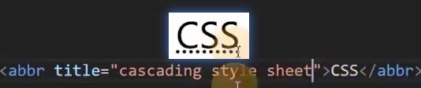
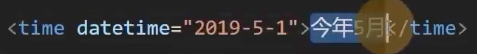
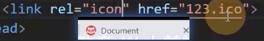

# 其他元素

1. abbr 文献中可能使用 很少用
    
2. time 给浏览器和搜索引擎看的时间 页面上不会显示
    
3. b 
   1. 以前是无语义元素，主要用于加粗字体
   2. 现在，效果加粗，机器阅读时会有些停顿
3. q
   1. 一小段引用文本
   2. 会自动加上个双引号
   3. 属性 cite 引用的链接地址，给浏览器看的
4. blockquote
   1. 大段饮用的文本
   2. 属性 cite
5. br
   1. 主要用于在文本中换行
6. hr(不建议用)
   1. 分割
7. meta
   1. 给搜索引擎看的，以后要让百度搜到自己的网站，就要填写相关信息
   2. 属性 description、author、keyword
8. link——链接外部资源(css、图标)
   1. rel属性：链接的资源和当前网页的关系
   2. type属性: 链接的资源的MIME类型，可以不写
   3. 图标
