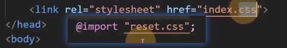
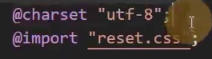

# @规则

at-rule：@规则、@语法、CSS语句、CSS指令

1. import

@import"路径";

导入另外一个CSS文件

相当于导入index.css后，index.css又先导入了reset.css，然后再导入自己写的样式
相当于2个 link了。

2. charset

@charset "utf-8";
告诉浏览器该css文件，使用的字符编码集是utf-8
必须写到第一行

出现中文建议写上。

