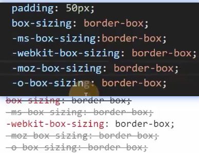
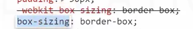

# 浏览器兼容性

## 问题产生原因

- 市场竞争
- 标准版本的变化

> chrome 54 支持部分css3的功能

## 厂商前缀

>比如：box-sizing, 谷歌旧版本浏览器中使用-webkit-box-sizing:border-box

- 市场竞争，标准没有发布
- 标准仍在讨论中(草案),浏览器厂商希望先支持

IE: -ms-
Chrome,safari: -webkit-
opera: -o-
firefox: -moz-
如果要更多的考虑兼容性问题的话，把厂商前缀加上

谁靠后谁胜出

> 浏览器在处理样式或元素时，使用如下的方式：
> 当遇到无法识别的属性时，直接跳过

## 浏览器自己独有的样式
1. 谷歌浏览器的滚动条样式
实际上，在开发中使用自定义的滚动条，往往是使用div+css+js实现的

多张图片 选择最合适的一张 显示

## css hack

根据不同的浏览器(主要针对IE)，设置不同的样式和元素
1. 样式

IE中，CSS的特殊前缀

- *属性，兼容IE5、IE6、IE7
- _属性，兼容IE5～IE6
- 属性值\9，兼容IE5～IE10
- 数值值\0，兼容IE8～IE10
- 属性值\9\0,兼容IE9~IE10

2. 条件判断

## 渐进增强 和 优雅降级

两种解决兼容性的思路，会改变代码的风格

- 渐进增强：先适应大部分浏览器，然后针对新版本浏览器加入新的样式

书写代码时，先避免书写有兼容性问题的代码，完成后，再逐步加入新标准中的代码

- 优雅降级，先制作完整的代码，然后针对低版本浏览器进行特殊处理

书写代码时，先不用特别在意兼容性，完成整个功能后，再针对低版本浏览器处理样式

## caniuse
查找css兼容性
[caniuse.com](https://caniuse.com/)
