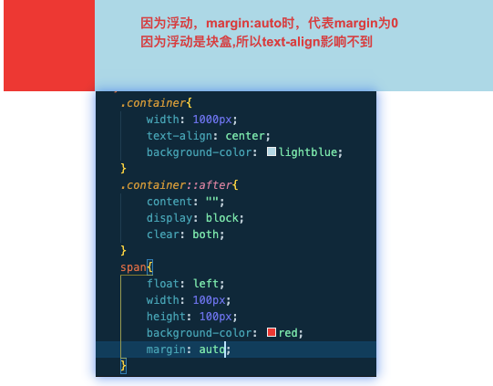

# 居中总结

居中：盒子在其包含块中居中

## 行盒(行块盒)水瓶居中

直接设置行盒(行块盒)父元素
```
text-align:center
```
## 常规流块盒水平居中

定宽，设置左右margin为auto

## 绝对定位元素的水平居中

定宽,设置左右的坐标为0(1eft:0, right:0),将左右 margin设置为auto
> 实际上,固定定位( fixed)是绝对定位( absolute)的特殊情况

## 浮动元素现在没啥好方法


除非主动设置margin-left的值

## 单行文本的垂直居中

设置文本所在元素的行高,为整个区域的高度

## 行块盒或块盒内多行文本的垂直居中

没有完美方案
设置盒子上下内边距(padding)相同,达到类似的效果

## 绝对定位的垂直居中

定高，设置上下的坐标为0(top、bottom),margin:auto;

## 块盒垂直水平居中的5种办法

fu是父盒
zi是子盒

```css
.fu{
    position: relative;
}
.zi{
    position: absolute;
    top: 50%;
    margin-top: -50px;
    left: 50%;
    margin-bottom: -50px;
}
```

```css
.fu{
    position: relative;
}
.zi{
    position: absolute;
    top: 0;
    left: 0;
    right: 0; 
    bottom: 0; 
    margin: auto;
}
```

```css
//添加以下样式(使用css3定义的新属性 IE10+)

.fu{display:flex;}

//将父元素设为弹性容器也可设为display:inline-flex;
//两者的区别是设为inline-flex该元素视为内联元素

.zi{margin:auto;}
```

```css
//使用css3定义的新属性 IE10+
.fu{
    display:flex;
    justify-content: center; //子元素水平方向居中
    align-items: center;//子元素垂直方向居中
}
```

```css
//IE10+
.fu{
    position: relative;
}
.zi{
    position: absolute;
    top: 50%;
    left: 50%;
    transform: translate(-50%,-50%);
    //使该元素分别向左和上移动宽高一半的距离
}
```