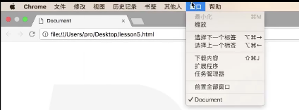

# javaScript发展史

**web最重要的东西**

**js知识点很多很多**

**js是基础**

## mosaic浏览器
1993年问世。
第一个获得普遍使用的网页浏览器
**作者：马克.安德森**
然后作者版权没了，接着创建了网景
## Netscape Navigator
公司：Netscape Communication Copropation(网景)
IE和火狐 根据这个浏览器为基础开发
**火狐前身**

## javaScript 1996年首次出现在浏览器上
作者：Brendan Eich
最初的设计目的改善网页的用户体验
最早叫：livescript
和sun公司合作后改名为 **javascript**
**接着javasrcipt被oracle收购了，javascript版权归oracle所有了**

## 浏览器组成

1. shell部分
   1. 这些部分就是shell部分，用户能操作的部分
2. 内核部分(看不到的，能够处理代码的，把代码运行出来的就是内核)
    1. 渲染引擎(语法规则、渲染) html+css 基础的识别，负责绘制部分
    2. js引擎  相当于汽车的马达
    3. 其他模块 

## js发展历史

2001年 ie6 ，对js引擎的优化和分离
2008年 google联合oracle 发布了 Chrome，采用了优化的js引擎，引擎代号V8，能把js代码直接转成机械码来执行，速度极快。
然后firefox也推出了具备强大功能的js引擎
    firefox3.5 TraceMonkey 强大在路径的优化
    firefox4.0 JeagerMonkey

## js的逼格

1. 解释性语言 —— (不需要编译成文件)跨平台
2. 单线程
3. ECMA

### 解释型
编译 
    全看完后通篇翻译代码成翻译完的文件，之后程序执行它(c\c++)
    优点；快、能做底层
    缺点：移植性不好(不垮平台)

java———> javac --> 编译 -->.class --->jvm ---->编译

解释
    看一行翻译一行，执行一行(php、js)
    优点：跨平台
    缺点：稍微慢

### 单线程和多线程

计算机先干一件事再干另一件事，单线程，叫 **同步**
计算机一起干多件事，多线程，**异步**

### ECMA

javascript == ECMAscript

然后推出了 DOM 和 BOM
- 浏览器提供的
DOM操作文档的
BOM操作浏览器的

## js三大部分

ECMAscript
DOM
BOM
