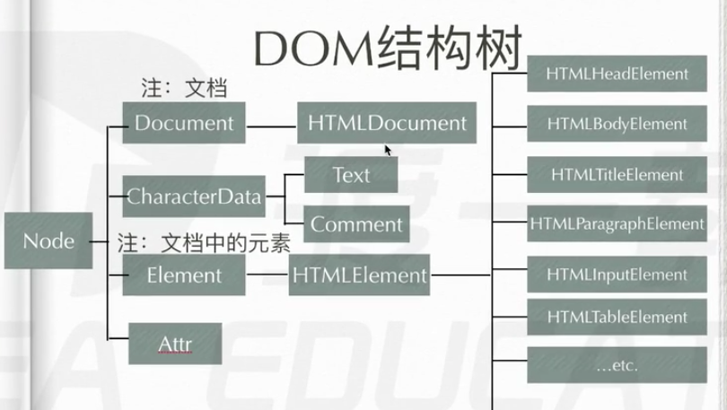
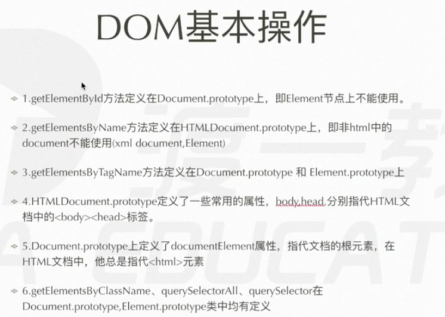
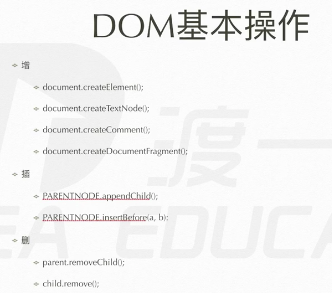
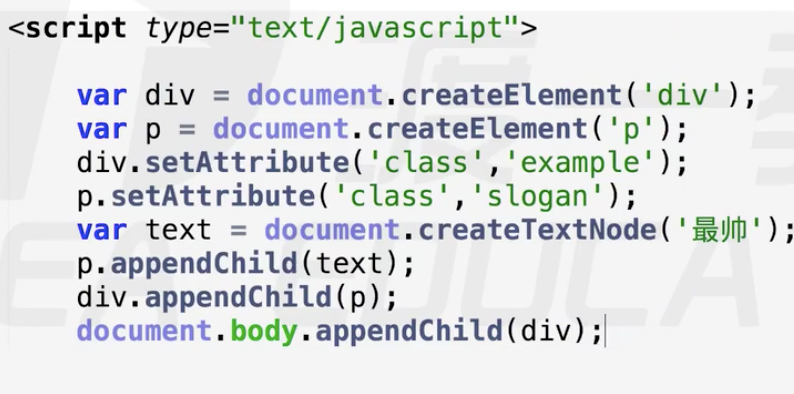

# dom继承树 dom基础操作

document --> HTMLDocument.prototype --> Document.prototype --> Node --> EventTarget --> Object
HTMLDocument --> Document --> Node --> EventTarget --> Object

## 增加节点

1. document.createElement('div');  创建元素节点
2. document.createTextNode(‘text’); 创建文本节点
3. document.createComment(注释’); 
4. document.createDocumentFragment(‘文档节点’);
创建后，在html页面还没有,只是单纯在 js里了，还要插入之后才能实现

## 插入节点
parentnode 是父节点，可以是div、span、strong一切元素
比如 div 那么就是在  
 
里面插入节点
1. parentnode.body.appendChild()
    把js创建的元素扔到 html页面里
    任何一个元素节点都有这个方法
    如果是页面里没有的元素，那么就是直接的 push
    如果是页面里有的元素，那么就是 剪切
2. parentnode.insertBefore(a,b)

## 删除节点

1. parent.removeChild() 从父元素中 剪切初一个 子节点
2. child.remove() 销毁自身

## 替换
1. parent.replaceChild(new,origin)
    拿新的替换旧的

## Element节点

### 属性

**取document对象的文本内容**
1. innerHTML 取全部
    div.innerHTML 可以拿出div里的内容
    div.innerHTML = '123' 直接覆盖之前的div内容
    div.innerHTML += '456' 在最后加入456
    div.innerHTML = " 123"
2. innerText(firefox不兼容)/textContent(老IE不好使)
document.body.innerHTML = "

"; 给body里加入一个div
### 方法
**给对象设置 类、id的**
1. ele.setAttribute()  
    div.setAttribute('class','demo');
    div.setAttribute('id','only');
2. ele.getAttribute()
    div.getAttribute('id');
    div.getAtteibute('class');

