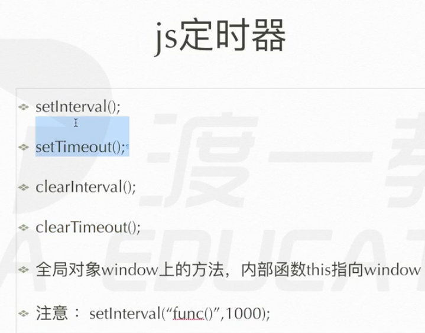
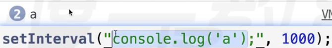

# dom对象 计时器

## 日期对象
日期对象，系统构建好的
var date = new Date();

w3c school


## 定时器


```js
var timer = setInterval(function(){},xxxx);
每隔xxxx毫秒(xxxx只识别一次)，运行一次function(){}
setInterval 非常不准
window上的方法
返回一个数字 作为 它的唯一标识 第几个计数器
那么就可以用这个标识删除它
clearInterval(timer);
```

```js
var timer = setTimeout(function(){},xxx);
等到xxx毫秒后，执行function(){}
只执行一次
clearTimeout(timer);
```

另外的用法

