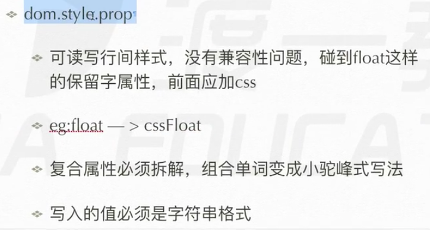
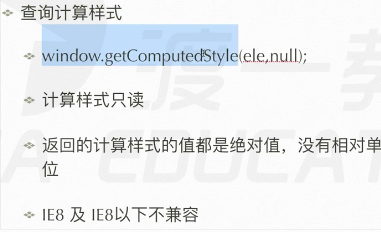

# 脚本化css
## 读写css属性
脚本化 控制的意思
读写元素css属性
dom.style.prop



```js
div.style.prop
a.style.prop
span.style.prop
是间接改变css属性值 只能改变行间属性，写在css样式表和外部样式的没用
比如
<div style = "width:100px;">
div.style.width = "200px";
<div style = "width:200px;"> 是可以的
复合属性必须拆解，变成小驼峰式
比如 border-width ---> div.style.borderWidth
```
## 查询计算模式
简介操作css属性(读写),除了上面的style方法，再也没有任何方法能写入值了。



```js
window.getComputedStyle(div,null);
window.getComputedStyle(div,null).width;
绝对值 获取的值最后都是计算后的 像素px 而不是10em这些值
IE8及以下不兼容
div.currentStyle ---> CSSStyleDeclaration
第二个参数 null 能获取伪元素的样式，就是干这个的。null是不获取
只有这种方法能获取伪元素
比如:
div{}
div::after{}
window.getComputedStyle(div,"after"); 也修改不了,普遍没用
```


```js
兼容性封装
function getStyle(elem,prop) {
    if(window.getComptedStyle) {
        return window.getComputedStyle(elem,null)[prop];
    }else{
        return elem.currentStyle[prop];
    }
}
```