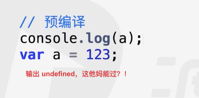
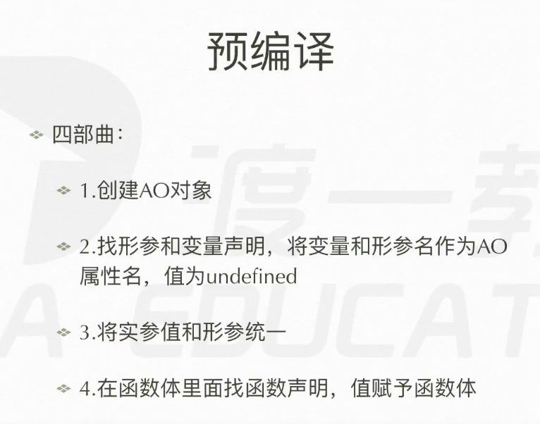
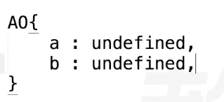
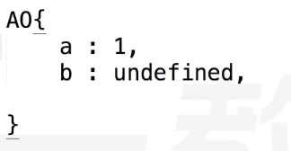
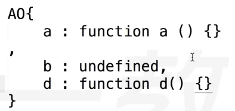
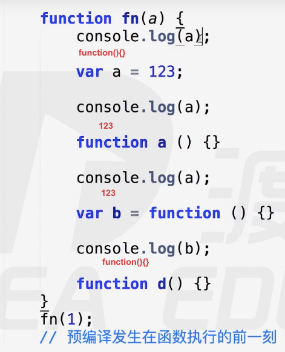
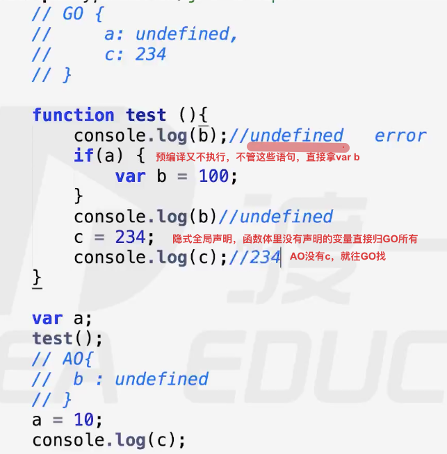

# 预编译

// 预编译

在执行代码之前，先通篇扫描一遍有无语法错误—————语法分析过程
分析完后，就进行预编译过程。
之后才是 执行代码



// 函数声明整体提升
// 变量 声明提升


## 全局变量域 window
a = 12;  未经声明就赋值自动归全局对象(window)所有

一切声明的全局变量，归window所有

全局变量声明  var a = 123;  ---> window.a = 123;

window 就是 全局的域
```js
<javascript>
var a = 10;  归window所有 全局变量
b = 10;      归window所有 全局变量
function temp(){
    var c = 10;   不归window所有 局部变量
    d = 10;       归window所有   全局变量
    var e = f = 10; e不归window所有，f归window所有
}
</javascript>
```

## 预编译过程


**发生在函数体里的过程**:
1.  
2. 
3. 
4. 
   function(){}  是 代表 这个函数体的全部文本
预编译的结果，变量声明、函数声明、实参也都传递了


发生在全局的预编译过程:
1. 生成一个GO(Bolobal Object)对象   GO === window
2. 找变量声明
3. 找函数声明

变量、函数名 不是归AO所有，就是归GO所有，AO里没的就是GO的。这也就是隐式全局变量的根源。




## 注意事项

```js
if(a) {
    var b = 123;
    function c(){

    }
}
现在过不了了，语法错误。以前是可以过的
```