# 对象


## 对象的书写
**函数的书写**
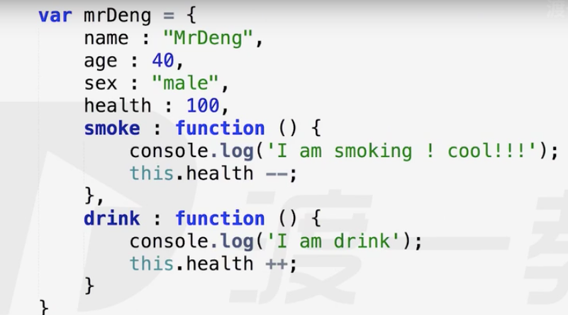
**对象的操作**
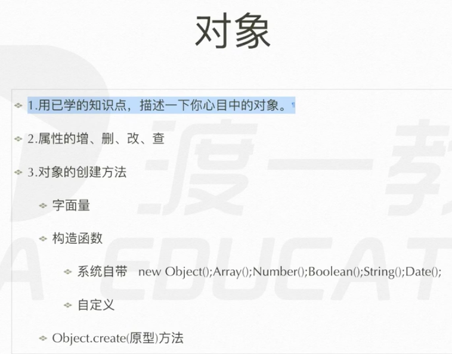
**构造函数的书写**
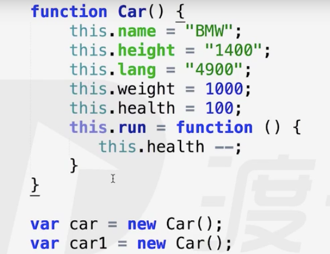
为了流程化的方法，类必须这么写

**构造函数原理**
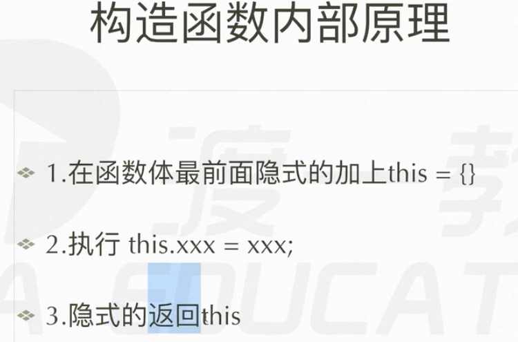
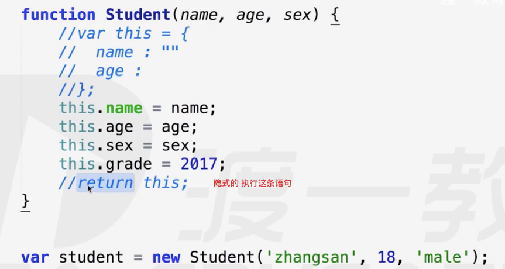

## 对象的增加

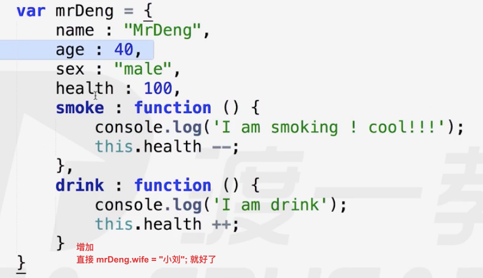

## 对象的删除

delete 对象.属性


## 对象的修改

mrDeng.wife = "xiaoliu"
mrDeng.wife = "xiaowang";   // 修改

## 查看
直接 console.log(mrDeng.wife)就好了

## 对象的创建方法

1. var obj = {} // plainObject 对象字面量
2. 构造函数
   1. 系统自带的构造函数   Object() Number() Array()
      - var obj = new Object();
      - obj.name = "abc"
   2. 自定义的
      - 构造函数 结构上和 函数 一点分别也没有
      - 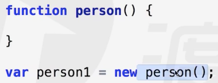
      - 构造函数命名必须 符合 **大驼峰式命名规则**
      - 和后端语言的类 没区别
   3. Object.create(原型)
      - 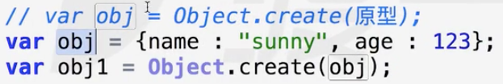

undefined 、 null 不能有自己的属性，也就是不能成为类


## 对象创建的实质

```js
function Person() {
    this.name = "MrWang";
}
var person = new Person();
```
1. 当执行到new Person()时，先在Pesson()里创建一个对象 var this = {}
2. 然后 执行 this.name = "MrWang"; 将其放入到this对象中
3. 最后 隐式的 return this


## 包装类
把 原始值 包裹成 一个类 这种类就是 包装类
```js
var num = 4; // 原始值是不可能有属性的
num.len = 3; // 不会报错 
conslole.log(num.len); // 输出undefined
```
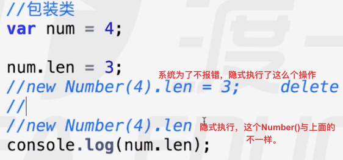
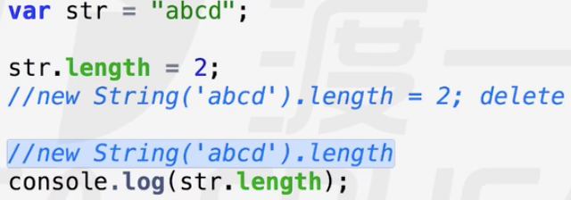
str.length 是 取的包装类的 属性

## 原型
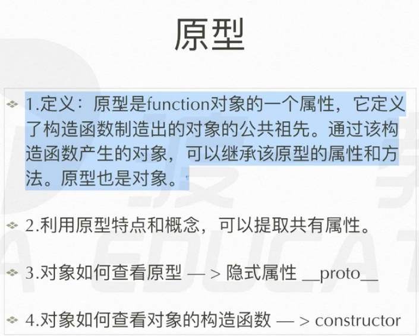

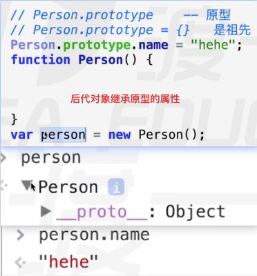
### 原型的书写方式
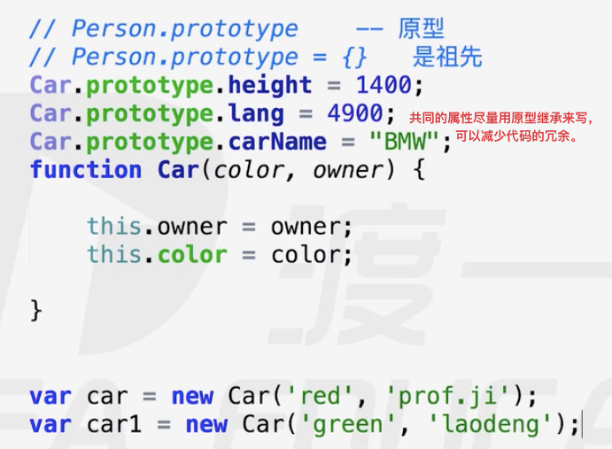
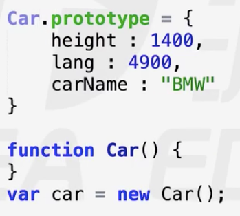

### 原型的实质


```js
function Person() {
    this.name = "MrWang";
}
var person = new Person();

刚创建this对象时候,this就自带有__proto__,指向Person.prototype对象
this = {
    __proto__ : Person.prototype;
}
因此 可以 通过 this.__proto__ = 某对象  改变 Person的祖先
```


### 更换原型的方法
1. prototype属性
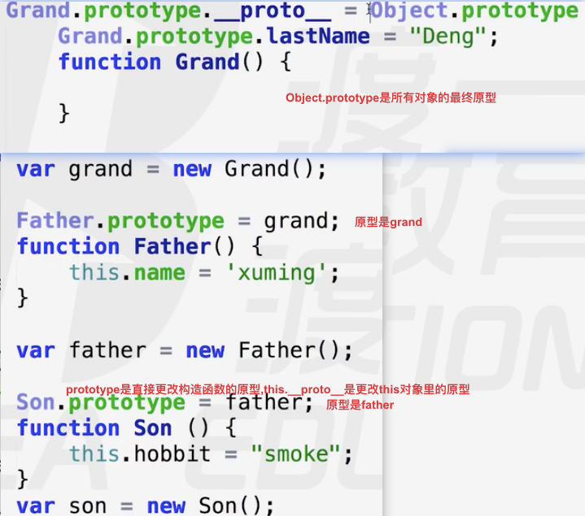
2. this.\_\_proto__
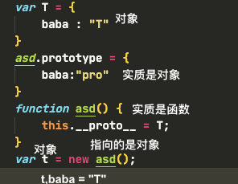

## 原型链
千层饼一样的东西，一级一级的原型连起来就是原型链
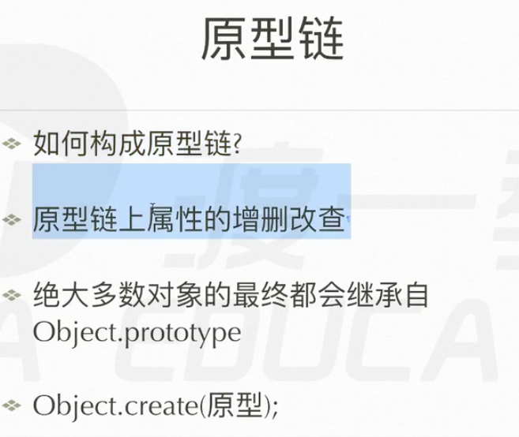


# 容易出错的地方

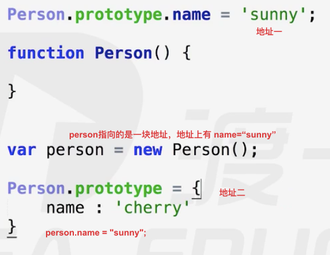

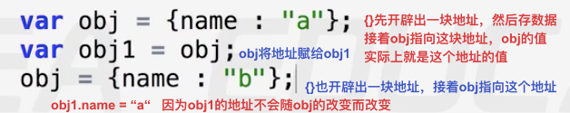


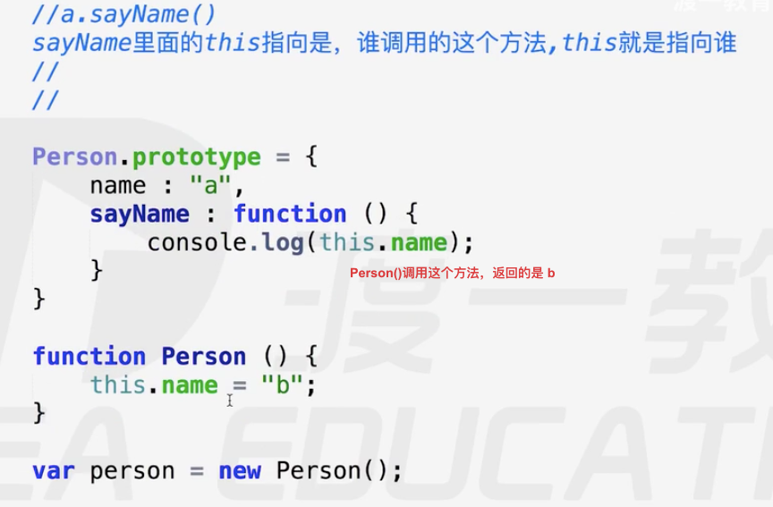

绝大多数对象的原型最终都指向Object.prototype
例外 通过 原型构造的对象 var t = Object.create(null),它没有原型
还有 undefined
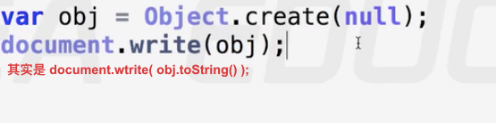

## 重写
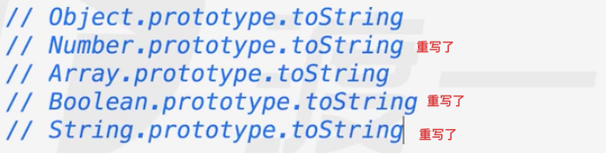
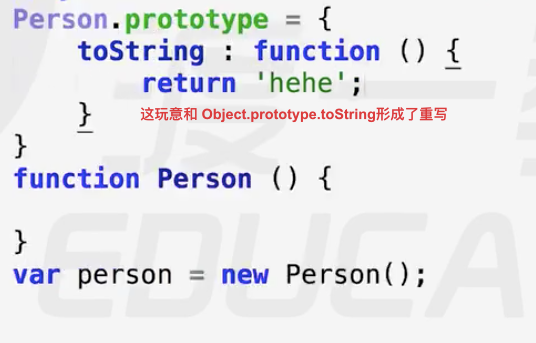


## 数学类
可正常计算的范围    前16位 后16位
Math.ceil() 向上取整
Math.floor() 向下取整
Math.random() 0～1随机数
Math.tofix(i) 保留i位小数