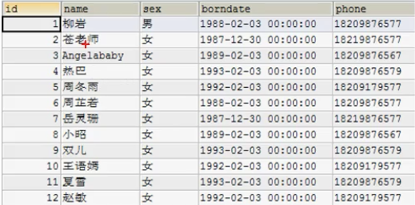

# Mysql基础

## 数据库的好处
1. 持久化数据到本地
2. 可以实现结构化查询，方便管理
## 数据库相关概念

1. DB(datebase) 数据库 保存一些列有组织的数据
2. DBMS(database management system)  数据库管理系统 数据库是通过DBMS创建和操作的容器
3. SQL(System Query Language)
   结构化查询语言，专门用来和数据库通信的语言
   不是某个特定数据库专有的语言，是所有的DBMS都支持的
   
## 数据库存储数据的特点
1. 将数据放到表中，表再放到库中
   表
2. 一个数据库中可以有多个表每个表都有一个名字，用来标识自己。表名具有唯一性
3. 表就有一些特性，这些特性定义了数据再表中如何存储，类似java中“类”的设计
4. 表由列组成，我们也称为字段。所有表都是由一个或多个列组成。每一个列类似java中的“属性”
5. 表中的数据是按行存储的，每一行类似于java中的“对象”

## DBMS的分类
- 基于共享文件系统的DBMS(Access)
- 基于客户机————服务器的DBMS(Mysql、Oracle、SqlServer) 属于C/S架构

## MySQL服务的登陆登出🌟
- 方法一:通过mysql自带的客户端 只限于root用户
- 方法二:通过windows自带的客户端
  登陆: mysql [-h主机名 -P端口号] -u用户名 -p密码
  推出 exit或command+C

## MySQL的常见命令
1. 查看当前所有数据库
   show databases;
2. 打开指定的库
   use 库名
3. 查看当前库的所有表
   show tables;
4. 插件其他库的所有表
   show tables from 库名;
5. 创建表
   create table 表名(
       列名 列类型,
       列名 列类型,
       ....
   );
6. 查看表结构
   desc 表名;
7. 查看服务器版本
   - select version();
   - mysql --version;
   - mysql --V;

## Mysql语法规范
1. 不区分大小写，但建议关键字大写，表名 列名小写
2. 每条命令最好用分号结尾
3. 每条命令如果根据需要，可以进行锁紧或 换行
4. 注释 
   - 单行注释: #注释文字
   - 单行注释: -- 注释文字
   - 多行注释: /* 注释文字*/
