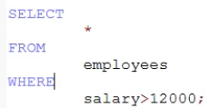
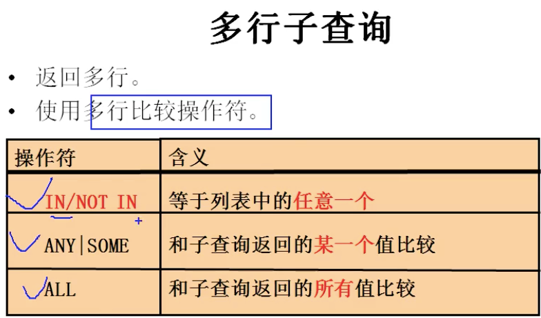

#  DQL语言🌟

[toc]

- SQL细分

1. DQL data query langueage 查询语言
   - 关键字：SELECT----FROM----WHERE
2. DML 数据操纵语言
   - 关键字：INSERT、UPDATE、DELETE
3. DDL 混合表的定义
   - 关键字：CREATE、DROP、ALTER
4. TCL语言 事务控制语言
   - 关键字：COMMIT、ROLLBACK、SAVEPOINT
5. DCL 数据控制语言 权限的控制
   - 关键字：GRANT、REMOVE

---

##  DQL语言 查询语句

SELECT 数据查询语句

### 基础查询

```sql
select 查询列表 from 表名;
```

**特点**:

```sql
1. 查询的结果是一个虚拟的表格
2. 查询列表可以是: 表中的字段、常量值、表达式、函数
```

**查询字段**

```sql
1. 查询表中的单个字段
   SELECT 字段 FROM 表名;
2. 查询表中的多个字段
   SELECT 字段、字段、字段 FROM 表名;
3. 查询表中的所有字段
   SELECT * FORM 表名;
```

**查询常量值**

```sql
1. SELECT 100;
2. SELECT 'john';
```

**查询表达式**
```sql
SELECT 100%98;
```

**查询函数**
```sql
SELECT VERSION();
```

**起别名**

```sql
1. SELECT 100 % 98 AS 结果;
SELECT last_name AS 姓,first_name AS 名 FROM employees;
2. SELECT last_name 姓,first_name 名 FROM employees;
好处: 便于理解、如果要查询的字段有重名的情况，使用别名可区分
```

**去重**
```sql
SELECT **DISTINCT** 表名 FROM 表名;
```

**连接字段**
```sql
SELECT CONCAT(last_name,first_name) AS 姓名
FROM employees;
```

**拼接问题**
```sql
拼接字段中有NULL存在，则直接变为NULL
- 解决 字段连接如果有字段位NULL，则直接显示NULL的问题
IFNULL(commission_pct,0)
```

---

### 条件查询

**语法**: 

```sql
select 
    想要查询的列表
from
    表名
where
    筛选条件;
```

**分类**

```sql
- 按条件表达式筛选
    条件运算符: > < = != <> <= >=
- 按逻辑表达式筛选
    逻辑运算符: &&    ||   !
              and   or   not
- 模糊查询
    like
        一般和通配符搭配使用
            通配符:
                % 任意多个字符，包含0个字符
                _ 任意单个字符
            转义字符:
                \_ \%
    between and
        可以提高语句的简洁度
        等价于 >= =<
        between 100 and 120,必须左小右大
    in
        判断某字段的值是否属于in列表中的某一项
        使用in提高语句简洁度
    is null｜is not null
        = <> 不能判断NULL
    <=> 安全等于
        is null 和 = 的结合体
```

---

**按条件筛选举例**



---

**按逻辑运算符筛选举例**


---

**模糊查询举例**

```sql
like
    一般和通配符搭配使用
        通配符:
            % 任意多个字符，包含0个字符
            _ 任意单个字符
        转义字符:
            \_ \%
```


---

**转义方式-除了使用转义字符**


---

```sql
between and
    可以提高语句的简洁度
    等价于 >= =<
    between 100 and 120,必须左小右大
```


---

```sql
in
    判断某字段的值是否属于in列表中的某一项 
    使用in提高语句简洁度
```


```sql
is null
is not null
    = 和 <> 不能判断NULL
```


```sql
安全等于 <=>
    is null 和 = 的结合体
    可读性比较差，因此很少用
```

---

###  排序查询

**语法**

```sql
select 查询列表
from 表
[where 筛选条件]
order by 排序列表 [asc/desc]
                  up  down
                  不写默认升序
```


**特点**
```sql
1. asc升序，desc降序
    不写默认升序
2. order by子句中可以支持单个字段、多个字段、表达式、函数、别名
3. order by子句一般是放在查询语句的最后面，limit子句除外
```


### 常见函数

```sql
调用:select 函数名(实参列表) [from 表];
```
```q
分类:
   1. 单行函数
        如 concat、length、ifnull等
   2. 分组函数
        功能功能:做统计使用的，又称为统计函数、聚合函数、统函数
```
分为:
字符函数

数学函数
日期函数
其他函数
流程控制函数

一、**字符函数**

```sql
length 获取参数值的字节个数
SELECT LENGTH('john'); 返回4
SELECT LENGTH(‘张三丰hahaha’) 返回15，一个汉字返回3字节
```

```sql
concat 拼接字符串
SELECT CONCAT(last_nmew,' ',first_name) 姓名 FROM 表名;
```
```sql
upper \ lower
SELECT UPPER('john'); 变大写
SELECT LOWER('joHn'); 变小写
```

```sql
substr \ substring 索引
mysql索引从 1 开始
SELECT SUBSTR('李莫愁爱上了陆展元',7) out_put; 陆展元
SELECT SUBSTR('李莫愁爱上了陆展元',1,3) out_put; 李莫愁
```

```sql
instr 返回字串第一次出现的索引，找不到返回0
SELECT INSTR('杨不悔爱上了殷六侠','殷六侠') AS out_put;返回 7
```

```sql
trim 去掉前后字母，不指定，默认为空格
SELECT TRIM('   张翠山   ') AS out_put; 返回 张翠山
SELECT TRIM('a' FROM 'aaaaa张aaaa翠山aaaaaaaaaaa') AS out_put; 返回 张aaaa翠山
```

```sql
lpad 用指定的字符实现左填充指定长度
SELECT LPAD('殷素素',10,'*') AS out_put; *******殷素素
SELECT LPAD('殷素素',2,'*') AS out_put; 殷素
rpad 用指定的字符实现右填充指定长度
SELECT RPAD('殷素素',12,'ab') AS out_put;
```

```sql
replace
SELECT REPLACE('周芷若周芷若张无忌周芷若','周芷若','赵敏') AS out_put; 返回 赵敏赵敏张无忌赵敏
```

二、**数学函数**

```sql
round 四舍五入
SELECT ROUND(1.45);  返回1.5
SELECT ROUND(-1.55);  返回-2
SELECT ROUND(1.5678,2); 返回1.57
```

```sql
ceil 向上取整
SELECT CEIL(1.52); 返回 2
SELECT CEIL(-1.02) 返回-1
floor 向下取整
SELECT FLOOR(-9.99); 返回-10
```

```sql
truncate 截断
SELECT TRUNCATE(1.699999，1); 返回1.6
SELECT TRUNCATE(1.699999，2); 返回1.69
```
```sql
mod 取余 相当于 %
SELECT MOD(-10,-3); 
```

三、**日期函数**
```sql
now 返回当前系统日期+时间
SELECT NOW();
curdate 发挥当前系统时期
SELECT CURDATE();
curtime 返回当前时间，不包含日期
SELECT CURTIME();
```

```sql
可以获取指定的部分，年、月、日、小时、分钟、秒
SELECT YEAR(NOW()) 年;
SELECT YEAR('1998-1-1') 年;
SELECT YEAR(hiredate) 年 FROM employees; hiredate是入职时间

SELECT MONTH(NOW()) 月;  返回 9
SELECT MONTHNAME(NOW()) 月;  返回 September
其他同理 day、hour、minute、second
```


四、**其他函数**
```sql
SELECT VERSION();
SELECT DATABASE();
SELECT USER();
```

五、**流程控制函数**
1. 
```sql
if函数 if else 的效果
SELECT IF(10>5,'大','小'); 返回大
```


2. 
```sql
case函数
第一种用法 switch case的效果
switch(变量或表达式){
    case 常量1: 语句1; break;
    case 常量2: 语句2; break;
    case 常量3: 语句3; break;
    case 常量4: 语句4; break;
}
case 要判断的字段或表达式
when 常量1 then 要显示的值1或语句1;
when 常量2 then 要显示的值2或语句2;
when 常量3 then 要显示的值3或语句3;
when 常量4 then 要显示的值4或语句4;
else 要显示的值n或语句n;
end
第二种用法 类似于多重if语句
case
when 条件1 then 要显示的值1或语句1
when 条件1 then 要显示的值2或语句2
when 条件1 then 要显示的值3或语句3
when 条件1 then 要显示的值4或语句4
else 要显示的值n或语句n;
end
```


### 分组函数

用作统计使用，又称为聚合函数或统计函数或组函数
1. 分类:
sum 求和、avg 平均值、max 最大值、min 最小值 count 计算个数
```sql
SELECT SUM(salary) FROM employees; 返回salary所有工资想加后的 数
SELECT AVG(salary) FROM employees; 平均工资
SELECT MAX(salary) FROM employees; 最高工资
SELECT MIN(salary) FROM employees; 最低工资
SELECT COUNT(salary) FROM employees;  计数
```
2. 参数支持哪些类型
```sql
SUM AVG 一般处理 数值型
MAX MIN COUNT 支持 字符、数值、日期
```
3. 是否忽略null
    所有分组函数都忽略null值
4. 和distinct搭配
```sql
SELECT SUM(DISTINCT salary) FROM employees; 支持
SELECT COUNT(DISTINCT salary) FROM employees; 支持
AVG MAX MIN 也都支持
```
5. count函数的详细介绍
```sql
SELECT COUNT(salary) FROM employees;
SELECT COUNT(*) FROM employees; 通常用于统计行数
```
- 效率
  - MYISAM存储引擎下， COUNT(*)的效率高
  - INNODB存储引擎下，COUNT(*)和COUNT(1)的效率差不多，比COUNT(字段)要高一点

6. 和分组函数一同查询的字段要求是group by后的字段

   ```sql
   SELECT AVG(salary),employee_id FROM employees;返回的数据无意义
   ```

### 分组查询

**语法**

```sql
# 语法
SELECT 分组函数,列
FROM table
[WHERE 筛选条件]
[GROUP BY 分组的列表]
[ORDER BY 子句];
```


**举例**

```sql
# 案例一 查询每个工种的最高工资
SELECT MAX(salary),job_id
FROM employees
GROUP BY job_Id;
# 案例二 查询每个位置上的部门个数
SELECT COUNT(*),location_id
FROM departments
GROUP BY location_id;

# 添加筛选条件
# 案例一 查询邮箱中包含a字符的，每个部分的平均工资
SELECT AVG(salary),department_id
FROM employees
WHERE email LIKE '%a%'
GROUP BY department_id;
# 案例二 查询有奖金你的每个领导手下员工的最高工资
SELECT MAX(salary),manager_id
FROM employees
WHERE commission_pct is not NULL
GROUP BY manager_id;

# 添加复杂的删选条件
# 案例一 查询每个部门的员工人数
SELECT COUNT(*),department_id
FROM employees
GROUP BY department_id;
# 案例二 根据一的结果进行筛选，查询哪个部门的员工人数>2
SELECT COUNT(*),department_id
FROM employees
GROUP BY department_id
HAVING COUNT(*) > 2;

# 习题一 查询每个工种有奖金的员工的最高工资>12000的工种编号和最高工资
SELECT MAX(salary),job_id
FROM employee
WHERE commission_pct IS NOT NULL
GROUP BY job_id
HAVING MAX(salary) > 12000
# 习题二 查询领导编号>102的每个领导手下最低工资>5000的领导编号是哪个，以及其最低工资
SELECT MIN(salary),manager_id
FROM employee
WHERE manager_id > 102
GROUP BY manager_id
HAVING min(salary) > 5000;
```

**特点**

```sql
1.分组查询种的筛选条件分为两类
								数据源				位置				 	关键字
		分组前筛选		 原始表			group by前面   where
		分组后筛选    结果表			group by后面   having
    分组函数做条件肯定是放在 having子句种
		能用分组前筛选的，优先考虑分组前筛选————性能问题
2. group by子句支持单个字段分组，多个字段分组用逗号隔开(没有顺序要求)，表达式或函数(用的较少)
3. 也可以添加排序(排序放在整个分组查询的最后)
```

**按表达式或函数分组**

```sql
# 案例一 按照员工姓名的长度分组，查询每一组的员工个数，筛选员工个数>5的有哪些
SELECT COUNT(*),LENGTH(laset_name) len_name
FROM employees
GROUP BY LENGTH(first_name)
HAVING COUNT(*) > 5;

# 按多个字段进行分组
# 案例一 查询每个部门每个工种的员工的平均工资
SELECT AVG(salary),department_id,job,id
FROM employees
GROUP BY department_id,job_id;

# 添加排序

# 案例一 查询每个部门每个工种的员工的平均工资，并且降序排序
SELECT AVG(salary),department_id,job,id
FROM employees
GROUP BY department_id,job_id
ORDER BY AVG(salary) DESC;
```

---

### 连接查询

> **含义** : 又称为多表查询，当查询的字段来自于多个表时，就会用到连接查询

**笛卡尔集错误样例**:  

​	`	SELECT name,boyName FROM beauty,boys;`

​	`	SELECT count(*) from beauty;`  输出12行

​	`SELECT count(*) form boys;` 输出4行

​		最后输出 12 * 4 = 48行

​		**原因**：没有有效的连接条件

**解决方法**：加上有效的连接条件		

 ```sql
SELECT name,boyName FROM boys,beauty
WHERE beauty.boyfriend_id = boys.id;
 ```

---

**分类**

```markdown
- 按年代分类
		sql192标准 只支持内连接
		sql199标准 支持内连接+外连接(左外+右外) + 交叉连接
- 按功能分类
	 内连接
			等值连接
			非等值连接
			自连接
	 外连接
		左外连接
		右外连接
		全外连接
	 交叉连接
```

---

#### sql192标准

一、**等值连接**

```sql
# 案例一 查询女神名和对应的男神名
SELECT name,boyName
FROM boys,beauty
WHERE boys.id = beauty.id; 最关键 实际上 还是查询48次，但是 WHERE 进行了筛选

# 案例二 查询员工名和对应的部门名
SELECT last_name,department_name
FROM employees,departments
WHERE employees.`department_id` =  
			departments.`department_id`;
```

1. 为表起别名

   ```markdown
   1. 提高语句的简洁度
   2. 区分多个重名的字段
   >注意：如果为表起了别名，则查询的字段就不能用原来的表名去限定
   ```

   ```sql
   # 案例一 查询员工名、工种号、工种名
   SELECT last_name,employees.job_id,job_title
   FROM employees,jobs
   WHERE employees.`job_id` = jobs.`job_id`
   		表名太长了，难阅读
   SELECT last_name,e.job_id,job_title
   FROM employees e,jobs j
   WHERE e.`job_id` = j.`job_id`;
   ```

2. 两个表的顺序可以替换

3. 可以加筛选

   ```sql
   # 案例一 查询有奖金的员工名、部门名
   SELECT last_name,department_name
   FROM employees e,department d
   WHERE e.`department_id` = d.`department_id`
   AND e.commission_pct IS NOT NULL;
   # 案例二 查询城市名重第二个字符为o的部门名和城市名
   SELECT department_name,city
   FROM departments d,locations l
   WHERE d.`location_id` = l.`location_id`
   AND city LIKE '_o%';
   ```

4. 可以加分组

   ```sql
   # 案例一 查询每个城市的部门个数
   SELECT COUNT(*) 个数,city
   FROM depantments d,location l
   WHERE d.`location_id` = l.`location_id`
   GROUP BY city;
   # 案例二 查询有奖金的每个部门的部门名和部门的领导编号和该部门的最低工资
   SELECT department_name,d.manage_id,MIN(salary)
   FROM departments d,employees e
   WHERE d.`department_id` = e.`department_id`
   AND commission_pct IS NOT NULL
   GROUP BY department_name;
   ```

5. 可以加排序

   ```sql
   # 案例一 查询每个工种的工种名和员工的个数，并且按员工个数降序
   SELECT job_title,COUNT(*)
   FROM employees e,jobs j
   WHERE e.`job_id` = j.`job_id`
   GROUP BY job_title
   ORDER BY COUNT(*) DESC;
   ```

6. 可以实现三表连接

   ```sql
   # 案例一 查询员工名、部门名和所在的城市
   SELECT last_name,department_name,city
   FROM employees e,departments d,locations l
   WHERE e.`department_id` = d.`department_id`
   AND d.`location_id` = l.`location_id`;
   ```

- **特点**

  ```markdown
  1. 多表等值连接的结果为多表的交集部分
  2. n表连接，至少需要n-1个连接条件
  3. 多表的顺序没有要求
  4. 一般要起别名
  5. 可以搭配前面介绍的所有子句使用，比如排序、分组、筛选
  ```

---

二、**非等值连接**

```sql
# 案例一 查询员工的工资和工资级别
SELECT salary,grade_level
FROM employees e,job_grades j
WHERE salary BETWEEN g.`lowest_sal` AND g.`highest_sal`;
```


**可以实现的操作 和 等值连接一摸一样,区别就是 WHERE子句不再是 = 而是其他操作符**

---

三、**自连接**

实际就等同于等值连接，但是只涉及 自己一个表，自己和自己连接

不是任何表都能做到的

```sql
# 查询 员工名和上级的名称
SELECT e.employee_id e.last_name,m.employee_id,m.last_name
FROM employees e,employees m
WHERE e.`employee_id` = m.`employee_id`;
```

---

#### sql199语法

**语法**

```sql
select 查询列表
from 表1 别名 [连接类型]
join 表2 别名
on 连接条件
where 筛选条件    sql192连接条件也是写在where 不容易区分
```

**连接类型分类**

```markdown
- 内连接 ：inner
- 外连接
			左外 : left[outer]
			右外 : right[outer]
			全外 : full[outer]
- 交叉连接 : cross
```

---

一、***内连接***

```mysql
select 查询列表
from 表1 别名
inner join 表2 别名
on 连接条件;
```

- 分类

  ```markdown
  - 内连接
  		1. 等值
  		2. 非等值
  		3. 自连接
  ```

---

1. 等值连接

   ```mysql
   # 案例一 查询员工名、部门名
   SELECT last_name,dapartment_name
   FROM employees e
   INNER JOIN deaprtments d
   ON e.`department_id` = d.`department_id`;
   # 案例二 查询名字中包含e的员工名和工种名(添加筛选)
   SELECT last_name,job_title
   FROM employees e
   INNER JOIN jobs j
   ON e.`job_id` =j.`job_id`
   WHERE last_name LIKE '%e%';
   # 案例三 查询部门个数>=3的城市名和部门个数(添加分组+筛选)
   SELECT city,COUNT(*) 部门个数
   FROM departments d
   INNER JOIN locations l
   ON d.`location_id` = l.`location_id`
   GROUP BY city
   HAVING count(*) > 3
   # 案例四 查询哪个部门的员工个数>3的部门名和员工个数，并按照个数降序(排序)
   SELECT department_name,COUNT(*) 个数
   FROM employees e
   INNER departments d
   ON e.`department_id` = d.`department_id`
   GROUP BY department_name
   HAVING COUNT(*) > 3
   ORDER BY COUNT(*) desc;
   # 案例五 查询员工名 部门名 工种名 并按照部门名降序(添加三表连接)
   SELECT last_name,department_name,job_title
   FROM employees e
   INNER JOIN departments d ON e.`department_id`=d.`department_id`
   INNER JOIN jobs j ON e.`job_id` = j.`job_id`
   ORDER BY department_name DESC;
   ```

   特点

   ```markdown
   1. 添加排序、分组、筛选
   2. inner可以省略
   3. 帅选条件放在where后面，连接条件放在on后面，提高分离性，便于阅读
   4. inner join连接和sql192中的等值连接效果是一样的，都是实现多表交集
   ```

2. 非等值连接

   ```mysql
   # 查询员工的工资等级
   SELECT salary,grade_level
   FROM employees e
   JOiN job_grades g
   ON e.`salary` BETWEEN g.`lowest_sal` AND g.`highest_sal`;
   # 查询工资级别个数>20的个数，并且按照工资级别降序
   SELECT COUNT(*),grade_level
   FROM employees e
   JOiN job_grades g
   ON e.`salary` BETWEEN g.`lowest_sal` AND g.`highest_sal`;
   GROUP BY grade_level;
   HAVING COUNT(*) > 20
   ORDER BY grade_level desc;
   ```

3. 自连接

   ```mysql
   # 查询员工的名字、上级的名字
   SELECT e.last_name,m.last_name
   FROM employees e
   JOIN employees m
   ON e.`manager_id` = m.`employee_id`
   # 查询姓名中包含字符k的员工的名字，上级的名字
   SELECT e.last_name,m.last_name
   FROM employees e
   JOIN employees m
   ON e.`manager_id` = m.`employee_id`
   WHERE e.`last_name` LIKE '%k%';
   ```

---

二、***外连接***


**应用场景**

```markdown
- 用于查询一个表中有，另一个表没有的记录
```

**特点**

```markdown
1. 外连接的查询结果为主表中的所有记录
		如果从表中有和它匹配的，则显示匹配的值
		如果从表中没有和它匹配的，则显示null
		外连接查询结果 = 内连接结果 + 主表中有而从表没有的记录
2. 左外连接：left outer join左边的是主表
	 右外连接：right outer join右边的就是主表
3. 左外和右外交换两个表的顺序，可以实现同样的效果
```

**左右外案例**

```mysql
# 查询男朋友 不在男神表的女神名
# 左外连接
SELECT b.name,bo.*
FROM beauty b
LEFT OUTER JOIN boys bo
ON b.`boyfriend_id` = bo.`id`;
WHERE bo.`id` IS NULL;
# 右外连接
SELECT b.name,bo.*
FROM boys bo
RIGHT OUTER JOIN beauty b
ON b.`boyfriend_id` = bo.`id`;
WHERE bo.`id` IS NULL;
# 案例一 查询哪个部门没有员工
SELECT d.*,e.employee_id
FROM dapartments d
LEFT OUTER JOIN employees e
ON d.`department_id` = e.`dapartment_id`
WHERE e.`employee_id` IS NULL;
```

**全外连接**

语法

```mysql
SELECT b.*,bo.*
FROM beauty b
FULL OUTER JOIN boys bo
ON b.`boyfriend_id1 = bo.id;
```

特点

> 由三部分组成 全外 = 内连接的结果 + 表1独 + 表2独

---

三、***交叉连接***

**语法**

```mysql
SELECT b.*,bo.*
FROM beauty b
CROSS KOIN boys bo;
笛卡尔乘积
```

---

### 子查询

> 含义：出现在其他语句中的select语句，称为子查询或内查询
>
> 外部的查询语句，称为主查询或外查询

内部嵌套其他select语句的查询，称为外查询或主查询

**举例**

```mysql
SELECT first_name
FROM employees
WHERE department_id IN(
	SELECT dapartment_id FROM dapartments
  WHERE location_id = 1700
) 一般子查询 需要 小括号
```

**分类**

```markdown
- 按子查询出现的位置：
		select后面:
					仅仅支持标量子查询
		from后面:
					支持表子查询
		where或having后面: ❤️
					标量子查询   ❤️
					列子查询     ❤️
					行子查询
		exists后面(相关子查询):
					表子查询
- 按结果集的行数不同:
		标量子查询(结果集只有一行一列)
		列子查询(结果集只有一列多行)
		行子查询(结果集有一行多列)
		表子查询(结果集一般为多行多列)
```

---

一、***where或having后面***❤️

1. 标量子查询(单行子查询) ❤️
2. 列子查询(多行子查询)❤️
3. 行子查询(多列多行)

- 特点

  ```markdown
  1. 子查询放在小括号内
  2. 子查询一半放在条件的右侧
  3. 标量子查询，一般搭配着单行操作符使用
  		 > < >= <= = <>
  4. 列子查询，一般搭配着多行操作符使用
  		in any/some all
  ```

**标量子查询案例**————只能单行单列 其他都会报错

- ```mysql
  # 案例一 谁的工资比Abel 高
  SELECT *
  FROM employees
  WHERE salary > (
  		SELECT salary
    	FROM employees
    	WHERE last_name = 'Abel';
  )
  # 案例二 返回job_id与141号员工相同,salary比143号员工多的员工的 姓名,job_id和工资
  SELECT last_name,job_id,salary
  FROM employees
  WHERE job_id = (
  		SELECT job_id
    	FROM employees
    	WHERE employee_id = 141
  ) AND salary > (
  		SELECT salary
    	FROM employees
    	WHERE employee_id = 143
  );
  # 案例三 返回公司工资最少的员工的last_name,job_id salary
  SELECT last_name,job_id,salay
  FROM employees
  WHERE salary = (
  		SELECT MIN(salary)
    	FROM employees;
  )
  # 案例四 查询最低工大于50号部门最低工资的部门id和最低工资
  SELECT department_id,MIN(salary)
  FROM employees
  GROUP BY department_id
  WHERE MIN(salary) > (
  		SELECT MIN(salary),department_id
    	FROM employees
    	WHERE department_id = 50
  )
  ```

**列子查询**(多行子查询)————一列多行



- **案例**

  ```mysql
  # 案例一 返回location_id是1400或1700的部门中所有员工姓名
  SELECT last_name,location_id
  FROM employees
  WHERE department_id IN (
  		SELECT DISTINCT department_id
    	FROM departments
    	WHERE location_id IN(1400,1700)
  );
  # 案例二 返回其他部门中比job_id为`IT_RPOG`部门任一工资低的员工的员工号、姓名、job_id 以及 salary
  SELECT employee_id,last_name,job_id,salary
  FROM employees
  WHERE salary < ANY(
  		SELECT DISTINCT salary
    	FROM departments
    	WHERE job_id = 'IT_RPOG'
  ) AND job_id <> 'IY_PROG';
  # 案例三 返回其他部门中比job_id为`IT_RPOG`部门所有工资低的员工的员工号、姓名、job_id 以及 salary
  SELECT employee_id,last_name,job_id,salary
  FROM employees
  WHERE salary < ALL(
  		SELECT DISTINCT salary
    	FROM departments
    	WHERE job_id = 'IT_RPOG'
  ) AND job_id <> 'IY_PROG';
  ```

***行子查询***(结果集一行多列或多行多列)

- ```mysql
  # 案例一 查询员工编号最小并且工资最高的员工信息
  SELECT *
  FROM employees
  WHERE (employee_id,salary) = (
  		SELECT MIN(employee_id),MAX(salary)
    	FROM employees
  )
  ```

- 特点

  - 只能用等于号 = , 很有局限性

---

二、***放在select后面***

- 只支持标量子查询

- 案例

  ```mysql
  # 案例一 查询每个部门的员工个数
  SELECT d.*,(
    SELECT COUNT(*)
    FROM employees
    WHERE e.department_id = d.department_id
  ) 个数
  FROM departments d;
  # 案例二 查询员工号=102的部门名
  SELECT (
  	SELECT department_name
  	FROM departments d
  	INNER JOIN employees e
    ON d.department_id = e.department_id
    WHERE e.employee_id = 102
  ) 部门名;
  ```

---

三、***from后面***

- 案例

  ```mysql
  # 案例一 查询每个部门的平均工资的工资等级
  SELECT ag_dep.*,g.grade_level
  FROM (
    SELECT AVG(salary) ag,department_id
    FROM employees
    GROUP BY department_id
  ) ag_dep
  INNER JOIN job_grades g
  ON ag_dep.ag BETWEEN lowest_sql AND highest_agl
  ```

> 将子查询结果充当一张表，要求必须起别名

---

四、***exists后面的子查询***————相关子查询

- 语法

  ```mysql
  # exists的语法 是个布尔值 只返回1、0 代表是否存在
  SELECT EXISTS(
    SELECT employee_id 
    FROM employees
  )
  # 案例一 查询有员工名的部门名
  SELECT department_name
  FROM deparmtents d
  WHERE EXISTS(
    SELECT *
    FROM employees e
    WHERE d.department_id = e.department_id
  ) 
  SELECT department_name
  FROM departments d
  WHERE d.department_id IN(
    SELECT department_id
    FROM employees
  );
  # 案例二 查询没有女朋友的男神信息
  SELECT bo.*
  FROM boys bo
  WHERE NOT EXISTS(
    SELECT boyfriend_id
    FROM beauty b
    WHERE bo.id = b.boyfriend_id
  );
  SELECT bo.*
  FROM boys bo
  WHERE bo.id NOT IN(
    SELECT boyfriend_id
    FROM beauty
  )
  ```

> 能用exists的地方都能用in

---

### 分页查询 ❤️

> 应用场景 ：页面显示不下时要换页显示 
>
> ​						分页提交sql请求

**语法**

```mysql
SELECT 查询列表						7
FROM 表									1
[JOIN type] JOIN 表2			2
ON 连接条件								3
WHERE 筛选条件						4
GROUP BY 分组字段					5
HAVING 分组后的筛选				 6
ORDER BY 排序的字段			  8
limit offset,size; 			 9
		offset要显示条目的起始索引(从0开始)
		size 要显示的条目个数
```

**案例**

```mysql
# 查询0-5条信息
SELECT *
FROM employees
LIMIT 0,5;  当从第一条开始时可以简写 LIMIT 5;
# 查询11-25条信息
SELECT *
FROM employees
LIMIT 10,15;
# 有奖金的员工信息，并且工资较高的前10名显示出来
SELECT *
FROM employees
WHERE commission_pct IS NOT NULL
ORDER BY salary desc
LIMIT 0,10;
```

**特点**

```markdown
- limit语句放在查询语句的最后面
公式
	要显示的页数 page，每页条目数size
  select 查询列表
  form 表
  limit (page-1)*size,size;
```

---

### union联合查询

> Union 联合 合并：将多条查询居于的结果合并成一个结果

案例

```mysql
# 案例一 查询部门编号 > 90或邮箱包含a的员工信息
SELECT * FROM employees WHERE email LIKE '%a%' OR id>90;
-->
SELECT * FROM employees WHERE email LIKE '%a%'
UNION
SELECT * FROM employees WHERE id>90;
```

**语法**

```mysql
查询语句1
UNION
查询语句2
....
查询语句n
```

> 应用场景 : 要查询的结果来自多个表，且多个表没有直接的联系，但查询的信息一样。

```mysql
SELECT id,cname,csex FROM t_ca WHERE casex='男'
UNION
SELECT t_id,tname,tgender FROM t_ua WHERE tgender='male';
```

**特点**

```markdown
1. 要求多条查询语句的查询列数时一致的
		因为是多个表连接在一起成为一个表，如果列数不一样，就没法形成一个表了
2. 要求多条查询语句的查询的每一列的类型和顺序最好一致
3. union关键字默认去重，union all可以包含重复向
```

