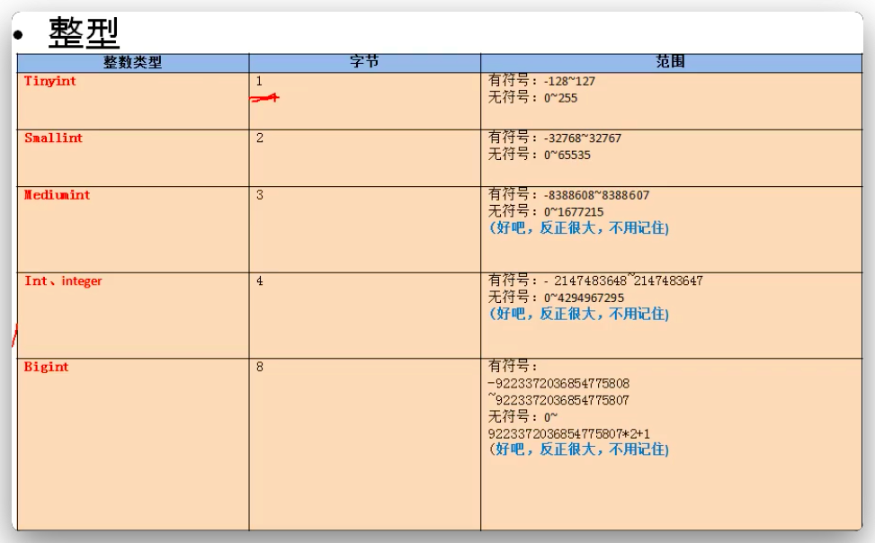
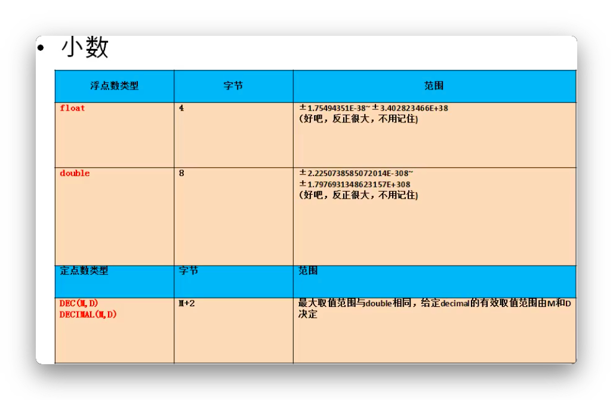
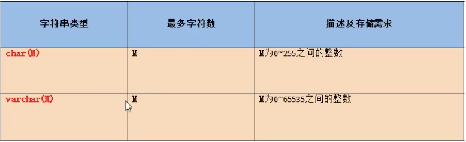
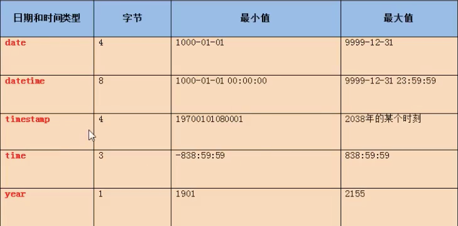
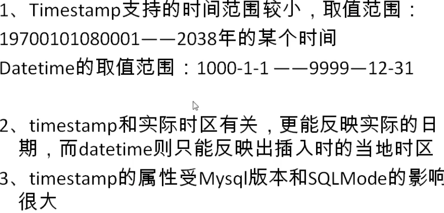

# DDL语言

[toc]


> 数据定义语言,主要涉及 库和表的管理

- 库 和 表的管理
  - 创建 create
  - 修改 alter
  - 删除 drop

---

## 库的管理

一、**库的创建**

1. **语法**

   ```mysql
   CREATE DATABASE [IF NOT EXISTS]库名;
   ```

2. **案例**

   ```mysql
   # 案例一 创建库books
   CREATE DATABASE books;
   CREATE DATABASE IF NOT EXISTS books;
   			有就创建，没有就返回。不报错
   ```

---

二、**库的修改**

> 库一般是不修改的，库名只能手动改。

1. **更改库的字符集**

   ```mysql
   ALTER DATABASE books CHAACTER SET gbk;
   ```

---

三、**库的删除**

1. 语法

   ```mysql
   DROP DATABASE IF EXISTS 库名;
   ```

---

## 表的管理

一、表的创建

1. **语法**

   ```mysql
   create table 表名(
     列名 列的类型[(长度)约束],
     列名 列的类型[(长度)约束],
     ...
     列名 列的类型[(长度)约束]
   );
   ```

2. 案例

   ```mysql
   # 案例一 创建表book
   CREATE TABLE book(
     id INT, # 编号
     bName VARCHAR(20), # 书名
     price DOUBLE, # 价格
     author IDVARCHAR(20), # 作者编号
     publishDate DATATIME # 出版日期
   )；
   ```

二、表的修改

**核心语法**

```mysql
alter table 表名
add|drop|modify|change column 列名 [列类型 约束];
```

1. 修改列名

   ```mysql
    # 把 publishdate 列名 变为 pubDate
    ALTER TABLE book 
    CHANGE COLUMN publishdate pubDate DATETIME;
   ```

2. 修改列的类型或约束

   ```mysql
   ALTER TABLE book
   MODIFY COLUMN pubdate TIMESTAMP;
   ```

3. 添加新列

   ```mysql
   ALTER TABLE author
   ADD COLUMN annual DOUBLE;
   ```

4. 删除列

   ```mysql
   ALTER TABLE author
   DROP COLUMN annual;
   ```

5. 修改表名

   ```mysql
   ALTER TABLE author
   RENAME TO book_author;
   ```

---

三、表的删除

1. **语法**

   ```mysql
   DROP TABLE IF EXISTS book_author;
   ```

通用的做法：

```mysql
DROP DATTABASE IF EXISTS 旧库名; 先删一次
CREATE DATABASE 新库名;

DROP TABLE IF EXISTS 旧表名
CREATE TABLE 新表名();
```

---

四、表的复制

1. 语法

   ```mysql
   # 只能复制表的结构
   CREATE TABLE copy LIKE author;
   # 复制表的结构+数据
   CREATE TABLE copy
   SELECT * FROM author;
   # 只复制部分数据
   CREATE TABLE copy
   SELECT id,au_name
   FROM author
   WHERE nathon='中国';
   # 仅仅复制某些字段(列)
   CREATE TABLE copy
   SELECT id,au_name
   FROM author
   WHERE 0;
   ```

---

## 常见的数据类型

1. 数值型
   1. 整形
   2. 小数
      1. 定点数
      2. 浮点数
2. 字符型
   1. 较短的文本：char、varchar
   2. 较长的文本：text、blob(较长的二进制数据 图片)
3. 日期型

一、整型



- 特点
  - 默认有符号，无符号要设置 unsigned
  - 插入的数值超过整形范围，会报 out of range异常，并插入临界值
  - 如果不设置长度，会有默认的长度，代表显示的最大宽度，不够用0在左边填充(要加上zerofill)

二、小数



1. 浮点数
   1. float(M,D)
   2. double(M,D)
2. 定点型  精确度较高,要求高精度的(货币)运算需要考虑
   1. dec(M,D)          
   2. decimal(M,D)  默认 M为10  D为0

- 特点

  - M和D 都可以省略

    ```mysql
    # M(整数部位+小数部位) 和 D(小数点后的位数)
    CREATE TABLE tab(
      f1 FLOAT(5,2),
      f2 DOUBLE(5,2),
      f3 DECIMAL(5,2)
    );
    ```

**原则：**

- 所选择的类型越简单越好
- 能保存数值的类型越小越好

三、字符型

- 较短的文本 M为最大字符数

  - char 代表固定长度的字符 char(M)
    - 比较耗费空间，效率高
    - M可以省略，默认为1
  - varchar 代表可变长度的字符 varchar(M)
    - 比较节省空间，比较节省
    - M不能省略

- 其他

  - binary和varbinary用于保存较短的二进制

  - enum用于保存枚举    性别 男女就是用这个做的

    ```mysql
    CREATE TABLe tab_char(
      c1 ENUM('a','b','c'),
    )
    INSERT INTO tab_char VALUES('a');  # 插入成功
    INSERT INTO tab_char VALUES('b');  # 插入成功
    INSERT INTO tab_char VALUES('c');  # 插入成功
    INSERT INTO tab_char VALUES('m');  # 插入失败
    INSERT INTO tab_char VALUES('A');  # 插入成功
    ```

  - set 用于保存集合

    ```markdown
    - 说明 : 和Enum类型类似，里面可以保存0～64个成员。
    - 和Enum类型的最大区别 : SET类型一次可以选取多个成员,Enum只能选取一个
        根据成员数目不同，存储所占的字节也不同
        成员数    字节数
        1～8       1
        9~16       2
        17~24      3
        25~32      4
        33~64      8
    ```

    ```mysql
    CREATE TABLE tab_set(
      s1 SET('a','b','c','d')
    )
    INSERT INTO tab_set VALUES('a');
    INSERT INTO tab_set VALUES('a','b');
    INSERT INTO tab_set VALUES('a','c','d');
    ```




---

四、日期型





- **比较**

  ```mysql
  CREATE TABLE tab_date(
    t1 DATETIME,
    t2 TIMESTAMP
  )
  INSERT INTO tab_date VALUES(NOW(),NOW());
  SHOW VARIABLES LIKE 'time_zone';
  SET ttime_zone='+9:00';
  ```

---

## 常见约束

```mysql
CREATE TABLE 表名(
  字段名 字段类型 约束
)
```

> 含义：一种限制，用于限制表中的数据，为了保证表中的数据的准确和可靠性(一致性)，比如学号 不能一致

- 分类
  - **NOT NULL** 非空 用于保证该字段的值不能为空
    - 姓名、学号
  - **DEFAULT**    默认 用于保证该字段又默认值 
    - 性别
  - **PRIMARY KEY**  主键  用于保证该字段的值就有唯一性，而且非空
    - 比如 学号、员工编号
  - **UNIQUE**   唯一  用于保证该字段的值就有唯一性，可以为空
    - 比如 座位号
  - **CHECK**   检查约束[mysql不支持]  
    - 比如年龄、性别
  - **FOREIGN KEY**  外键 ， 用于限制两个表的关系的，用于保证该表字段值必须来自于主表的关联列的值
    - 在从表中添加外键约束，用于饮用主表中某列的值
    - 比如 学生表的专业编号 员工表的部门编号 员工表的公众编号
- 添加约束的时机
  - 创建表时
  - 修改表时
- 约束的添加分类
  - 列级约束
    - 六大约束语法都支持，但外键约束没有效果 (主键、默认、唯一、非空)
  - 表级约束
    - 除了非空、默认，其他的都支持(主键、外键、唯一)

```mysql
# 语法
CREATE TABLE 表名(
  字段名 字段类型 列级约束,
  字段名 字段类型,
  表级约束
)
```

---

一、创建表时添加

1. 添加列级约束

   ```mysql
   CREATE TABLE stuinfo(
     id INT PRIMARY KEY, # 主键
     stuName VARCHAR(20) NOT NULL, # 非空
     gender CHAR(1) CHECK(gender='男' OR gender = '女'), # 检查
     seat INT UNIQUE, # 唯一
     age INT DEFAULT 18, # 默认约束
     majorId INT REFERENCES major(id) # 外键
   )
   CREATE TABLE major(
     id INT PRIMARY KEY,
     majorName VARCHAR(20)
   )
   ```

2. 添加表级约束

   ```mysql
   # 语法
   CREATE TABLE 表(
     ...
     [CONSTRAINT 约束名] 约束类型(字段名)
   )
   ```

   ```mysql
   CREATE TABLE stuinfo(
     id INT,
     stuname VARCHAR(20),
     gender CHAR(1),
     seat INT,
     age INT,
     majorid INT,
     CONSTRAINT pk PRIMARY KEY(id),
     CONSTRAINT uq UNIQUE(seat),
     CONSTRAINT ck CHECK(gender = '男' OR gender = '女'),
     CONSTRAINT fk_stuinfo_major FOREIGN KEY(majorid) REFERENCES major(id)
   )
   ```

- 通用的写法

  ```mysql
  CREATE TABLE IF NOT EXISTS stuinfo(
    id INT PRIMARY KEY,
    stuname VARCHAR(20) NOT NULL,
    sex CHAR(1),
    age INT DEFAULT 18,
    seat INT UNIQUE,
    majorid INT,
    CONSTRAINT fk_stuinfo_major FOREIGN KEY(mojorid) REFERENCES major(id)
  )
  ```

- 主键和唯一的大对比

  ```markdown
  			保证唯一性			是否允许为空     一个表中可以有多少个   是否允许组合
  主键      是            否             至多有一个 					允许,不推荐
  唯一      是            是						 可以有很多个	 			 允许,不推荐
  ```

- **外键**
  1. 要求在从表设置外键关系
  2. 从表的外键列的类型和主表的关联列的类型要求一致或兼容，名字没要求
  3. 主表的关联列必须是一个key(一般是主键或唯一)
  4. 插入数据时，先插入主表，再插入从表
  5. 删除数据时，先删除从表，在删除主表

二、修改表时约束

- 语法

  ```mysql
  # 添加列级约束
  alter table 表明 modify column 字段名 字段类型 新约束;
  # 添加表级约束
  alter table 表明
  add [constraint 约束名] 约束类型(字段名) [外键的饮用];
  ```

1. 添加非空约束

   ```mysql
   ALTER TABLE stuinfo MODIFY COLUMN stuname VARCHAR(20) NOT NULL;
   ```

2. 添加默认约束

   ```mysql
   ALTER TABLE stuinfo MODIFY COLUMN age INT DEFAULT 10;
   ```

3. 添加主键

   1. 列级约束

      ```mysql
      ALTER TABLE stuinfo MODIFY COLUMN id INT PRIMARY KEY;
      ```

   2. 表级约束

      ```mysql
      ALTER TABLE stuinfo ADD PRIMARY KEY(id);
      ```

4. 添加唯一键

   1. 列级约束

      ```mysql
      ALTER TABLE stuinfo MODIFY COLUMN seat INt UNIQUE;
      ```

   2. 表级约束

      ```mysql
      ALTER TABLE stuinfo ADD UNIQUE(seat);
      ```

5. 添加外键

   ```mysql
   ALTER TABLE stuinfo
   ADD CONSTRAINT fk_stuinfo_major
   FOREIGN KEY(majorid) REFERENCES major(id);
   ```

三、修改表时删除约束

1. 删除非空约束

   ```mysql
   ALTER TABLE stuinfo MODIFY COLUMN stuname VARCHAR(20) NULL;
   ```

2. 删除默认约束

   ```mysql
   ALTER TABLE stuinfo MODIFY COLUMN age INT;
   ```

3. 删除主键

   ```mysql
   ALTER TABLE stuinfo DROP PRIMARY KEY;
   ```

4. 删除唯一

   ```mysql
   ALTER TABLE stuinfo DROP INDEX seat;
   ```

5. 删除外键

   ```mysql
   ALTER TABLE stuinfo DROP FOREIGN KEY fk_stuinfo_major;
   ```

- 级联删除

  ```mysql
  alter table stuinfo 
  add constraint fk_stu_major foreign key(majorid) 
  references major(id); # 传统的添加外键的方式
  
  # major 和 stuinfo有了外键，也就是 stuinfo 是 major的从表
  # 删除的时候，要先删除从表，然后才能删主表
  delete from major where id=3; # 报错 major是主表
  # 这时候就需要级联删除 删除主表数据时，跟着删了从表数据
  alter table stuinfo 
  add constraint fk_stu_major foreign key(majorid)
  references major(id)
  on delete cascade;    # 与之对应的是传统的添加外键方式
  	# 删除数据
  delete from major where id=3; # 不报错
  ```

- 级联置空

  ```mysql
  # 与级联删除的区别 就是 删除主表数据时，保留从表数据
  alter table stuinfo 
  add constraint fk_stu_major foreign key(majorid)
  references major(id)
  on delete set null;
  	# 删除
  delete from major where id=3;
  ```

  

---

## 标识列

> 又称为自增长列
>
> 含义：可以不用手动的插入值，系统提供默认的序列之

一、创建表时设置标识列

```mysql
CREATE TABLE tab_identity(
  id INT PRIMARY KEY auto_increment,
  name VARCHAR(20)
);
INSERT INTO tab_identity(id,name) VALUES(NULL,'john');   1
INSERT INTO tab_identity(name) VALUES('lucy');           2
```

- 改变步长

  ```mysql
  SET auto_increment=3;
  1 4 7 10...
  ```

- 特点

  ```markdown
  1. 标识列不一定要和主键搭配，但是要求是一个key
  2. 一个表只能有一个 标识列
  3. 标识列的类型只能是数值型
  4. 标识列可以通过 SET auto_increment_increment=3修改步长
  5. 也可以通过手动直接修改 初始值
  ```

二、修改表时设置标识列

```mysql
ALTER TABLE tab_indetity
MODIFY COLUMN id INT PRIMARY KEY AUTO_INCREMENT;
```

三、修改表时删除标识列

```mysql
ALTER TABLE tab_identity
MODIFY COLUMN id INT;
```

