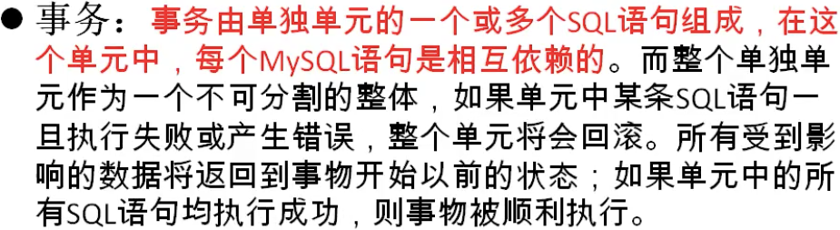
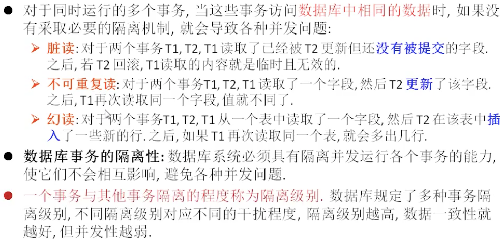
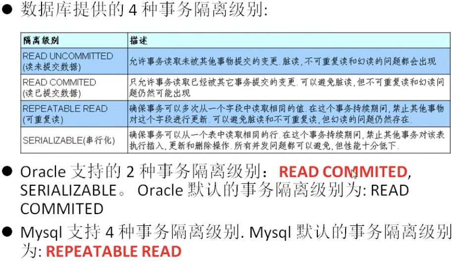

# TCL语言

Transacton control language 事务控制语言

> 事务：一个或一组sql语句组成一个执行单元，这个执行单元要么全部执行，要么全部不执行

例如 **转账**,要么转账成功 我少钱你多钱，要么转账失败。不能出现我少钱了你没多钱的情况



**存储引擎**


---

事务的ACID属性

1. **原子性**
   - 原子性时指事务是一个不可分割的工作单位，事务中的操作**要么都发生，要么不发生**
2. 一致性
   - **一个事务执行会使数据从一个一致状态切换到另外一个一致状态**
3. 隔离性
   - 事务的隔离性是指**一个事务的执行不能被其他事务干扰**，即一个事务内部的操作及使用的数据对并发的其他事务时隔离的，并发执行的各个事务之间不能互相干扰
4. 持久性
   - 持久性是指一个事务一旦被提交，它对数据库中的**数据的改变就是永久性的**，接下来的其他操作和数据库故障不应该对其有任何影响

---

## 事务的创建

1. 隐性事务：事务没有明显的开启和结束的标记

   比如insert、update、delete语句

   delete from 表 where id = 1;  这就是一个事务

2. 显示事务：事务具有明显的开启和结束的标记

   前提：必须先设置自动提交功能为禁用

   ```mysql
   # 步骤一 开启事务
   set autocommit = 0;
   start transaction;# 可选的
   # 步骤二 编写事务中的sql语句(select insert ipdate delete)
   语句1;
   语句2;
   ...
   # 步骤三 结束事务
   commit; # 提交事务
   rollback; # 回滚事务
   savepoint 节点名; # 设置保存点
   
   # 演示savepoint的使用
   SET autocommit = 0;
   start transaction;
   delete from account where id = 25;
   savepoint a; # 设置保存点 必须与 rollback 配合使用
   delete from account where id = 28;
   rollback to a;
   ```
   
3. Delete和rruncate在事务使用时的区别

   ```mysql
   # 演示delete    支持回滚
   set autocommit=0;
   start transaction;
   delete from account;
   rollback;
   # 演示truncate  不支持回滚
   set autocommit=0;
   start transaction;
   truncate table account;
   rollback;  
   ```

   

---

## 事务并发问题介绍

对于同时运行的多个事务，当这些事务访问数据库中相同的数据时，如果没有采取必要的隔离机制，就会导致各种病发问题。

```mysql
事务的隔离级别：
										脏读				不可重复读				幻读
read uncommitted     √             √            √          
read committed       x             √            √
repeatable read      x             x            √
serializable         x						 x						x
```



---



- 事务隔离级别 @@tx_isolation

  - 每启动一个mysql程序，就会获得一个单独的数据库连接，每个数据库连接都有一个全部变量，标识当前的隔离级别

  - 查看当前的隔离级别

    ```mysql
    select @@tx_siolation;
    ```

  - 设置当前mysql连接的隔离级别

    ```mysql
    set transaction isolation level read committed;
    ```

  - 设置数据库系统的全局的隔离级别

    ```mysql
    set global transaction isolation level read committed;
    ```

