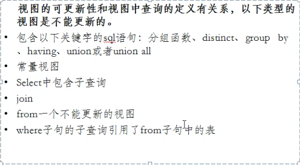

## 视图

> 含义：虚拟的表，和普通表一样使用

**mysql 5.1版本出现的新特性，是通过表动态生成的数据**

- 通过普遍表 临时组成的 一个表，便于以后 **复用**

- 行盒列的数据**来自**定义视图的查询中**使用的表**
- 是在==使用视图时动态生成==的，只保存了sql逻辑，不保存查询结果,也就没有空间

### 视图的创建

- **语法**

  ```mysql
  # 创建
  create view 视图名
  as
  查询语句;
  # 使用
  select * from 视图名;
  ```

  ```mysql
  # 案例一 查询邮箱中包含a字符的员工名、部门名、工种名
  		#创建
  create view myv
  as
  select last_name,department_name,job_title
  from employees e
  join departments d on e.daparment_id = d.department_id
  join jobs j on e.job_id = j.job_id;
  		#使用
  select * from myv
  where last_name like "%a%";
  ```

- 作用

  - 重用了sql语句
  - 简化复杂的sql操作，不必知道它的查询细节
  - 保护数据，提高安全性

### 视图的修改

1. 方式一

   ```mysql
   create or replace view 视图名
   as
   查询语句;
   ```

2. 方式二

   ```mysql
   alter view 视图名
   as
   查询语句;
   ```

### 删除视图

- 语法

  ```mysql
  drop view 视图名,视图名,视图名;
  ```

### 查看视图

- 方法一 `desc 视图名;`
- 方法二 `show create view 视图名`

## 视图的更新



```mysql
create or replace view myv1
as
select lat_name,email,salary*12*(1+ifnull(commission_pct,0)) "salary"
from employees;
```

1. 插入

   ```mysql
   inser into myv1 values("张飞",'zf@qq.com',100000);
   ```

2. 修改

   ```mysql
   update myv1 set last_name = "张无忌"
   where last_name= "张飞";
   ```

3. 删除

   ```mysql
   delete from myv1
   where last_name = "张无忌";
   ```

**视图和表的对比**

```mysql
				创建语法的关键字						是否实际占用物理空间 		  	使用
视图		 create view              只是保存了sql逻辑	  增删改查，一般不能增删改
表				create table							保存了数据					    增删改查
```

