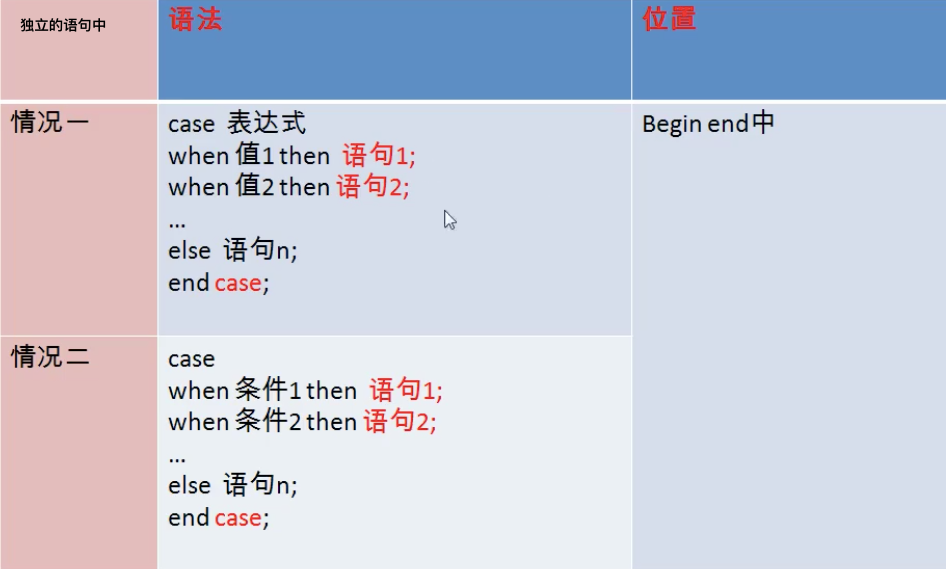
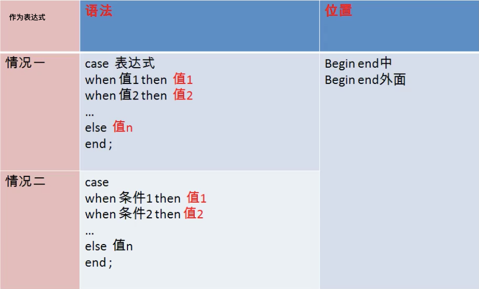
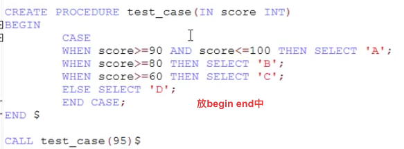
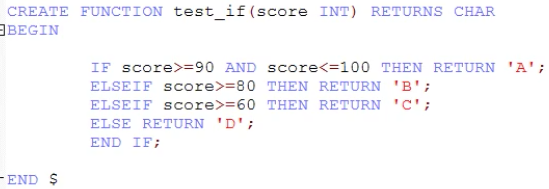
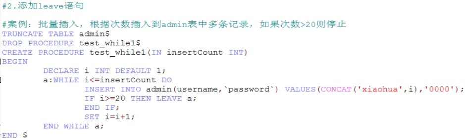
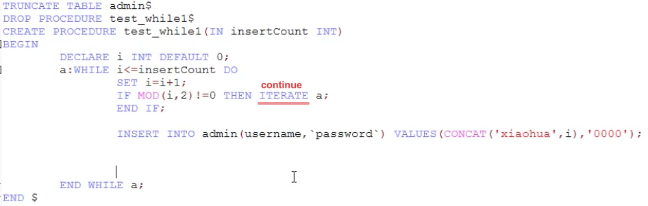
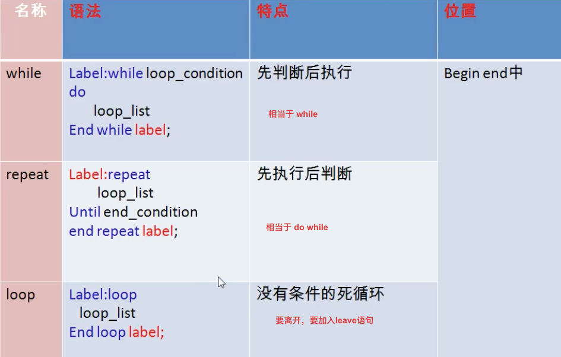

# 流程控制结构

三大结构

- 顺序结构：程序从上往下依次执行
- 分支结构：程序从两条或多条路径中选择一条去执行
- 循环结构：程序在满足一定条件的基础上，重复执行一段代码

---

## 分支结构

1. if函数

   - 功能：实现简单的双分支
   - 语法：`if(表达式1,表达式2,表达式3)`如果1成立，返回2，否则返回3
   - 应用：任何地方

2. case结构

   - 类似于switch语句，一般用于实现等值判断

     ```mysql
     case 变量｜表达式｜字段
     when 要判断的值 then 返回的值1或语句1;
     when 要判断的值 then 返回的值2或语句2;
     ....
     else then 返回的值n或语句n;
     end case;
     ```

   - 类似多重if语句，一般用于实现区间判断

     ```mysql
     case
     when 要判断的条件1 then 返回的值1或语句1;
     when 要判断的条件2 then 返回的值2或语句2;
     ....
     else then 返回的值n或语句n;
     end case;
     ```

   - 特点

     - 可以作为表达式，嵌套在其他语句中使用，可以放在任何地方
     - 可以作为独立的语句去使用，只能放在begin。end中

   - 

   - 

   - 

3. if结构

   - 功能：实现多重分支

   - 语法

     ```mysql
     if 条件1 then 语句1;
     elseif 条件2 then 语句2;
     ....
     [else 语句n;]
     end if;
     只能应用在 begin end中;
     ```

   - 

---

## 循环结构

- 分类
  - while
  - loop
  - repeat
- 循环控制
  - iterate 类似 continue
  - leave 类似 break

---

**while**

语法

```mysql
[标签:]while 循环条件 do			while(循环条件) {
	循环体													循环体;
end while[ 标签];						 }
```

loop

```mysql
语法：
[标签:]loop
	循环体;
end loop [标签];
```

repeat

```mysql
语法
[标签:] repeat
		循环体;
until 结束循环的条件
end repeat [标签];
```








