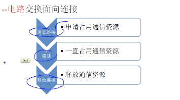
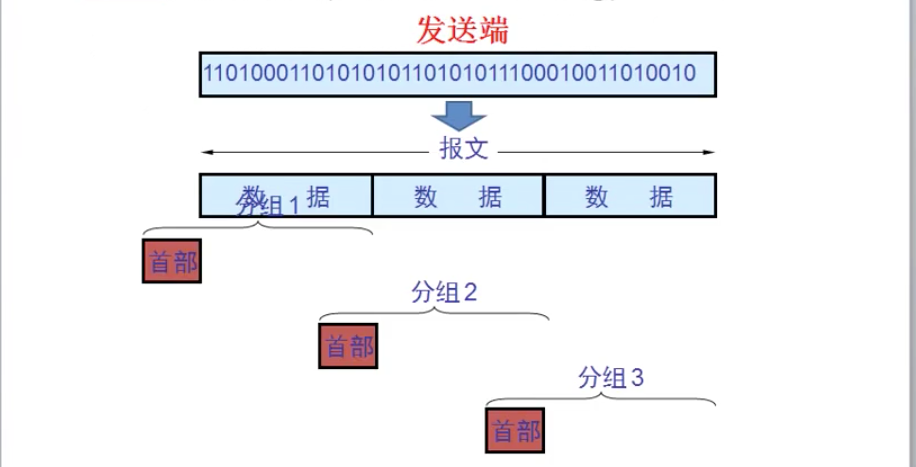
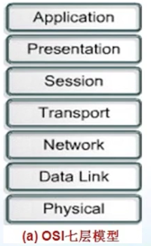

# 计算机网络概述

[toc]
## 因特网在信息时代的作用

**数字化**，现实中的一切都可以变为01存储在计算机中
**信息化**，打电话、qq聊天，能够进行交互就是信息化
**网络化**，前俩者都离不开网络化
**三网合一**
电信网络：手机，移动、电信、联通
电视网络：电视，主要单向的
计算机网络

1. 连通性
2. 共享
   1. 软件共享 远程连接
   2. 硬件共享 可以远程操控另一台计算机的硬件设备

## 因特网概述

**网络**、**互联网**、**因特网**

### 网络

1. 计算机通过**集线器**和**交换机**这样的设备组建一个局域网
2. 网线叫做链路，一边链路不超过100m
3. 网络设备和计算机称为节点
4. 应用，学校的机房(交换机)

### 互联网

1. 通过路由器，使得网络和网络连接起来就是互联网
2. 路由器可以和广域网相连，传的很远

4个以太网孔就可以连接4台交换机，连4个网络，5个以太网孔就5个

### 因特网

因特网也是互联网，是全球最大的互联网
整个因特网使用的就是TCP/IP协议(网关、路由器、路径之类的)

### 因特网发展阶段

1. 第一阶段，这时候没有对外开放，就是美国国防部用
   1. 1969年，美国国防部研发的分组交换
   2. 1975年，分组交换网相互连接出现了互联网
   3. 1983年，tcp/ip协议成为了互联网的标准协议
   4. 这时候的ipv4没有考虑安全问题，才有了之后的ipv6

2. 第二阶段

主干网，45m/s
   1. 主干网、地区网、校园网

1. 第三阶段，美国政府不再负责互联网的运营，给了公司运营

   1. ISP——Internet服务提供商，比如联通、电信
   2. 例如一个小区都用电信，电信就会给我们分配公网地址
      1. 公网地址，由因特网全球机构统一分配

### 因特网的标准工作

有线、无线、路由交换设备、tcp/ip协议，不是一家公司制造，就需要一个标准，就是因特网协会来制定

## 因特网的组成

核心部分：能够让计算机进行通讯的部分

1. 电路交换
   1. 典型用途，打电话
   2. 适合于数据量很大的实时性传输
   3. 核心路由器之间可用电路交换
2. 分组交换
计算机的网络就是用的分组交换

   1. 完整的**20M word文档**就是一个报文

   1. 首部：目标地址、源地址、报文的第几段数据

路由器的存储转发功能
3. 报文交换
   1. 报文交换一般比分组长的多
   2. 报文交换时延较长

3种交换方式时间比较


边缘部分：接入因特网的部分都属于边缘部分
1. 主机之间的通信方式
   1. 客户服务器方式(寻常的下载方式，下载人越多越慢)
      
   2. 对等方式(迅雷的车队)
      
      1. 每台计算机既是客户端又是服务器
      2. 下载的人越多，元越多，下载速度越快
      3. 下载一个文件从多个地方下载

## 计算机网络在我国的发展

中国在1994年4月20日正式接入互联网

**计算机网络类别**
1. 作用范围
   1. 广域网WAN 
      1. 使用广域网技术的网络，不单单从网络涵盖范围区分了
      2. 花钱买服务 花钱买带宽 
   2. 城域网MAN 
   3. 局域网LAN 
      1. 局域网网线一般不超过100m
      2. 自己购买设备，自己维护 带宽固定
   4. 个人区域网PAN
2. 使用者
   1. 公用网
      1. 整个因特网
   2. 专用网
      1. 政府专用网，不允许外人接入
3. 拓扑结构
   1. 总线型

   2. 环形

   3. 星形 现在一般都是星形结构

   4. 树状

   5. 网状 路由器就是这样的结构，骨干网上

1. 交换方式
   1. 电路交换网
   2. 报文交换网
   3. 分组交换网
2. 工作方式
   1. 资源子网
   2. 通信子网
   3. 接入网

## 计算机网络的性能

### 性能指标
1. 速率
   连接在计算机网络上的主机在数字信道上传送数据位数的速率，也叫data rate或bit rate 
   8M 指的是 比特 8Mb/s
   而我们看到的下载速度是字节，也就是8/8 = 1M/s
2. 带宽
   数据通信领域中，数字信道能传输的最高速度
3. 吞吐量
   即在单位时间内通过某个网络的数据量
4. 时延
   1. 发送时延
      
   2. 传播时延
      
   3. 处理时延 
      网络节点存储转发处理时间
   4. 排队时延
      网络节点缓存队列排队时间
      
5. 时延带宽积
   1. 时延带宽积 = 传播时延 * 带宽
   
6. 往返时间
   1. 从发送方发送数据开始，到发送方收到接收方确认
7. 利用率
   1. 信道利用率
   2. 网络利用率

### 非性能指标

## 计算机网络的体系结构

**几个基本概念**

### OSI七层模型

**开发人员要解决的问题**
应用层 能够产生网络流量能够和用户交互的应用程序
表示层 加密 压缩 开发人员需要考虑的问题
会话层 服务和客户端建立的会话 查木马 netstat -nb
**网络工程师要解决的问题**
传输层 可靠传输(建立对话) 不可靠传输(qq聊天) 流量控制
网络层 IP地址编址 选择最佳路径
数据链路层 输入如何封装数据 添加物理层地址 MAC地址

物理层 电压(多少伏代表0，多少代表1)、接口标准 网线8根线

**网络排错 从底层到高层排错**

网络安全和OSI参考模型
   物理层安全
   数据链路层安全 ADSL
   网络层安全
   应用层安全 SQL注入漏洞 上传漏洞

### TCP/IP四层模型

应用层
传输层
网络层
网络接口层(数据链路层+物理层)

### 计算机网络的体系结构

