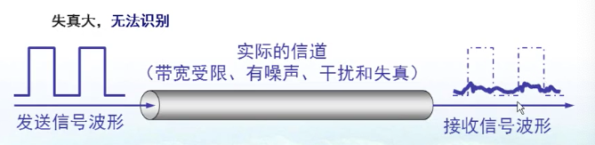
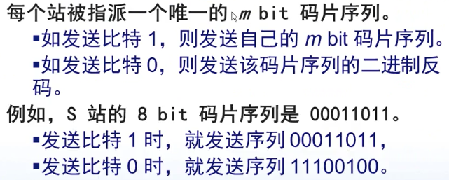

# 物理层

[toc]
## 物理层的基本概念

物理层解决如何在连接各种计算机的传输媒体上传输数据比特流，而不是指具体的传输媒体。
物理层的首要任务描述为：确定与传输媒体的接口的一些特性，即：

1. 机械特性：例接口形状、大小、引线数目
2. 电气特性：例规定电压番位(-5~5v)
3. 功能特性：例如规定-5表示0，5表示1
4. 过程特性：也称规程特性，规定建立连接时各个相关部分的工作步骤

## 数据通信的基础知识

**典型的数据通信模型**

### 数据通信的相关术语

通信的目的是传送消息。
**数据**————运送消息的实体
**信号**————数据的电气或电磁的表示
**“模拟信号”**————代表消息的参数的取值是连续的
**“数字信号”**————代表消息的参数的取值是离散的
**码元**—————在使用时间域的波形表示数字信号时，则代表不同离散数值的基本波形就称为码元。

### 有关信道的基本概念

信道一般表示向一个方向传送信息的媒体。所以咱们平时说的通信线路往往包含一条发送信息的信道和一条接受信息的信道。

1. 信道分类
    **单工信道**————只有一个方向的通信而没有反方向的交互
    **半双工通信**————通信的双方都可以发送信息，但不能双方同时发送。
    **全双工通信**————通信的双方可以同时发送和接受信息。
2. **基带信号**和**带通信号**
    
3. **几种最基本的调制方法** 把基带信号调制成带通信号
    
    
4. 常用编码
    
    
    
    

### 信道的极限容量

**奈氏准则**————1924年，Nyquist提出的，理想条件(没噪声)下，为了避免码间串扰，码元的传输速率的上限值
在任何信道，码元传输的速率是有上限的，否则会出现码间串扰的问题，使接受段对码元的判断成为不可能。

### 信噪比
香农用信息论的理论推导出了带宽受限且有高斯白噪声干扰的信道的极限、无差错的信息船速速度。

## 物理层下面的传输媒体

### 导向传输媒体
导向传输媒体中，电磁波沿着固体媒体传播
1. 双绞线
   1. 屏蔽双绞线STP
      1. 
   2. 无屏蔽双绞线UTP
      1. 
2. 同轴电缆
   
   1. 50欧同轴电缆————数字传输，多用于基带传输，也叫基带同轴电缆
   2. 70欧同轴电缆————模拟传输，也叫宽带同轴电缆
3. 光纤
   

## 信道复用技术
复用是通信技术中的基本概念

### 频分复用FDM
电话就是用这种技术

### 时分复用DTM

**时分复用器**

这样容易造成时间的浪费
**统计时分复用STDM**

### 波分复用WDM
其实就是频分复用

### 码分复用CDM
手机通讯就是码分复用
**常见名词**——————码分多址CDMA

内积为1、-1有信号，为0 没有信号

## 数字传输系统

脉码调制PCM体制最初是为了在电话局之间的中继线路上传输多路的电话

由于历史原因，有俩个不兼容的国际标准,我国采用的是E1
1. 北美24路PCM(T1) 速率1.544Mb/s 每秒8000次采样，8bit，24路
2. 欧洲30路PCM(E1) 速率2.084Mb/s 每秒8000次采样，8bit，32路
当需要更高速率时，可采用复用的方法

## 宽带接入技术
如何把计算机接入因特网
### xDSL（用数字技术对现有的模拟电话用户线进行改造）

**频分复用**

### 光纤同轴混合网HFC
**HFC网**是在目前覆盖面很广的**有线电视网CATV**的基础上开发的一种**居民宽带接入网**。
HFC除了可以传送CATV外，还可以提供电话、数据和其他宽带交互型业务
现有的CATV网是**树形拓扑结构**的同轴电缆网络，**采用的模拟技术的频分复用**对电视节目进行单向传输，而HFC网则需要对CATV网进行改造。

**FTTx技术**

