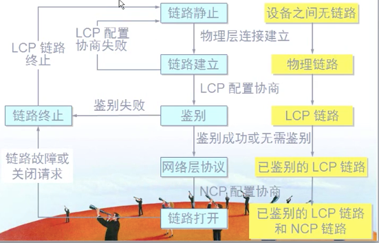
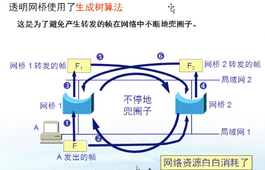

# 数据链路层

[toc]


## 数据链路层基本概念和基本问题

### 基本概念

#### 数据发送模型


**主机H1**
**运输层**分段
**网络层**加上地址
**链路层**加上mac地址，封装成帧
**物理层**传输比特流

**路由器**
**网络层**传输比特流
**链路层**检查mac地址看看是不是给自己的
**网络层**看网络层的地址，寻找前往哪个路由器
**链路层**加上mac地址，封装
**物理层**传输比特流

**主机H2**
**物理层**传输比特流
**链路层**检查mac地址，删去封装
**网络层**去除ip地址
**运输层**整合数据包变回报文
**应用层**接受数据

#### 数据链路层的信道类别

1. 点对点信道
   1. 一对一
2. 广播信道
   1. 一对多，连接的主机很多，必须使用专用的共享信道协议来协调主机的数据发送

**链路**是一条点到点的物理线路段，中间没有任何其他设备点。
    一条链路只是一条通路的一个组成部分。
**数据链路**除了物理线路外，还必须有通信协议来控制这些数据的传输。若把实现这些协议的硬件和软件加到链路上，就构成了数据链路。
   现最常见的方法是中用适配器(网卡)来实现这些协议的硬件和软件
   一般的适配器都包括了数据链路层和物理层这俩层的功能。


### 数据链路层三个基本问题

1. **封装成帧**
2. **透明传输**
3. **差错控制**

#### 封装成帧

**封装成帧**就是在一段数据的前后分别添加**首部**和**尾部**然后就构成了一个帧。*确定帧的界限*

MTU=1500，数据部分最大不能超过1500个字节

#### 透明传输

**若传输的数据不是仅有“可打印字符”组成时，就会出现问题。**


***用字节填充法解决透明传输的问题***
发送端的数据链路层在数据中出现控制字符“SOH”或“EOT”前面插入一转义字符“ESC”(16进制码是1B)


#### 差错控制

```
传输过程中可能会产生比特差错，1变为0，0变为1.
```
**误码率**：***传输的错误比特*** 占据 ***总比特*** 的比率
**误码率和信噪比有很大关系**。

***解决办法*** 
**循环冗余检验CRC**


101001001 传到后再除以1101，如果余数为0就没错，不为0就有错，就扔了。
**除数随便选，1101可以 1001也可以。**
这个除数2台计算机怎么商量的，是链路层的协议的事，不用管。
*二进制除法，异或运算，相同为0，不同为1.*
**FCS**称为 **帧检验序列**
**FCS** 可以用**CRC**检测得出，也可以用**其他方法**检测得出。

```
CRC只能做到无差错接受，但是要做到可靠传输，就必须加上确认和重传
   考虑：帧重复、帧丢失、帧乱序的情况
CRC只能是无接受差错，但并不是无传输差错
   OSI/RM模型观点是：数据链路层要无传输差错。但这种理念没被接受
无传输差错的重传是应用层确认丢包后，再返回去要求服务器端重传一次
数据链路层只需要做到无差错接受
```

## 两种情况下的数据链路层

### 使用点对点信道的数据链路层

广域网 使用的 似乎 就是 点对点型的

重点用的协议是**PPP协议**
#### PPP协议概述

##### PPP协议的组成


有身份验证的功能，能记账


**LCP负责身份验证**
关键字：***异步串行***、***同步串行***

##### PPP协议帧的形式

7E 代表开始结尾
FF 目标地址 固定的


#### PPP协议实现透明传输

##### 字节填充的方式
如果传输的基本单位是**字节**，那么就采用**字节填充**的方式解决，类似转义字符。


##### 零比特填充的方式
如果是**同步传输**的话，那么传输的**就不一定是一个字节一个字节的传输了**
可能传输的是**比特流**(传输的是一连串的比特)
那么按照**字节填充**的方式就没用了。这时候就需要**零比特填充方式**了


#### PPP协议的工作状态

1. 当用户接入ISP(互联网服务提供商)时，路由器的调制解调器对拨号作出确认，建立一条物理连接
2. PC机向路由器发送一系列**LCP**(链路控制协议)**分组**(封装成多个PPP帧)
3. 这些分组及其响应 选择一些 PPP参数，进行网络层配置，NCP(网络控制协议)给PC机分配一个IP地址，使PC机成为因特网的一个主机。
4. 通信完毕后，NCP释放网络层连接，收回IP地址。
5. LCP(链路控制协议)释放数据链路层连接
6. 最后释放物理层的连接


#### PPP应用举例

PPP特有的功能:能身份验证，ip地址自动协商，设置ip地址等等。
目的：**解释PPP封装**————不只是PPP协议可以实现封装，其他协议也可以实现，比如HDLC、帧中继。
**视频实例**： https://www.bilibili.com/video/BV17p411f7ZZ?p=31
结论：PPP协议只是数据链路层进行封装用的一个数据链路层协议，不封装数据链路层一样能通，相当于明文加密的用途

### 使用广播信道的数据链路层

**以太网是一种广播式网络**

#### 以太网特点

以太网基于数据包交换的
以太网不超过100m
**以太网是一种局域网技术**(拨号上网、宽带上网、光纤上网是广域网技术)
局域网用广播式

**局部网的拓扑**


##### 局域网的特点和优点

最主要的特点：网络为一个单位所拥有，且地理范围和站点数目均有限

局域网有以下主要优点：
1. 具有广播功能，从一个站点可很方便的访问全网。
2. 局域网上的主机可共享连接在局域网上的各种硬件和软件资源
3. 便于系统的扩展和逐渐的演变，各设备的位置可灵活调整和改变。
4. 提高了系统的可靠性、可用性、生存性

##### 共享通信媒体

**静态划分信道**————已经不适用了
   频分复用
   时分复用
   波分复用
   码分复用

**动态媒体接入控制**
   随机接入（主要被以太网采用！）
   受控接入(目前已不被采用)

##### 总线型


优点：不用划分信道
缺点：链路上只能有一个发一个收。D和E通信时，A和B不能通讯，也不安全

#### 以太网冲突检测和避让机制

载波监听/多点接入/碰撞检测
**以太网**使用CSMA/CD协议
**多点接入**：许多计算机以多点接入的方式连接在一根总线上。
**载波监听**：每一个站在发送数据前先要检测以下总线上是否有其他计算机在发送数据，有的话，暂时不发送，以免碰撞。就是用电子技术检测总线上有没有其他计算机发送的数据信号。
**碰撞检测**：在计算机边发送数据边检测信道上的信号电压大小。


##### 以太网重要特性

1. 使用CSMA/CD的以太网不能进行全双工通信只能进行半双工通信。
2. 每个站发送数据后都存在碰撞的可能性，因此整个以太网的平均通信量远小于以太网的最高数据率。

##### 争用期


## 以太局域网（以太网）

### 以太网概述

以太网的2个标准
1. DIX Ethernet V2 世界第一个局域网(以太网)产品的规格
2. IEEE 的 802.3标准，与上述差别极小。因此也可成为以太网
TCP/IP体系经常用的是 DIX 而不是802.3标准。
#### 以太网与数据链路层的两个子层

为了使数据链路层更好的适应多种局域网标准，802委员会就将局域网的数据链路层拆成2个子层。
1. 逻辑链路控制LLC子层 基本不用了
2. 媒体介入控制MAC子层


#### 以太网提供的服务
以太网提供的服务是不可靠的交付的，出现问题由高层来决定是否纠正。


### 拓扑

#### 星型拓扑(总线型在前面)
冲突域，星型功能和总线型一样，A和B通信时，C和D也不能通信
因为总线型太垃圾了，所以出现了集线器，因此产生了星型拓扑。
不过集线器现在也没什么人用了，被交换机代替了。


**集线器特点**

**集线器工作原理**


每个站到集线器到举例不超过100m。


### 信道利用率

以太网到信道被占用到情况：
争用期长度为2t，即端到端到2倍。检测碰撞后不发送干扰信号
帧的长为L(bit)，数据发送速率为C(b/s)，因而帧的发送时间为L/C=To(s)


### MAC层

在局域网中，硬件地址又称为物理地址/MAC地址（48位）
802标准的“地址”严格讲应该是每一个站的“名字”或标识符
MAC地址在网卡(芯片)一出场的时候，就有一个全球唯一的地址
MAC地址 实际上就是 适配器地址 或 适配器标识符EUI-48
MAC48位二进制：
1. IEEE的注册管理机构RA负责向厂家分配地址字段的前三个字节(高24位)
2. 地址字段的后三个字节(低24位)由厂家自行指派，成为扩展标识符


#### mac帧格式

FCS帧 校验序列
**以太网**用的是**麦克斯特编码**，不用知道结束界符，只要后面没数据就没了。


## 扩展以太网

### 网桥与交换机

#### 在物理层考虑扩展

**之举使用光纤和一堆光纤调制解调器连接到集线器**
**调制解调器**：把计算机的数字信号翻译成模拟信号


**用集线器连接的计算机不宜超过30台**


因为**集线器**实在太过垃圾，因此出现了**网桥**

通信一次后，就会记录mac地址在哪边，形成一个站表
之后就不会冲突到另一边连着的计算机了，相当于2个冲突域

**网桥的优势与劣势**


#### 透明网桥


**足够多接口的网桥** 就是 **交换机**

**交换机**的带宽是独享的，**交换机**的带宽是计算机带宽的总和

##### 透明网桥使用了生成树算法




#### 创建和管理VLAN(虚拟局域网)

一个VLAN就是一个广播域
VlAN间的通信是通过第三层的路由器来完成的
与传统局域网技术相比，VLAN更灵活，更安全。
网络设备的移动、添加、修改的管理开销见效。

用途：因为一个VLAN不安全，太多计算机能看到自己了，因此要创建多个VLAN


跑多个VLAN数据的口都应该配制成干道端口(中继端口)


## 高速以太网

速率达到或超过100Mb/s的以太网称为高速以太网。
在双绞线上传送100Mb/s基带信号的星型拓扑以太网，仍使用802.3的CSMA/CD协议。100BASE-T以太网称为快速以太网。

100Base-T以太网的物理层：
1. 100BASE-TX：使用2对UTP5类线或冰壁双绞线STP
2. 100BASE—FX：使用2对光纤
3. 100BASE-T4：使用4对UTP3类线或5类线

### 100Base—T特点

可在全双工方式下工作而无冲突发生，因此不实用CSMA/CD协议
MAC帧格式仍然是802.3标准规定的
保持最短帧长不变，但讲一个网段对最大电缆长度减小到100m
帧间时间间隔从原来的9.6us改为现在对0.96us

### 吉比特以太网
允许在1gb/下全双工和半双工两种工作方式
半双工下使用CSMA/CD协议

多用于：**单位的服务器交换机上**

10g比特网只使用光纤作为传输媒体，不再使用铜线了。
10g比特网只在全双工下工作，也没有争用问题，也不用CSMA/CD协议
10g比特网对出现使得以太网对工作范围从局域网(校园网、企业网)扩大到了城域网、广域网，从而实现了端到端对以太网传输
好处：
1. 成熟对技术
2. 互操作性很好
3. 在广域网中使用以太网时价格便宜
4. 统一的帧格式简化了操作和管理


**这是不科学的联网方式**⬆️
VLAN的路由在三层交换实现


