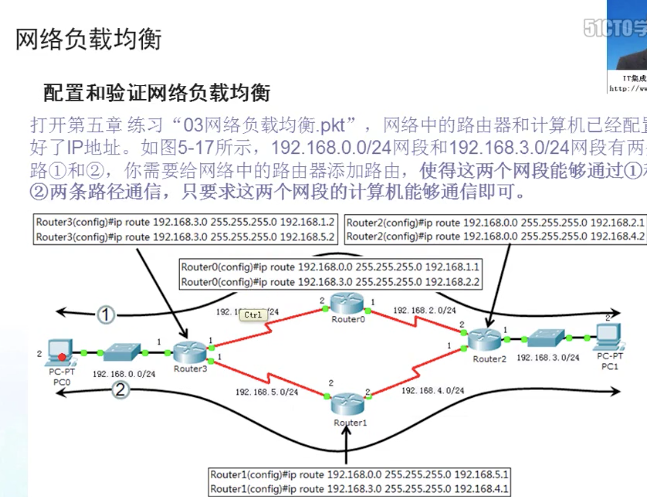
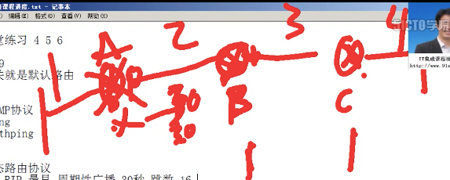

# 网络层

[toc]
**指引**
1. 网络层提供的两种服务
2. 网际协议IP
3. 网际控制报文协议ICMP
4. 因特网的路由选择铁椅
5. IP多播
6. 虚拟专用网VPN 和 网络地址转换NAT

## 数据传输的过程

PDU 协议数据单元
有**TCP/IP协议**通讯下的数据传输；
报文(消息)-->数据段(报文段)-->分组(数据包)-->帧-->比特流
应用层------>运输层--——--->网络层交付—-->链路层->物理层
**无连接网络服务**：
报文(消息)-->数据段(报文段)-->数据报------->帧-->比特流
应用层------>运输层——----->网络层交付—-->链路层->物理层

报文：包含完整的数据信息
报文段：组成报文的每个分组
数据包：TCP/IP协议通讯传输中的数据单元
数据段：无连接的网络层数据传输，工作方式类似报文交换
帧：数据链路层的传输单元

## 网络层提供的两种服务
网络层关注的是如何将**分组**从源端沿着网络路径送达目的地的
在计算机网络领域，**网络层应该向运输层提供怎么样的服务**(面向连接还是无连接)曾经引起了长期的争论。
争论的实质：在计算机通信中，**可靠交付**应该由谁来负责，是网络还是端系统。
两种服务：网络层应该向运输层提供怎么样的服务？
1. 虚电路服务
2. 数据报服务

### 虚电路服务(现在没用，曾经想用)
虚电路表示这只是一条逻辑上的连接，分组都沿着这条逻辑连接按照设定好的方式发送，而不是真正建立了一条物理连接。

### 数据报服务(用的是这种)
数据包写上地址，从哪来，到哪去


### 2种服务的比较


## 网际协议IP

### 虚拟互联网

#### 网络互联的设备
中间设备又称为中间系统或中继系统。
物理层中继系统：**转发器**
数据链路层中继系统：**网桥**或 **桥接器** 或 **交换机**
网络层中继系统：**路由器**
网关：到路由器的接口


#### 网络互联要解决的问题


#### 互联网络与虚拟互联网络


### IP协议简介
**网际协议IP**是TCP/IP体系中2个最主要的协议之一。
与IP协议**配套使用**的还有4个协议：

1. 地址解析协议ARP 与 逆地址解析协议RARP  解析对方的mac地址的
2. 网际控制报文协议ICMP  报告网络故障的，依赖于ip协议
3. 网际组管理协议IGMP    依赖于IP协议


### IP地址

Ipv4 用完了。
#### IP地址分类


#### 特殊的几个地址
127.0.0.1 本地环回地址
169.254.0.0 私有保留地址
10.0.0.0 保留的私网地址，给企业内网用的，在互联网上没有这种地址。
172.16.0.0～172.31.0.0 保留的私网地址(可以重复，公网地址不行)
192.168.0.0～192.168.255.0 保留的私网地址

#### 子网掩码
告诉计算机哪些是网络部分，哪些是主机部分。

## 划分子网和构造超网 A/B/C都是这么用的
子网划分 Ipv4坚持到现在的理由
**改变主机号对应的子网掩码**
**分成2个子网**

主机部分不能全为0，全为0代表这个网段，不能给计算机用
也不能全为1，全为1代表广播地址。


**分成四个子网**


### 点到点的网络的子网掩码————252 11111100
0代表网段不能用 1、2代表主机1、2 3代表广播地址
4代表网段不能用 5、6代表主机1、2 7代表广播地址 

### 变长子网划分

精打细算


### 超网
**改变网络号对应的子网掩码**


#### 路由聚合————构成超网


### 数据包转发过程MAC地址和IP地址


**数据段+ip地址 == 数据包** 这是在网络层封装的
**数据段+ip地址+MAC地址 == 数据帧** 这是在数据链路层封装的
IP地址决定最初和最后的地址，mac地址决定下一跳地址

### arp协议

#### arp协议工作机制


arp靠的是广播，所以广播协议少不得
arp协议不安全，中间人截获数据包、抓包、p2p终结者、网络执法官都是因为它
**电脑1想与电脑2通讯时，黑客3怎么截获————arp欺骗**

1. 电脑1发广播查所有计算机的mac地址，以找到电脑2 ip对应的mac地址
2. 黑客3告诉电脑1 ip对应的mac地址是mac3，电脑1就变成了和黑客通讯。
3. 然后黑客3再给电脑2数据。

**p2p终结者**

**原先其他3台电脑都直接过的路由器，现在M1电脑让他们的下一跳变为自己，控制网速后，再连向路由器**

**网络执法官**
**能控制本网络的计算机，谁和谁能通，谁能不能上网**
非法利用arp协议，装个arp防火墙就能防止这种欺骗

#### 如何断定arp欺骗
arp -a
看看自己电脑的网关mac地址，和同一局域网的电脑的网关mac地址。

### IP数据报格式
应用层信息————>传输层分组加上编号---->网络层再给其分组加上首部---->数据链路层加上MAC地址————>加上帧头帧尾开始在物理层往其他地方传


**区分服务**：给数据包搭上一个标记，表示网络传输的数据高级不高级
**总长度**：首部+数据部分总共多少字节
**标识**：这是第几个数据包
**标志**：有没有分片，比如3000字节的包路由器将其分成了3个1000字节的包
**片偏移**：记录分片后的包首部偏移了多少。一片=8b
**生存时间**：归0后，路由器就不转了。
**协议**：表示数据部分的上层协议是什么，以便主机的IP层将数据部分上交给哪个处理过程 
**首部校验和**：验证首部有没有错误 


**协议号**
ICMP协议号：1；
IGMP协议号：2；
TCP协议号：6；
UDP协议号：17；域名解析
IPv6协议号：41；
OSPF协议号：89；

### ip转发分组的流程

数据路由 路由器在不同网段转发数据包
网络畅通的条件 能去能回 沿途的路由器必须知道目标网络下一跳给哪个接口

### windows上的默认路由和网关

**网关就是默认路由**
0.0.0.0就是默认路由，不能没有默认路由
添加默认路由的意义：**解决双网卡双网关产生的丢包现象**
**连接公网的加默认路由，不连接公网的网卡不加默认路由，然后手动添加路由表**
计算机上最好就只有1个网关

### 网络负载均衡




## ICMP协议
### ICMP简介
**为了提高数据报交付成功的机会，在网际层使用了网际控制报文协议ICMP**
**ICMP允许主机或路由器报告差错情况和提供有关异常情况的报告**
**ICMP是IP层的协议**
**ICMP报文作为IP层数据报的数据，加上数据报的首部，组成IP数据报发送出去**

### ICMP报文格式


## 路由器协议
### 动态路由协议————RIP
RIP 最早 周期性广播 30秒 跳数越少，路径越优 最大跳数15跳，过了就联不通了

**如果路由器A当机了，过了3个30s后，路由器B就会知道它当机了，然后告诉其他路由器去网段1的别走它了。
**


### 内部网关协议OSPF

```markdown
OSPF动态路由协议 开放式
    度量值 带宽 支持多区域 触发式更新
    三个表   
        邻居表      hello包 每10s发个hello包
        链路状态表   
        计算路由表
```


### 外部网关协议————BGP


## IGMP 组播————多播协议
**多播地址可以想像成频道，电台**

**组播 = 多播**

**在音媒体、视频音频的地方会用到，比较节省带宽**

## 典型的路由器的结构


## VPN————虚拟专用网
**私网地址在互联网上没法找到，如果在其他地方想要用到这些地址，那么就要用私网地址。**


## 网络地址转换技术————NAT、PAT
**只替换地址的技术是NAT**，路由器上有几个公网地址，能替换几台计算机
**替换端口的是PAT**————路由器上1个公网地址，用端口号代表不同计算机，端口号65536
**互联网用的最多的技术**


用一个地址替换一堆计算机的ip地址，让一堆计算机联网，区分用端口号区分，端口号也替换。
**端口地址转换技术**————pat

### NAT端口映射

端口衍射能够让外网的人也能访问内网里的内容。
**端口映射和PAT的区别**
端口映射是固定的，pat对端口的使用是空闲随机对。

### MPLS多协议标记交换MPLS


MPLS域中 LSR 使用 LDP交换报文


h1比h2先转发，占用abc这条转发速度比较快的线路，这就是优先级。


